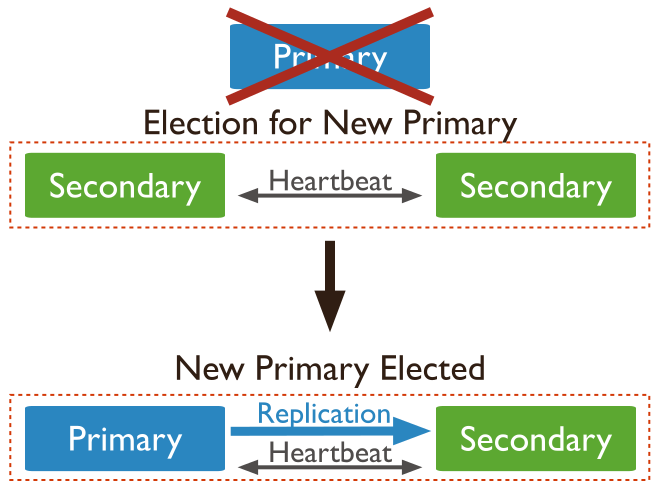
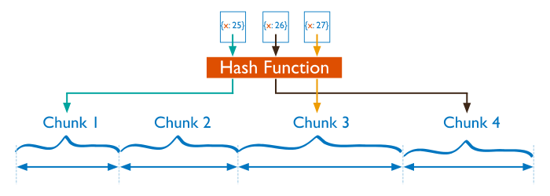

# MongoDB

## MongoDB文档模型的好处

MongoDB是文档型数据库，是Schema Free的

1、json形式
在MongoDB中，开发人员可以直接将一个json数据存储进MongoDB，这对于开发人员来说是非常友好额；

2、读写性能高
在关系型数据库中，我们经常会进行join、子查询等关联性需求，这时候往往会带来较多的随机IO，而在MongoDB中，我们可以通过合理的数据模型设计来将很多的关联需求通过内嵌、反范式的方式实现，减少了随机IO；

3、schema free
MongoDB的数据模型是灵活的，无需为了Online DDL而操心，不同的document也可以有不同的结构。

MongoDB的可以通过内嵌来减少联合查询的需求，可以通过反范式来减少随机IO

## Document Validation

MongoDB 3.2推出了Document Validation，Document Validation, MongoDB官方想表达”schema free but you may need some rules

phone字段为string类型或者email字段要匹配”@mongodb.com”结尾，或者status为”Unknown”或者"Incomplete"

``` mongodb
db.createCollection("contacts", 
    { validator: {$or:
        [
            { phone: {$type:"string"}},
            { email: {$regex:/@mongodb\.com$/}},
            { status: {$in:["Unknown","Incomplete"]}}
        ]}})
```

多了一个validationLevel参数，我们可以在设置validation的时候指定我们的validationLevel级别：

- 默认级别是strict，对该collection已有的和以后新增的document都进行validation验证；
- 可以设置为moderate，仅对已经存在的document进行validation限定；

同时还有validationAction参数来指定当有不符合validation规则的数据进行update或者insert的时候， 我们mongodb实例如何进行处理。

- 默认级别为error，mongodb将拒绝这些不符合validation规则的insert和update。
- 可以设置为warn，mongodb会在日志中记录，但是允许这类insert和update操作。

## MongoDB ACID事务支持

### MongoDB对原子性（Atomicity）的支持

Mongodb的原子性是单行/文档级原子性

对于关系型数据库的多行、多文档、多语句原子性目前Mongodb是不支持的

可以通过建模让mongodb支持多文档原子性，MongoDB不是范式而是反范式的设计，通过大表和小表可以把相关的数据放到同一个文档中去。然后通过一条语句来执行操作

MongoDB最新的4.0版本开始支持多文档事务，MongoDB的多文档事务仅适用于使用WiredTiger存储引擎的服务器，且当前仅支持单个副本集。4.2版本将带来分片集群支持。

### MongoDB对一致性（consistency）的支持

MongoDB的可调一致性，也就是可以自由选择强一致性或最终一致性，如果你的应用场景是前台的方式可以选择强一致性，如果你的应用场景是后台的方式（如报表）可以选择弱一致。在NoSQL中，通常有两个层次的一致性：第一种是强一致性，既集群中的所有机器状态同步保持一致。第二种是最终一致性，既可以允许短暂的数据不一致，但数据最终会保持一致。

#### CAP

首先我们来了解一下什么是CAP理论，其核心是：一个分布式系统不可能同时很好的满足 一致性，可用性和分区容错性这三个需求，最多只能同时较好的满足两个。

- 一致性(Consistency) ：所有节点在同一时间具有相同的数据； 
- 可用性(Availability) ：保证每个请求不管成功或者失败都有响应； 
- 分区容错性(Partition tolerance) ：系统中任意信息的丢失或失败不会 影响系统的继续运作，即可靠性。 

而MongoDB通过复制集和分片技术很好的满足了CP原则。

要保证数据强一致性，最简单的方法是令写操作在所有数据节点上都执行成功才能返回成功，也就是同步概念。而这时如果某个结点出现故障，那么写操作就成功不了了，需要一直等到这个节点恢复。也就是说，如果要保证强一致性，那么就无法提供7×24的高可用性。

而要保证可用性的话，就意味着节点在响应请求时，不用完全考虑整个集群中的数据是否一致。只需要以自己当前的状态进行请求响应。由于并不保证写操作在所有节点都写成功，这可能会导致各个节点的数据状态不一致。

CAP理论导致了最终一致性和强一致性两种选择。当然，事实上还有其它的选择，比如在Yahoo的PNUTS中，采用的就是松散的一致性和弱可用性结合的方法。但是我们讨论的NoSQL系统没有类似的实现，所以我们在后续不会对其进行讨论。

### MongoDB对隔离性（isolation）的支持

在关系型数据库中，SQL2定义了四种隔离级别，分别是READ UNCOMMITTED、READ COMMITTED、REPEATABLE READ和SERIALIZABLE。但是很少有数据库厂商遵循这些标准，比如Oracle数据库就不支持READ UNCOMMITTED和REPEATABLE READ隔离级别。而MySQL支持这全部4种隔离级别。每一种级别都规定了一个事务中所做的修改，哪些在事务内核事务外是可见的，哪些是不可见的。为了尽可能减少事务间的影响，事务隔离级别越高安全性越好但是并发就越差；事务隔离级别越低，事务请求的锁越少，或者保持锁的时间就越短，这也就是为什么绝大多数数据库系统默认的事务隔离级别是RC。
MongoDB在3.2之前使用的是“读未提交”，这种情况下会出现“脏读”。但在MongoDB 3.2开始已经调整为“读已提交”。

下面说说每种隔离级别带来的问题：

#### READ-UNCOMMITTED（读尚未提交的数据）

在这个级别，一个事务的修改，即使没有提交，对其他事务也都是可见的。事务可以读取未提交的数据，这也被称为“脏读（dirty read）”。这个级别会导致很多问题，从性能上来说，READ UNCOMMITTED不会比其他的级别好太多，但却缺乏其他级别的很多好处，除非真的有非常必要的理由，在实际应用中一般很少使用。

#### READ-COMMITTED（读已提交的数据）

在这个级别，能满足前面提到的隔离性的简单定义：一个事务开始时，只能“看见”已经提交的事务所做的修改。换句话说，一个事务从开始直到提交之前，所做的任何修改对其他事务都是不可见的。这个级别有时候也叫“不可重复读（non-repeatable read）”，因为两次执行同样的查询，可能会得到不一样的结果。

#### REPEATABLE-READ（可重复读）

在这个级别，保证了在同一个事务中多次读取统一记录的结果是一致的。MySQL默认使用这个级别。InnoDB和XtraDB存储引擎通过多版本并发控制MVCC（multiversion concurrency control）解决了“幻读”和“不可重复读”的问题。通过前面的学习我们知道RR级别总是读取事务开始那一刻的快照信息，也就是说这些数据数据库当前状态，这在一些对于数据的时效特别敏感的业务中，就很可能会出问题。

#### SERIALIZABLE（串行化）

在这个级别，它通过强制事务串行执行，避免了前面说的一系列问题。简单来说，SERIALIZABLE会在读取的每一行数据上都加锁，所以可能导致大量的超时和锁争用的问题。实际应用中也很少在本地事务中使用SERIALIABLE隔离级别，主要应用在InnoDB存储引擎的分布式事务中。

### MongoDB对持久性（durability）的支持

在传统数据库中（单机）的表现为服务器任何时候发生宕机都不需要担心数据丢失的问题，因为有方式可以把数据永久保存起来了

MongoDB同样是使用数据进来先写日志（日志刷盘的速度是非常快）然后在写入到数据库中的这种方式来保证数据的持久性，如果出现服务器宕机，当启动服务器时会从日志中读取数据。不同的是传统数据库这种方式叫做“WAL” Write-Ahead Logging（预写日志系统），而MongoDB叫做“journal”。此外MongoDB在数据持久性上这点可能做的更好，MongoDB的复制默认节点就是三节点以上的复制集群，当数据到达主节点之后会马上同步到从节点上去。

## MongoDB 集群

mongodb的集群搭建方式主要有三种，主从模式，Replica set模式，sharding模式, 三种模式各有优劣，适用于不同的场合，属Replica set应用最为广泛，主从模式现在用的较少，sharding模式最为完备，但配置维护较为复杂

### 高可用（多副本Replication)

Mongodb的Replica Set即副本集方式主要有两个目的，一个是数据冗余做故障恢复使用，当发生硬件故障或者其它原因造成的宕机时，可以使用副本进行恢复。另一个是做读写分离，读的请求分流到副本上，减轻主（Primary）的读压力。

Mongo 副本集是多个mongod实例，一般为3个，一个primary二个Secondary.Primary 把所有的数据修改存入**operation log(oplog)**, Secondaries**异步复制** Primary的oplog把数据修改入自己的数据集。如果Primary不可用，Secondary会开始一个选举，选出一个新的Primary.


- 一个 primary实例.
- 两个secondary 实例. 两个 secondaries 都可以通过选举成为 primary.



还有另外一种创建副本集的方式，如果Primary和Secondary的个数是偶数个，可以加一个Arbiter做为仲裁节点，它不保存数据。加入Arbiter的目的是为了维护quorun机制来相应其他实例的heartbeat和election请求。Arbiter不保存数据，所以是非常轻量，可以不用独立的服务器。


- 一个 primary实例.
- 一个secondary 实例. secondary 都可以通过选举成为 primary.
- 一个 arbiter. arbiter在选举中只能投票，不能成为实例节点.


#### 选举机制

MongoDB节点之间维护心跳检查，主节点选举由心跳触发。MongoDB复制集成员会向自己之外的所有成员发送心跳并处理响应信息，因此每个节点都维护着从该节点POV看到的其他所有节点的状态信息。节点根据自己的集群状态信息判断是否需要发起选举。

Quorom 机制，是一种分布式系统中常用的，用来保证数据冗余和最终一致性的投票算法。每个实例和其他实例同步Heartbeat和vote。

一种非常常用的选举 leader 的方式是“Majority Vote”（“少数服从多数”），但 Kafka 并未采用这种方式。这种模式下，如果我们有 2f+1 个 Replica（包含 Leader 和 Follower），那在 commit 之前必须保证有 f+1 个 Replica 复制完消息，为了保证正确选出新的 Leader，fail 的 Replica 不能超过 f 个。因为在剩下的任意 f+1 个 Replica 里，至少有一个 Replica 包含有最新的所有消息。这种方式有个很大的优势，系统的 latency 只取决于最快的几个 Broker，而非最慢那个。Majority Vote 也有一些劣势，为了保证 Leader Election 的正常进行，它所能容忍的 fail 的 follower 个数比较少。如果要容忍 1 个 follower 挂掉，必须要有 3 个以上的 Replica，如果要容忍 2 个 Follower 挂掉，必须要有 5 个以上的 Replica。也就是说，在生产环境下为了保证较高的容错程度，必须要有大量的 Replica，而大量的 Replica 又会在大数据量下导致性能的急剧下降

#### Server选择算法

MongoDB drivers使用Server选择算法来决定哪个副本集中的成员来读写，Mongo可以控制读写分离，虽然默认是从Primary读写。
Server的选择在每次读写操作时发生，在配置里由read preference 和 localThresholdMS 决定。Multi-document 事物包含读操作必须使用read preference 为 primary.

### 水平扩展(分片Sharding)

当MongoDB复制集遇到下面的业务场景时，就需要考虑使用分片
-存储容量需求超出单机磁盘容量；
-活跃的数据集超出单机内存容量，导致很多请求都要从磁盘读取数据，影响性能；
-写IOPS超出单个MongoDB节点的写服务能力。

- shard: 可以是一个副本集或单独的mongod进程，保存分片后的集合数据.
- mongos: 如果每个分片都包含部分集群数据，那么还需要一个接口连接整个集群。这就是mongos。mongos进程是一个路由器，将所有的读写请求指引到合适的分片上。如此一来，mongos为客户端提供了一个合理的系统视图.mongos是轻量级且非持久化的，第一次启动或者关掉重启就会从 config server 加载配置信息，以后如果配置服务器信息变化会通知到所有的 mongos 更新自己的状态，这样 mongos 就能继续准确路由。
- config servers: 持久化了分片集群的元数据，改数据包括：每个数据库，集合和特定范围数据的位置；一份变更记录，保存了数据在分片之间进行迁移的历史信息.配置服务器中保存的元数据是某些特定功能和集群维护是的重中之重。举例来说，每次有mongos进程启动，它都会从配置服务器中获取一份元数据的副本。没有这些数据，就无法获得一致的分片集群视图。在生产环境通常有多个 config server 配置服务器来提高可用性。


MongoDB 分片在collection级别, collection中的数据分布在多个shard上.

块(chunk): MongoDB将数据拆分为chunk，每个chunk都是collection中的一段连续的数据记录，为防止一个chunk变的越来越大，当一个chunk增加到特定大小时，会被自动拆分为两个较小的chunk。

#### Sharding 策略

Hashed Sharding: 哈希分片根据shard key计算hash值。每个chunk安排了一个hash过的shard key值范围



Ranged Sharding: 范围分片是根据shard key的值的范围把数据分布不同的shard上。


#### 读写路由

请求如果包含了shard key或着包含shard key为前缀，mongos能够把查询定位到特定的shard集。这种定位的查询方式比广播到所有的shard性能高了很多。
如果查询不包含shard key，mongos会执行一个广播操作，查询所有的shards。这种分散和聚合的查询消耗更多的时间


#### Chunk自动均衡(拆分与迁移)

MongoDB将数据拆分为chunk，每个chunk都是collection中的一段连续的数据记录，为防止一个chunk变的越来越大，当一个chunk增加到特定大小时，会被自动拆分为两个较小的chunk。所有自动均衡和移动都是基于Chunk

为了使得数据相对平均的分布到所有的shard上，Mongodb有一个balancer运行在后台来自动调整chunks在多个shard中的分布。

     分片机制的重点是块的拆分（spliting）与迁移（migration）

      首先，考虑一下块拆分的思想。在初始化分片集群时，只存在一个块，这个块的范围涵盖了整个分片集合。那该如何发展到有多个块的分片集群呢？答案就是块大小达到某个阈值是就会对块进行拆分。默认的块的最大块尺寸时64MB或者100000个文档，先达到哪个标准就以哪个标准为准。在向新的分片集群添加数据时，原始的块最终会达到某个阈值，触发块的拆分。这是一个简单的操作，基本就是把原来的范围一分为二，这样就有两个块，每个块都有相同数量的文档。

     块的拆分是个逻辑操作。当MongoDB进行块拆分时，它只是修改块的元数据就能让一个块变为两个。因此，拆分一个块并不影响分片集合里文档的物理顺序。也就是说拆分既简单又快捷。

     设计分片系统时最大的一个困难就是保证数据始终均匀分布。MongoDB的分片集群是通过在分片中移动块来实现均衡的。我们称之为迁移，这是一个真实的物理操作。

    迁移是由名为均衡器（balancer）的软件进程管理的，它的任务就是确保数据在各个分片中保持均匀变化。通过追踪各分片上块的数量，就能实现这个功能。虽然均衡的触发会随总数据量的不同而变化，但是通常来说，当集群中拥有块最多的分片与拥有块最少的分片的块数相差大于8时，均衡器就会发起一次均衡处理。在均衡过程中，块会从块较多的分片迁移到块较少非分片上，直到两个分片的块数大致相等为止。

#### 读写分离

官网中建议不使用向从节点取数据。原因：

1、  所有的从节点拥有与主节点一样的写入负载，读的加入会增加其负载
2、  对于分片的集合，在平衡器的关系下，数据的返回结果可能会缺失或者重复某部分数据。
3、  相对而言，官方建议使用shard来分散读写请求。

使用的场景；

1、  异地的分布式部署
2、  故障切换，在紧急情况下向从节点读数据

支持五种 read preference模式：
1.primary：主节点，默认模式，读操作只在主节点，如果主节点不可用，报错或者抛出异常。
2.primaryPreferred：首选主节点，大多情况下读操作在主节点，如果主节点不可用，如故障转移，读操作在从节点。
3.secondary：从节点，读操作只在从节点，如果从节点不可用，报错或者抛出异常。
4.secondaryPreferred：首选从节点，大多情况下读操作在从节点，特殊情况（如单主节点架构）读操作在主节点。
5.nearest：最邻近节点，读操作在最邻近的成员，可能是主节点或者从节点，关于最邻近的成员请参考。

总结：副本集不是为了提高读性能存在的，在进行oplog的时候，读操作时被阻塞的。提高读取性能应该使用分片和索引，它的存在更多是作为数据冗余，备份。尤其当主库本来就面临着大量的写入压力，对于副本集的节点，也同样会面临写的压力。

## 创建Sharding

create folder 7001/data/db
create folder 7002/data/db
create folder 7003/data/db

1. Start each member of the replica set with the appropriate options

~/Work/Develop/mongodb-linux-4.0.5/bin/mongod --replSet "rs0" --bind_ip localhost --port 7001 --dbpath ~/Work/Develop/mongodb-linux-4.0.5/7001/data/db --logpath ~/Work/Develop/mongodb-linux-4.0.5/7001/log/mongo.log &

~/Work/Develop/mongodb-linux-4.0.5/bin/mongod --replSet "rs0" --bind_ip localhost --port 7002 --dbpath ~/Work/Develop/mongodb-linux-4.0.5/7002/data/db --logpath ~/Work/Develop/mongodb-linux-4.0.5/7002/log/mongo.log &

~/Work/Develop/mongodb-linux-4.0.5/bin/mongod --replSet "rs0" --bind_ip localhost --port 7003 --dbpath ~/Work/Develop/mongodb-linux-4.0.5/7003/data/db --logpath ~/Work/Develop/mongodb-linux-4.0.5/7003/log/mongo.log &

2. Connect a mongo shell to one of the mongod instances

~/Work/Develop/mongodb-linux-4.0.5/bin/mongo --port 7001

3. Initiate the replica set.

rs.initiate( {
   _id : "rs0",
   members: [
      { _id: 1, host: "localhost:7001" },
      { _id: 2, host: "localhost:7002" },
      { _id: 3, host: "localhost:7003" }
   ]
})

4. View the replica set configuration, Create and populate a new collection

rs.conf()
rs.status()

```
use test
var bulk = db.test_collection.initializeUnorderedBulkOp();
people = ["Marc", "Bill", "George", "Eliot", "Matt", "Trey", "Tracy", "Greg", "Steve", "Kristina", "Katie", "Jeff"];
for(var i=0; i<1000000; i++){
   user_id = i;
   name = people[Math.floor(Math.random()*people.length)];
   number = Math.floor(Math.random()*10001);
   bulk.insert( { "user_id":user_id, "name":name, "number":number });
}
bulk.execute();
```

db.getCollection("test_collection").find()

### Restart the Replica Set as a Shard

1. Restart secondary members with the --shardsvr option

~/Work/Develop/mongodb-linux-4.0.5/bin/mongod --replSet "rs0" --shardsvr --bind_ip localhost --port 7002 --dbpath ~/Work/Develop/mongodb-linux-4.0.5/7002/data/db --logpath ~/Work/Develop/mongodb-linux-4.0.5/7002/log/mongo.log &

~/Work/Develop/mongodb-linux-4.0.5/bin/mongod --replSet "rs0" --shardsvr --bind_ip localhost --port 7003 --dbpath ~/Work/Develop/mongodb-linux-4.0.5/7003/data/db --logpath ~/Work/Develop/mongodb-linux-4.0.5/7003/log/mongo.log &

2. Step down the primary, Restart the primary with the --shardsvr option

rs.stepDown()

~/Work/Develop/mongodb-linux-4.0.5/bin/mongod --replSet "rs0" --shardsvr --bind_ip localhost --port 7001 --dbpath ~/Work/Develop/mongodb-linux-4.0.5/7001/data/db --logpath ~/Work/Develop/mongodb-linux-4.0.5/7001/log/mongo.log &

### Deploy Config Server Replica Set and mongos

create folder 7001/configdb/db
create folder 7002/configdb/db
create folder 7003/configdb/db

1. Deploy the config servers as a three-member replica set

```
~/Work/Develop/mongodb-linux-4.0.5/bin/mongod --configsvr --replSet configReplSet --bind_ip localhost --port 6001 --dbpath ~/Work/Develop/mongodb-linux-4.0.5/6001/data/configdb --logpath ~/Work/Develop/mongodb-linux-4.0.5/6001/log/mongoconfig.log &

~/Work/Develop/mongodb-linux-4.0.5/bin/mongod --configsvr --replSet configReplSet --bind_ip localhost --port 6002 --dbpath ~/Work/Develop/mongodb-linux-4.0.5/6002/data/configdb --logpath ~/Work/Develop/mongodb-linux-4.0.5/6002/log/mongoconfig.log &

~/Work/Develop/mongodb-linux-4.0.5/bin/mongod --configsvr --replSet configReplSet --bind_ip localhost --port 6003 --dbpath ~/Work/Develop/mongodb-linux-4.0.5/6003/data/configdb --logpath ~/Work/Develop/mongodb-linux-4.0.5/6003/log/mongoconfig.log &
```

Connect a mongo shell to one of the config servers and run rs.initiate() to initiate the replica set.


~/Work/Develop/mongodb-linux-4.0.5/bin/mongo --port 6001

rs.initiate( {
   _id : "configReplSet",
   configsvr: true,
   members: [
      { _id: 1, host: "localhost:6001" },
      { _id: 2, host: "localhost:6002" },
      { _id: 3, host: "localhost:6003" }
   ]
})

2.  Start a mongos instance

start the mongos specifying the config server replica set name followed by a slash / and at least one of the config server hostnames and ports

~/Work/Develop/mongodb-linux-4.0.5/bin/mongos --configdb configReplSet/localhost:6001,localhost:6002,localhost:6003  --bind_ip localhost --port 6000 --logpath ~/Work/Develop/mongodb-linux-4.0.5/log/mongos.log &

### Add Initial Replica Set as a Shard

The following procedure adds the initial replica set rs0 as a shard.

1. Connect a mongo shell to the mongos

~/Work/Develop/mongodb-linux-4.0.5/bin/mongo localhost:6000/admin

2. Add the shard

Add a shard to the cluster with the sh.addShard method:

sh.addShard( "rs0/localhost:7001,localhost:7002,localhost:7003" )

### Add Second Shard

1. Start each member of the replica set with the appropriate options.

~/Work/Develop/mongodb-linux-4.0.5/bin/mongod --replSet "rs1" --bind_ip localhost --port 8001 --dbpath ~/Work/Develop/mongodb-linux-4.0.5/8001/data/db --logpath ~/Work/Develop/mongodb-linux-4.0.5/8001/log/mongo.log &

~/Work/Develop/mongodb-linux-4.0.5/bin/mongod --replSet "rs1" --bind_ip localhost --port 8002 --dbpath ~/Work/Develop/mongodb-linux-4.0.5/8002/data/db --logpath ~/Work/Develop/mongodb-linux-4.0.5/8002/log/mongo.log &

~/Work/Develop/mongodb-linux-4.0.5/bin/mongod --replSet "rs1" --bind_ip localhost --port 8003 --dbpath ~/Work/Develop/mongodb-linux-4.0.5/8003/data/db --logpath ~/Work/Develop/mongodb-linux-4.0.5/8003/log/mongo.log &

2. Connect a mongo shell to one of the mongod instances

~/Work/Develop/mongodb-linux-4.0.5/bin/mongo --port 8001

3. Initiate the replica set.

rs.initiate( {
   _id : "rs1",
   members: [
      { _id: 1, host: "localhost:8001" },
      { _id: 2, host: "localhost:8002" },
      { _id: 3, host: "localhost:8003" }
   ]
})

3. Connect a mongo shell to the mongos

~/Work/Develop/mongodb-linux-4.0.5/bin/mongo localhost:6000/admin

4. Add the shard

Add a shard to the cluster with the sh.addShard method:

sh.addShard( "rs1/localhost:8001,localhost:8002,localhost:8003" )

### Shard a Collection

1. Connect a mongo shell to the mongos

~/Work/Develop/mongodb-linux-4.0.5/bin/mongo localhost:6000/admin

2. Enable sharding for a database.

Before you can shard a collection, you must first enable sharding for the collection’s database. Enabling sharding for a database does not redistribute data but makes it possible to shard the collections in that database

sh.enableSharding( "test" )

3. Create an index on the shard key

Before sharding a non-empty collection, create an index on the shard key

use test
db.test_collection.createIndex( { number : 1 } )
db.test.insert( { test : "mvc" } )
4. Shard the collection

In the test database, shard the test_collection, specifying number as the shard key. Run in **mongos**

use test
sh.shardCollection( "test.test_collection", { "number" : 1 } )

The balancer redistributes chunks of documents when it next runs. As clients insert additional documents into this collection, the mongos routes the documents to the appropriate shard.

5. Confirm the shard is balancing.

Run in **mongos**

use test
db.stats()
db.printShardingStatus()