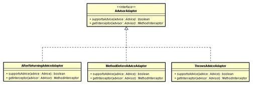
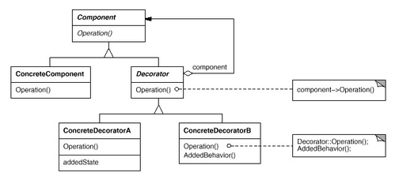
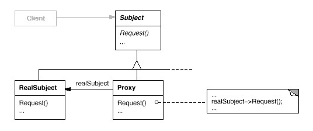
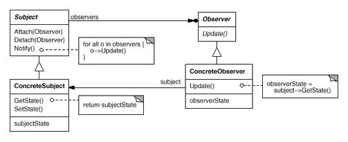
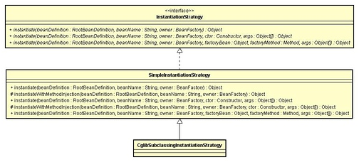

---
title: 设计模式
date: 2019-05-24 22:06:47
categories: 
- 软件开发
- 系统架构
- 架构设计
---

# 设计模式

## 设计模式的分类

五种创建者模式 ： 单例模式，工厂方法模式，抽象工厂模式，建造者模式，原型模式
七种结构型模式 ： 适配器模式，装饰器模式，代理模式，外观模式，桥接模式，组合模式，享元模式
十一种行为模式 ： 策略模式，模板方法模式，观察者模式，迭代子模式，责任链模式，命令模式，备忘录模式，状态模式，访问者模式，中介者模式，解释器模式
并发型模式 ： Future模式,Master_worker模式,Guarded Suspension模式,不变模式,生产者消费者模式　
线程池模式 : HS/HA半同步/半异步模式，L/F领导者跟随者模式


## 设计模式七大原则

1. 单一职责原则【SINGLE RESPONSIBILITY PRINCIPLE】：一个类负责一项职责.
2. 里氏替换原则【LISKOV SUBSTITUTION PRINCIPLE】：继承与派生的规则.
3. 依赖倒置原则【DEPENDENCE INVERSION PRINCIPLE】：高层模块不应该依赖低层模块，二者都应该依赖其抽象；抽象不应该依赖细节；细节应该依赖抽象。即针对接口编程，不要针对实现编程.
4. 接口隔离原则【INTERFACE SEGREGATION PRINCIPLE】：建立单一接口，不要建立庞大臃肿的接口，尽量细化接口，接口中的方法尽量少.
5. 迪米特法则【LOW OF DEMETER】：低耦合，高内聚.
6. 开闭原则【OPEN CLOSE PRINCIPLE】：一个软件实体如类、模块和函数应该对扩展开放，对修改关闭.
7. 组合/聚合复用原则【Composition/Aggregation Reuse Principle(CARP) 】：尽量使用组合和聚合少使用继承的关系来达到复用的原则.

## 23种设计模式

### 五种创建者模式

1. 单例模式(Singleton pattern)： JVM中只创建一个实例存在，反复使用,严格单例需要控制线程安全，反序列化创建对象
2. 工厂方法模式
 - 普通工厂模式(factory method pattern)： 建立一个工厂类，对实现同一接口的类进行实例创建，多个实例共用一个工厂方法
 - 多个工厂方法模式(Abstract factory pattern) ： 提供一个接口, 用于创建相关或依赖对象的家族, 而不需要指定具体类，对普通工厂改进，每一类实例的创建对应一个工厂方法
 - 静态工厂方法模式 ： 对多个工厂方法模式改进，将方法设置为静态的，不再需要创建工厂实例
3. 抽象工厂模式 ： 抽象工厂模式，创建多个工厂类，这样一旦需要增加新的功能，只需增加新的工厂类，不需要修改原有代码
4. 建造者模式(Builder pattern)： 封装一个产品的构造过程, 并允许按步骤构造. 将一个复杂对象的构建与它的表示分离, 使得同样的构建过程可以创建不同的表示, 建造者是创建复合对象，工厂模式创建单个产品
5. 原型模式(prototype pattern)： 对一个已有对象的复制产生一个和原对象类似的新对象，通过clone, 当创建给定类的实例过程很昂贵或很复杂时, 就使用原形模式.
 浅复制 ： 基本数据类型的变量会被重新创建，引用类型还是指向原对象 (Object.clone就是浅拷贝)
 深复制 ： 基本数据类型和引用类型被重新创建 (写入读出二进制流产生新对象)
6. 多例模式(Multition pattern): 在一个解决方案中结合两个或多个模式, 以解决一般或重复发生的问题.


### 七种结构型模式

1. 适配器模式(Adapter pattern)将一个类的接口, 转换成客户期望的另一个接口. 适配器让原本接口不兼容的类可以合作无间. 对象适配器使用组合, 类适配器使用多重继承
 类的适配器模式 ： 接口Targetable拥有和A相同的方法，并有新的适配方法，类Adapter继承A实现Targetable
 对象的适配器模式 ： 和类适配器不同的是，持有A的实例而不是继承A
 接口的适配器模式 ： 解决有时候并不想实现接口中的所有的方法，让抽象类B实现接口C，其他的实现类只需要继承B
2. 装饰器模式(decorator pattern)：动态地将责任附加到对象上, 若要扩展功能, 装饰者提供了比继承更有弹性的替代方案， 给一个对象动态增加新的功能，装饰对象B实现被装饰对象A相同的接口，并且B持有A的实例，用户更关注被装饰后的功能
3. 代理模式(Proxy pattern)： 类Proxy实现被代理的类A相同的接口，并持有A的实例，实现类似装饰器模式，但用户更关注被代理的对象功能 (可参考JDK proxy)
4. 外观模式(facade pattern)： 提供了一个统一的接口, 用来访问子系统中的一群接口. 外观定义了一个高层接口, 让子系统更容易使用, 解决类与类之间的依赖关系，将其他的类组合在一起
5. 桥接模式(Bridge pattern)： 使用桥接模式通过将实现和抽象放在两个不同的类层次中而使它们可以独立改变，把事物和具体实现分开，使得二者可以独立变化 (参考JDBC的不同数据库驱动加载)
6. 组合模式(composite pattern)：允许你将对象组合成树形结构来表现"整体/部分"层次结构. 组合能让客户以一致的方式处理个别对象以及对象组合， 多个对象组合在一起进行操作,整体和个体的设计(参考二叉树，目录)
7. 享元模式(Flyweight Pattern)： 如想让某个类的一个实例能用来提供许多"虚拟实例"， 实现对象的共享(参考数据库连接池的实现，commons-pool开源实现)

### 十一种行为模式


1. 父类和子类
 策略模式(strategy pattern): 多个子类实现同一个接口，用户按自己的选择选用不同的实现，如排序接口，具体实现快排，堆排等
 模板方法模式(Template pattern)： 抽象类定义主方法，子类继承抽象类，选择实现父类的方法，通过调用父类实现对子类的调用
2. 两个类之间
 观察者模式(observer pattern): 在对象之间定义一对多的依赖, 这样一来, 当一个对象改变状态, 依赖它的对象都会收到通知, 并自动更新, 观察者先订阅，被观察者变化时通知列表内的观察者
 迭代子模式(iterator pattern): 用于遍历聚集中的对象，如集合,Iterator持有遍历对象实例，对其进行顺序访问
 责任链模式(Chain of responsibility pattern): 通过责任链模式, 你可以为某个请求创建一个对象链. 每个对象依序检查此请求并对其进行处理或者将它传给链中的下一个对象, 一个实例对象调用自己的实例去处理一个任务，然后递归，始终会有一个对象去处理这个任务，这个查找链不限于链表和树等
 命令模式(Command pattern)： 将"请求"封闭成对象, 以便使用不同的请求,队列或者日志来参数化其他对象. 命令模式也支持可撤销的操作, 实现和请求分开，如controller和service层的分离
3. 类的状态
 备忘录模式(Memento pattern): 当你需要让对象返回之前的状态时(例如, 你的用户请求"撤销"), 你使用备忘录模式，原始类A创建备忘类B保存在C中，B保存A的属性，C只能新增不能修改
 状态模式(State pattern)：允许对象在内部状态改变时改变它的行为, 对象看起来好象改了它的类, 类A有不同状态Status，不同的状态同一方法对应不同的行为
4. 通过中间类
 访问者模式(visitor pattern)： 分离对象数据结构和行为的方法，解决为现有类A新增功能，不能修改A的代码的情况,缺点是不适用数据结构易于变化的场景
 中介者模式(Mediator pattern)： 为降低类的耦合性，只需保持其它类和中间类的关系，不需要类之间相互持有实例对象
 解释器模式(Interpreter pattern)： 类似编译器，正则表达式实现，使用场景受限


### 并发型模式 

```
1. 主动对象模式 Active Object : 自带处理线程，其他请求进入缓冲区等待异步执行，调用和执行分离
2. 阻碍模式 Balking Pattern : 设置一个共享变量，当线程进入一个方法，判断该值是否为真，如果为真说明已经在执行了，返回结束，否则设为真并执行
3. 双重检查锁定 Double Checked Locking ：　参考单例模式实例的初始化双检查
4. 守卫模式 Guarded　：　判断共享变量是否为真，当为假wait,等待条件为真时notify
5. 领导者/追随者模式 Leaders/Followers : 每个线程共享一个事件源，并在三个状态切换leader、follower和processor;leader接受事件，状态变成processor，选举一个新的leader，事件处理完状态变成follower；不需要线程的上下文切换
6. 监测对象模式 Monitor object : 互斥执行和协作。使用ｓｙｎｃｈｒｏｎｉｚｅｄ和wait/notify/notifyAll
7. 读写锁 Read-write lock　：　读写锁分离，增加吞吐量    
8. 调度模式 Scheduler ： 定期处理(Timer)
9. 线程池模式    Thread pool ： 线程被当作资源管理分配
10. 线程特定存储 Thread-specific storage : 将变量保存在ＴｈｒｅａｄLocal中，避免重复创建或从其他地方获取
```

### Java 3种并发实现

```
1. Thread : 直接使用Thread/Runnable/Future
2. Executors和Services ： 线程池技术来控制应用程序的并发，线程数通常和业务相关于cpu不相关，需要上下文切换实现并发，任务从开始到结束时间是不稳定的，执行过程中需要抢占cpu
3. ForkJoin框架和并行流 ： cpu数来控制并行，并发数量不会大于cpu的并发数
```

### Java并发策略

```
1. Future模式:　提高响应速度
2. Master_worker模式: 子任务分配，提高响应速度　
3. Guarded Suspension模式 : 队列缓冲，非立即处理，避免因为请求太多而崩溃
4. 不变模式: 类似String/Double...不需要同步，线程安全
5. 生产者消费者模式　:　缓解两者间的性能差
```

### Spring中的设计模式

1. 简单工厂

又叫做静态工厂方法（StaticFactory Method）模式，但不属于23种GOF设计模式之一。
简单工厂模式的实质是由一个工厂类根据传入的参数，动态决定应该创建哪一个产品类。
Spring中的BeanFactory就是简单工厂模式的体现，根据传入一个唯一的标识来获得Bean对象，但是否是在传入参数后创建还是传入参数前创建这个要根据具体情况来定。

2. 工厂方法（Factory Method）

定义一个用于创建对象的接口，让子类决定实例化哪一个类。Factory Method使一个类的实例化延迟到其子类。
Spring中的FactoryBean就是典型的工厂方法模式。如下图：


3. 单例（Singleton）

保证一个类仅有一个实例，并提供一个访问它的全局访问点。

Spring中的单例模式完成了后半句话，即提供了全局的访问点BeanFactory。但没有从构造器级别去控制单例，这是因为Spring管理的是是任意的Java对象。

4. 适配器（Adapter）

将一个类的接口转换成客户希望的另外一个接口。Adapter模式使得原本由于接口不兼容而不能一起工作的那些类可以一起工作。
Spring中在对于AOP的处理中有Adapter模式的例子，见如下图：


由于Advisor链需要的是MethodInterceptor（拦截器）对象，所以每一个Advisor中的Advice都要适配成对应的MethodInterceptor对象。

5.包装器（Decorator）

动态地给一个对象添加一些额外的职责。就增加功能来说，Decorator模式相比生成子类更为灵活。

Spring中用到的包装器模式在类名上有两种表现：一种是类名中含有Wrapper，另一种是类名中含有Decorator。基本上都是动态地给一个对象添加一些额外的职责。

6. 代理（Proxy）

为其他对象提供一种代理以控制对这个对象的访问。
从结构上来看和Decorator模式类似，但Proxy是控制，更像是一种对功能的限制，而Decorator是增加职责。


Spring的Proxy模式在aop中有体现，比如JdkDynamicAopProxy和Cglib2AopProxy。

7.观察者（Observer）

定义对象间的一种一对多的依赖关系，当一个对象的状态发生改变时，所有依赖于它的对象都得到通知并被自动更新。


Spring中Observer模式常用的地方是listener的实现。如ApplicationListener。

8. 策略（Strategy）

定义一系列的算法，把它们一个个封装起来，并且使它们可相互替换。本模式使得算法可独立于使用它的客户而变化。
Spring中在实例化对象的时候用到Strategy模式，见如下图：


9.模板方法（Template Method）

定义一个操作中的算法的骨架，而将一些步骤延迟到子类中。Template Method使得子类可以不改变一个算法的结构即可重定义该算法的某些特定步骤。

Template Method模式一般是需要继承的。这里想要探讨另一种对Template Method的理解。Spring中的JdbcTemplate，在用这个类时并不想去继承这个类，因为这个类的方法太多，但是我们还是想用到JdbcTemplate已有的稳定的、公用的数据库连接，那么我们怎么办呢？我们可以把变化的东西抽出来作为一个参数传入JdbcTemplate的方法中。但是变化的东西是一段代码，而且这段代码会用到JdbcTemplate中的变量。怎么办？那我们就用回调对象吧。在这个回调对象中定义一个操纵JdbcTemplate中变量的方法，我们去实现这个方法，就把变化的东西集中到这里了。然后我们再传入这个回调对象到JdbcTemplate，从而完成了调用。这可能是Template Method不需要继承的另一种实现方式吧。
