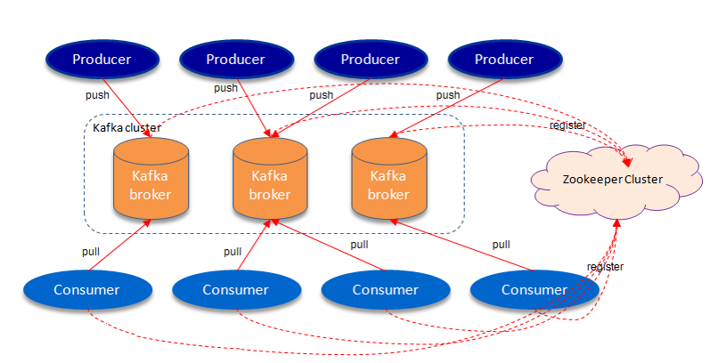
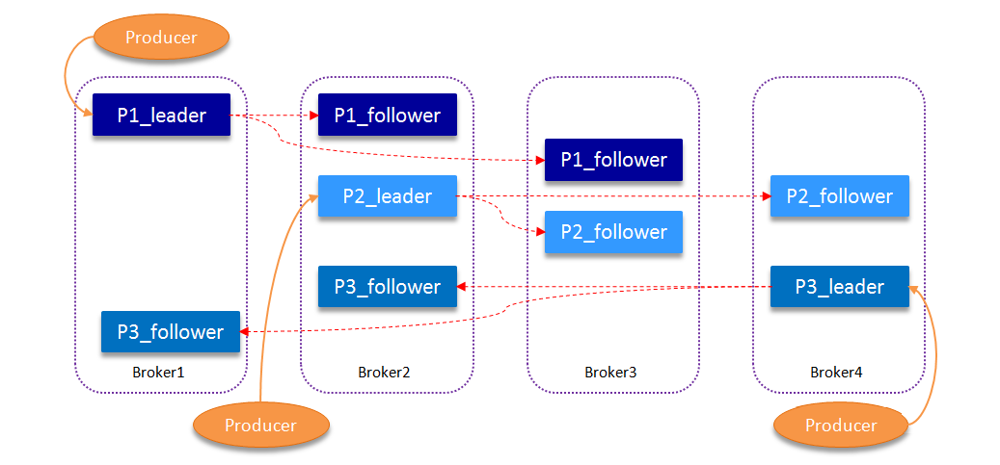

 # Kafka

 Kafka 是一种分布式的，基于发布 / 订阅的消息系统。主要设计目标如下：

- 以时间复杂度为 O(1) 的方式提供消息持久化能力，即使对 TB 级以上数据也能保证常数时间复杂度的访问性能。
- 高吞吐率。即使在非常廉价的商用机器上也能做到单机支持每秒 100K 条以上消息的传输。
- 支持 Kafka Server 间的消息分区，及分布式消费，同时保证每个 Partition 内的消息顺序传输。
- 同时支持离线数据处理和实时数据处理。
- Scale out：支持在线水平扩展。

 [Kafka](https://kafka.apache.org "Kafka") is a distributed, partitioned, replicated commit log service. ”




它提供了一个非常特殊的消息机制，不同于传统的mq

## kafka基基原理

       通常来讲，消息模型可以分为两种：队列和发布-订阅式。队列的处理方式是一组消费者从服务器读取消息，一条消息只有其中的一个消费者来处理。在发布-订阅模型中，消息被广播给所有的消费者，接收到消息的消费者都可以处理此消息。Kafka为这两种模型提供了单一的消费者抽象模型： 消费者组(consumer group)。消费者用一个消费者组名标记自己。

       一个发布在Topic上消息被分发给此消费者组中的一个消费者。假如所有的消费者都在一个组中，那么这就变成了queue模型。假如所有的消费者都在不同的组中，那么就完全变成了发布-订阅模型。更通用的， 我们可以创建一些消费者组作为逻辑上的订阅者。每个组包含数目不等的消费者，一个组内多个消费者可以用来扩展性能和容错。       

       并且，kafka能够保证生产者发送到一个特定的Topic的分区上，消息将会按照它们发送的顺序依次加入，也就是说，如果一个消息M1和M2使用相同的producer发送，M1先发送，那么M1将比M2的offset低，并且优先的出现在日志中。消费者收到的消息也是此顺序。如果一个Topic配置了复制因子（replication facto）为N,那么可以允许N-1服务器宕机而不丢失任何已经提交（committed）的消息。此特性说明kafka有比传统的消息系统更强的顺序保证。但是，相同的消费者组中不能有比分区更多的消费者，否则多出的消费者一直处于空等待，不会收到消息。

## 主题和日志 (Topic和Log)

      每一个分区(partition)都是一个顺序的、不可变的消息队列,并且可以持续的添加。分区中的消息都被分了一个序列号,称之为偏移量(offset),在每个分区中此偏移量都是唯一的。Kafka集群保持所有的消息,直到它们过期,无论消息是否被消费了。实际上消费者所持有的仅有的元数据就是这个偏移量，也就是消费者在这个log中的位置。 这个偏移量由消费者控制：正常情况当消费者消费消息的时候，偏移量也线性的的增加。但是实际偏移量由消费者控制，消费者可以将偏移量重置为更老的一个偏移量，重新读取消息。 可以看到这种设计对消费者来说操作自如， 一个消费者的操作不会影响其它消费者对此log的处理。 再说说分区。Kafka中采用分区的设计有几个目的。一是可以处理更多的消息，不受单台服务器的限制。Topic拥有多个分区意味着它可以不受限的处理更多的数据。第二，分区可以作为并行处理的单元，稍后会谈到这一点。

## 分布式(Distribution)

       Log的分区被分布到集群中的多个服务器上。每个服务器处理它分到的分区。根据配置每个分区还可以复制到其它服务器作为备份容错。 每个分区有一个leader，零或多个follower。Leader处理此分区的所有的读写请求，而follower被动的复制数据。如果leader宕机，其它的一个follower会被推举为新的leader。 一台服务器可能同时是一个分区的leader，另一个分区的follower。 这样可以平衡负载，避免所有的请求都只让一台或者某几台服务器处理。

## 与传统的mq区别
- 更快！单机上万TPS
- 传统的MQ，消息被消化掉后会被mq删除，而kafka中消息被消化后不会被删除，而是到配置的expire时间后，才删除
- 传统的MQ，消息的Offset是由MQ维护，而kafka中消息的Offset是由客户端自己维护
- 分布式，把写入压力均摊到各个节点。可以通过增加节点降低压力

------------
## 基本术语

### Producer/Consumer
这两个与传统的MQ一样

### Broker
集群中的KafkaServer，用来提供Partition服务

### Topic
Kafka中的topic其实对应传统MQ的channel，即消息管道，例如同一业务用同一根管道。Topic 在逻辑上可以被认为是一个 queue，每条消费都必须指定它的 Topic，可以简单理解为必须指明把这条消息放进哪个 queue 里。为了使得 Kafka 的吞吐率可以线性提高，物理上把 Topic 分成一个或多个 Partition，每个 Partition 在物理上对应一个文件夹，该文件夹下存储这个 Partition 的所有消息和索引文件

### Partition 
假如说传统的MQ，传输消息的通道(channel)是一条双车道公路，那么Kafka中，Topic就是一个N车道的高速公路。每个车道都可以行车，而每个车道就是Partition。

一个Topic中可以有一个或多个partition。
一个Broker上可以跑一个或多个Partition。集群中尽量保证partition的均匀分布，例如定义了一个有3个partition的topic，而只有两个broker，那么一个broker上跑两个partition，而另一个是1个。但是如果有3个broker，必然是3个broker上各跑一个partition。

Partition中严格按照消息进入的顺序排序
一个从Producer发送来的消息，只会进入Topic的某一个Partition（除非特殊实现Producer要求消息进入所有Partition）
Consumer可以自己决定从哪个Partition读取数据



### Offset
单个Partition中的消息的顺序ID，例如第一个进入的Offset为0，第二个为1，以此类推。传统的MQ，Offset是由MQ自己维护，而kafka是由client维护

### Replica
Kafka从0.8版本开始，支持消息的HA，通过消息复制的方式。在创建时，我们可以指定一个topic有几个partition，以及每个partition有几个复制。复制的过程有同步和异步两种，根据性能需要选取。 正常情况下，写和读都是访问leader，只有当leader挂掉或者手动要求重新选举，kafka会从几个复制中选举新的leader。

### Producer 消息路由

Kafka会统计replica与leader的同步情况。当一个replica与leader数据相差不大，会被认为是一个"in-sync" replica。只有"in-sync" replica才有资格参与重新选举。

Producer 发送消息到 broker 时，会根据 Paritition 机制选择将其存储到哪一个 Partition。如果 Partition 机制设置合理，所有消息可以均匀分布到不同的 Partition 里，这样就实现了负载均衡。如果一个 Topic 对应一个文件，那这个文件所在的机器 I/O 将会成为这个 Topic 的性能瓶颈，而有了 Partition 后，不同的消息可以并行写入不同 broker 的不同 Partition 里，极大的提高了吞吐率。可以在 $KAFKA_HOME/config/server.properties 中通过配置项 num.partitions 来指定新建 Topic 的默认 Partition 数量

在发送一条消息时，可以指定这条消息的 key，Producer 根据这个 key 和 Partition 机制来判断应该将这条消息发送到哪个 Parition

### ConsumerGroup
一个或多个Consumer构成一个ConsumerGroup，一个消息应该只能被同一个ConsumerGroup中的一个Consumer消化掉，但是可以同时发送到不同ConsumerGroup。

通常的做法，一个Consumer去对应一个Partition。

传统MQ中有queuing（消息）和publish-subscribe（订阅）模式，Kafka中也支持：

当所有Consumer具有相同的ConsumerGroup时，该ConsumerGroup中只有一个Consumer能收到消息，就是 queuing 模式
当所有Consumer具有不同的ConsumerGroup时，每个ConsumerGroup会收到相同的消息，就是 publish-subscribe 模式


1. producer：
　　消息生产者，发布消息到 kafka 集群的终端或服务。
2. broker：
　　kafka 集群中包含的服务器。
3. topic：
　　每条发布到 kafka 集群的消息属于的类别，即 kafka 是面向 topic 的。
4. partition：
　　partition 是物理上的概念，每个 topic 包含一个或多个 partition。kafka 分配的单位是 partition。
5. consumer：
　　从 kafka 集群中消费消息的终端或服务。
6. Consumer group：
　　high-level consumer API 中，每个 consumer 都属于一个 consumer group，每条消息只能被 consumer group 中的一个 Consumer 消费，但可以被多个 consumer group 消费。
7. replica：
　　partition 的副本，保障 partition 的高可用。
8. leader：
　　replica 中的一个角色， producer 和 consumer 只跟 leader 交互。
9. follower：
　　replica 中的一个角色，从 leader 中复制数据。
10. controller：
　　kafka 集群中的其中一个服务器，用来进行 leader election 以及 各种 failover。
12. zookeeper：
　　kafka 通过 zookeeper 来存储集群的 meta 信息。

## Kafka delivery guarantee

有这么几种可能的 delivery guarantee：

At most once 消息可能会丢，但绝不会重复传输

At least one 消息绝不会丢，但可能会重复传输

Exactly once 每条消息肯定会被传输一次且仅传输一次，很多时候这是用户所想要的。

## Kafka 为何需要 High Available

Replication用来保证HA.

引入 Replication 之后，同一个 Partition 可能会有多个 Replica，而这时需要在这些 Replication 之间选出一个 Leader，Producer 和 Consumer 只与这个 Leader 交互，其它 Replica 作为 Follower 从 Leader 中复制数据。

因为需要保证同一个 Partition 的多个 Replica 之间的数据一致性（其中一个宕机后其它 Replica 必须要能继续服务并且即不能造成数据重复也不能造成数据丢失）。如果没有一个 Leader，所有 Replica 都可同时读 / 写数据，那就需要保证多个 Replica 之间互相（N×N 条通路）同步数据，数据的一致性和有序性非常难保证，大大增加了 Replication 实现的复杂性，同时也增加了出现异常的几率。而引入 Leader 后，只有 Leader 负责数据读写，Follower 只向 Leader 顺序 Fetch 数据（N 条通路），系统更加简单且高效

### 如何将所有 Replica 均匀分布到整个集群

为了更好的做负载均衡，Kafka 尽量将所有的 Partition 均匀分配到整个集群上。一个典型的部署方式是一个 Topic 的 Partition 数量大于 Broker 的数量。同时为了提高 Kafka 的容错能力，也需要将同一个 Partition 的 Replica 尽量分散到不同的机器

Kafka 的 Data Replication 需要解决如下问题：

- 怎样 Propagate 消息
- 在向 Producer 发送 ACK 前需要保证有多少个 Replica 已经收到该消息
- 怎样处理某个 Replica 不工作的情况
- 怎样处理 Failed Replica 恢复回来的情况

Producer 在发布消息到某个 Partition 时，先通过 ZooKeeper 找到该 Partition 的 Leader，然后无论该 Topic 的 Replication Factor 为多少（也即该 Partition 有多少个 Replica），Producer 只将该消息发送到该 Partition 的 Leader。Leader 会将该消息写入其本地 Log。每个 Follower 都从 Leader pull 数据。这种方式上，Follower 存储的数据顺序与 Leader 保持一致。Follower 在收到该消息并写入其 Log 后，向 Leader 发送 ACK。一旦 Leader 收到了 ISR 中的所有 Replica 的 ACK，该消息就被认为已经 commit 了，Leader 将增加 HW 并且向 Producer 发送 ACK。

为了提高性能，每个 Follower 在接收到数据后就立马向 Leader 发送 ACK，而非等到数据写入 Log 中。因此，对于已经 commit 的消息，Kafka 只能保证它被存于多个 Replica 的内存中，而不能保证它们被持久化到磁盘中，也就不能完全保证异常发生后该条消息一定能被 Consumer 消费

Consumer 读消息也是从 Leader 读取，只有被 commit 过的消息（offset 低于 HW 的消息）才会暴露给 Consumer。

### ACK 前需要保证有多少个备份

Broker 存活包含两个条件，一是它必须维护与 ZooKeeper 的 session（这个通过 ZooKeeper 的 Heartbeat 机制来实现）。二是 Follower 必须能够及时将 Leader 的消息复制过来，不能“落后太多”

Leader 会跟踪与其保持同步的 Replica 列表，该列表称为 ISR（即 in-sync Replica）。如果一个 Follower 宕机，或者落后太多，Leader 将把它从 ISR 中移除。这里所描述的“落后太多”指 Follower 复制的消息落后于 Leader 后的条数超过预定值或者 Follower 超过一定时间

Kafka 的复制机制既不是完全的同步复制，也不是单纯的异步复制。事实上，完全同步复制要求所有能工作的 Follower 都复制完，这条消息才会被认为 commit，这种复制方式极大的影响了吞吐率（高吞吐率是 Kafka 非常重要的一个特性）。而异步复制方式下，Follower 异步的从 Leader 复制数据，数据只要被 Leader 写入 log 就被认为已经 commit，这种情况下如果 Follower 都复制完都落后于 Leader，而如果 Leader 突然宕机，则会丢失数据。而 Kafka 的这种使用 ISR 的方式则很好的均衡了确保数据不丢失以及吞吐率。Follower 可以批量的从 Leader 复制数据，这样极大的提高复制性能（批量写磁盘），极大减少了 Follower 与 Leader 的差距。

### Leader Election 算法

一种非常常用的选举 leader 的方式是“Majority Vote”（“少数服从多数”），但 Kafka 并未采用这种方式。这种模式下，如果我们有 2f+1 个 Replica（包含 Leader 和 Follower），那在 commit 之前必须保证有 f+1 个 Replica 复制完消息，为了保证正确选出新的 Leader，fail 的 Replica 不能超过 f 个。因为在剩下的任意 f+1 个 Replica 里，至少有一个 Replica 包含有最新的所有消息。这种方式有个很大的优势，系统的 latency 只取决于最快的几个 Broker，而非最慢那个。Majority Vote 也有一些劣势，为了保证 Leader Election 的正常进行，它所能容忍的 fail 的 follower 个数比较少。如果要容忍 1 个 follower 挂掉，必须要有 3 个以上的 Replica，如果要容忍 2 个 Follower 挂掉，必须要有 5 个以上的 Replica。也就是说，在生产环境下为了保证较高的容错程度，必须要有大量的 Replica，而大量的 Replica 又会在大数据量下导致性能的急剧下降

Kafka 在 ZooKeeper 中动态维护了一个 ISR（in-sync replicas），这个 ISR 里的所有 Replica 都跟上了 leader，只有 ISR 里的成员才有被选为 Leader 的可能。在这种模式下，对于 f+1 个 Replica，一个 Partition 能在保证不丢失已经 commit 的消息的前提下容忍 f 个 Replica 的失败

## ISR 实现可用性与数据一致性的动态平衡

常用数据复制及一致性方案

### Master-Slave

- RDBMS 的读写分离即为典型的 Master-Slave 方案
- 同步复制可保证强一致性但会影响可用性
- 异步复制可提供高可用性但会降低一致性

### WNR

- 主要用于去中心化的分布式系统中。DynamoDB 与 Cassandra 即采用此方案或其变种
- N 代表总副本数，W 代表每次写操作要保证的最少写成功的副本数，R 代表每次读至少要读取的副本数
- 当 W+R>N 时，可保证每次读取的数据至少有一个副本拥有最新的数据
- 多个写操作的顺序难以保证，可能导致多副本间的写操作顺序不一致。Dynamo 通过向量时钟保证最终一致性

### Paxos 及其变种

- Google 的 Chubby，Zookeeper 的原子广播协议（Zab），RAFT 等

### 基于 ISR 的数据复制方案

Kafka 的数据复制是以 Partition 为单位的。而多个备份间的数据复制，通过 Follower 向 Leader 拉取数据完成Kafka 的数据复制方案接近于上文所讲的 Master-Slave 方案。不同的是，Kafka 既不是完全的同步复制，也不是完全的异步复制，而是基于 ISR 的动态复制方案

ISR，也即 In-sync Replica。每个 Partition 的 Leader 都会维护这样一个列表，该列表中，包含了所有与之同步的 Replica（包含 Leader 自己）。每次数据写入时，只有 ISR 中的所有 Replica 都复制完，Leader 才会将其置为 Commit，它才能被 Consumer 所消费。

这种方案，与同步复制非常接近。但不同的是，这个 ISR 是由 Leader 动态维护的。如果 Follower 不能紧“跟上”Leader，它将被 Leader 从 ISR 中移除，待它又重新“跟上”Leader 后，会被 Leader 再次加加 ISR 中。每次改变 ISR 后，Leader 都会将最新的 ISR 持久化到 Zookeeper 中。Kafka 删除 Segment 的方式，是直接删除 Segment 对应的整个 log 文件和整个 index 文件而非删除文件中的部分内容。

## 高效使用磁盘

### 顺序写磁盘

Kafka 的整个设计中，Partition 相当于一个非常长的数组，而 Broker 接收到的所有消息顺序写入这个大数组中。同时 Consumer 通过 Offset 顺序消费这些数据，并且不删除已经消费的数据，从而避免了随机写磁盘的过程。

由于磁盘有限，不可能保存所有数据，实际上作为消息系统 Kafka 也没必要保存所有数据，需要删除旧的数据。而这个删除过程，并非通过使用“读 - 写”模式去修改文件，而是将 Partition 分为多个 Segment，每个 Segment 对应一个物理文件，通过删除整个文件的方式去删除 Partition 内的数据。这种方式清除旧数据的方式，也避免了对文件的随机写操作。

### 充分利用 Page Cache

使用 Page Cache 的好处如下

- I/O Scheduler 会将连续的小块写组装成大块的物理写从而提高性能
- I/O Scheduler 会尝试将一些写操作重新按顺序排好，从而减少磁盘头的移动时间
- 充分利用所有空闲内存（非 JVM 内存）。如果使用应用层 Cache（即 JVM 堆内存），会增加 GC 负担
- 读操作可直接在 Page Cache 内进行。如果消费和生产速度相当，甚至不需要通过物理磁盘（直接通过 Page Cache）交换数据
- 如果进程重启，JVM 内的 Cache 会失效，但 Page Cache 仍然可用

## 零拷贝
Kafka 中存在大量的网络数据持久化到磁盘（Producer 到 Broker）和磁盘文件通过网络发送（Broker 到 Consumer）的过程。这一过程的性能直接影响 Kafka 的整体吞吐量。

### 传统模式下的四次拷贝与四次上下文切换

以将磁盘文件通过网络发送为例。传统模式下，一般使用如下伪代码所示的方法先将文件数据读入内存，然后通过 Socket 将内存中的数据发送出去。这一过程实际上发生了四次数据拷贝。首先通过系统调用将文件数据读入到内核态 Buffer（DMA 拷贝），然后应用程序将内存态 Buffer 数据读入到用户态 Buffer（CPU 拷贝），接着用户程序通过 Socket 发送数据时将用户态 Buffer 数据拷贝到内核态 Buffer（CPU 拷贝），最后通过 DMA 拷贝将数据拷贝到 NIC Buffer。同时，还伴随着四次上下文切换

### sendfile 和 transferTo 实现零拷贝

而 Linux 2.4+ 内核通过 sendfile 系统调用，提供了零拷贝。数据通过 DMA 拷贝到内核态 Buffer 后，直接通过 DMA 拷贝到 NIC Buffer，无需 CPU 拷贝。这也是零拷贝这一说法的来源。除了减少数据拷贝外，因为整个读文件 - 网络发送由一个 sendfile 调用完成，整个过程只有两次上下文切换，因此大大提高了性能。


## 基本交互原理

每个Topic被创建后，在zookeeper上存放有其metadata，包含其分区信息、replica信息、LogAndOffset等 
默认路径/brokers/topics/<topic_id>/partitions/<partition_index>/state

Producer可以通过zookeeper获得topic的broker信息，从而得知需要往哪写数据。

Consumer也从zookeeper上获得该信息，从而得知要监听哪个partition。

## 创建一个Producer

Kafka提供了java api，Producer特别的简单，举传输byte[] 为例

```java
Properties p = new Properties();
props.put("metadata.broker.list", "10.1.110.21:9092");
ProducerConfig config = new ProducerConfig(props);
Producer producer = new Producer<String, byte[]>(config);
producer.send(byte[] msg);
```
## 创建一个Consumer

Kafka提供了两种java的Consumer API：High Level Consumer和Simple Consumer

如何保证kafka的高容错性？

producer不使用批量接口，并采用同步模型持久化消息。
consumer不采用批量化，每消费一次就更新offset


## Setup Kafka
[Quick Start](https://kafka.apache.org/quickstart "Quick Start")

### Windows
cd F:\Develop\kafka_2.11-1.0.0\
#### 1. Start the server
**start zookeeper**
bin\windows\zookeeper-server-start.bat config\zookeeper.properties
**start kafka**
bin\windows\kafka-server-start.bat config\server.properties

#### 2. Create a topic
Let's create a topic named "test" with a single partition and only one replica:
`bin\windows\kafka-topics.bat --create --zookeeper localhost:2181 --replication-factor 1 --partitions 1 --topic test`

We can now see that topic if we run the list topic command:
` bin\windows\kafka-topics.bat --list --zookeeper localhost:2181`

#### 3. Send some messages

Kafka comes with a command line client that will take input from a file or from standard input and send it out as messages to the Kafka cluster. By default, each line will be sent as a separate message.

Run the producer and then type a few messages into the console to send to the server.

`bin\windows\kafka-console-producer.bat --broker-list localhost:9092 --topic test`

#### 4. Start a consumer

Kafka also has a command line consumer that will dump out messages to standard output.

`bin\windows\kafka-console-consumer.bat --bootstrap-server localhost:9092 --topic test --from-beginning`


