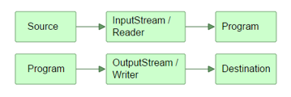

[TOC]

## 输入和输出 – 数据源和目标媒介
Java的IO包主要关注的是从原始数据源的读取以及输出原始数据到目标媒介。以下是最典型的数据源和目标媒介：
- 文件
- 管道
- 网络连接
- 内存缓存
- System.in, System.out, System.error

## Java IO的用途和特征

Java IO中包含了许多InputStream、OutputStream、Reader、Writer的子类

- 文件访问
- 网络访问
- 内存缓存访问
- 线程内部通信(管道)
- 缓冲
- 过滤
- 解析
- 读写文本 (Readers / Writers)
- 读写基本类型数据 (long, int etc.)
- 读写对象

## 流

在Java IO中，流是一个核心的概念。流从概念上来说是一个连续的数据流。你既可以从流中读取数据，也可以往流中写数据



InputStream和Reader与数据源相关联，OutputStream和writer与目标媒介相关联

### InputStream, OutputStream, Reader 和Writer

一个程序需要InputStream或者Reader从数据源读取数据，需要OutputStream或者Writer将数据写入到目标媒介中。流和数组不一样，不能通过索引读写数据。在流中，你也不能像数组那样前后移动读取数据，除非使用RandomAccessFile 处理文件。流仅仅只是一个连续的数据流。


- java.io.InputStream类是所有Java IO输入流的基类。如果你正在开发一个从流中读取数据的组件，请尝试用InputStream替代任何它的子类(比如FileInputStream)进行开发

- java.io.OutputStream是Java IO中所有输出流的基类。如果你正在开发一个能够将数据写入流中的组件，请尝试使用OutputStream替代它的所有子类


IO Reader/Writer 例子

```java
Reader reader = new FileReader("c:\\data\\myfile.txt");
int data = reader.read();
while(data != -1){
    char dataChar = (char) data;
    data = reader.read();
}
```

```java
Writer writer = new FileWriter("c:\\data\\file-output.txt"); 
writer.write("Hello World Writer"); 
writer.close();
```

### 整合Reader与InputStream

一个Reader可以和一个InputStream相结合。如果你有一个InputStream输入流，并且想从其中读取字符，可以把这个InputStream包装到InputStreamReader中
`Reader reader = new InputStreamReader(inputStream);`

### 整合Writer和OutputStream
与Reader和InputStream类似，一个Writer可以和一个OutputStream相结合。把OutputStream包装到OutputStreamWriter中，所有写入到OutputStreamWriter的字符都将会传递给OutputStream
`Writer writer = new OutputStreamWriter(outputStream);`

###整合Reader和Writer
和字节流一样，Reader和Writer可以相互结合实现更多更有趣的IO，工作原理和把Reader与InputStream或者Writer与OutputStream相结合类似。
```java
Reader reader = new BufferedReader(new FileReader(...));

Writer writer = new BufferedWriter(new FileWriter(...));
```

## 管道

Java IO中的管道为运行在同一个JVM中的两个线程提供了通信的能力。所以管道也可以作为数据源以及目标媒介。不能利用管道与不同的JVM中的线程通信

### 通过Java IO创建管道

可以通过Java IO中的PipedOutputStream和PipedInputStream创建管道。一个PipedInputStream流应该和一个PipedOutputStream流相关联。一个线程通过PipedOutputStream写入的数据可以被另一个线程通过相关联的PipedInputStream读取出来。

```java
public static void main(Stringp[] args){
    final PipedOutputStream output = new PipedOutputStream();
    final PipedInputStream input = new PipedInputStream(output);
    
    Thread thread1 = new Thread(new Runnable(){
        public void run() {
            output.write("pipe1".getBytes())
        }
    })；

    Thread thread2 = new Thread(new Runnable(){
        public void run() {
            int data = input.read();
            while(data != -1){
                System.out.print((char) data);
                data = input.read();
            }
        }
    })；

    thread1.start();
    thread2.start();
}
```
### 管道和线程
当使用两个相关联的管道流时，务必将它们分配给不同的线程。read()方法和write()方法调用时会导致流阻塞，这意味着如果你尝试在一个线程中同时进行读和写，可能会导致线程死锁。


参考： [并发线程网](http://ifeve.com/java-io/)