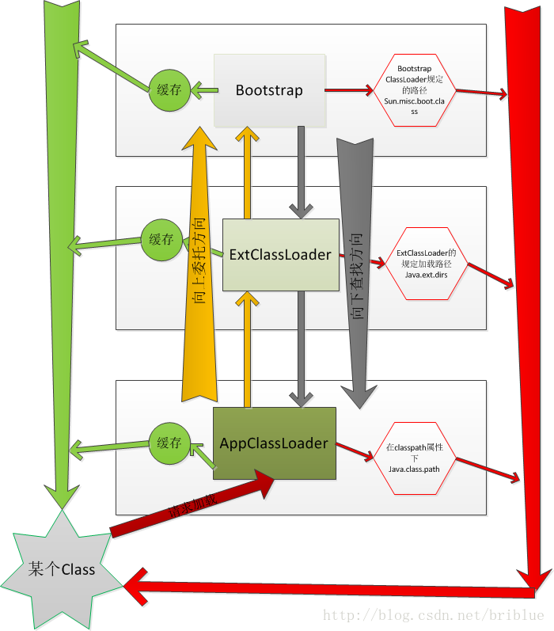
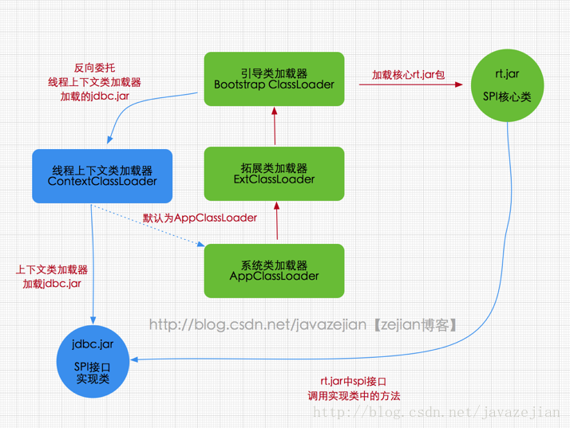
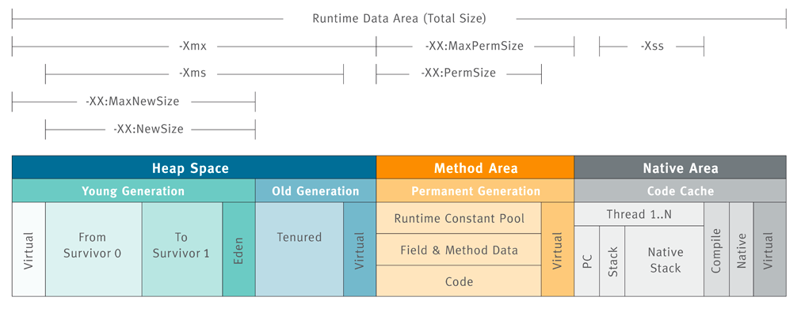
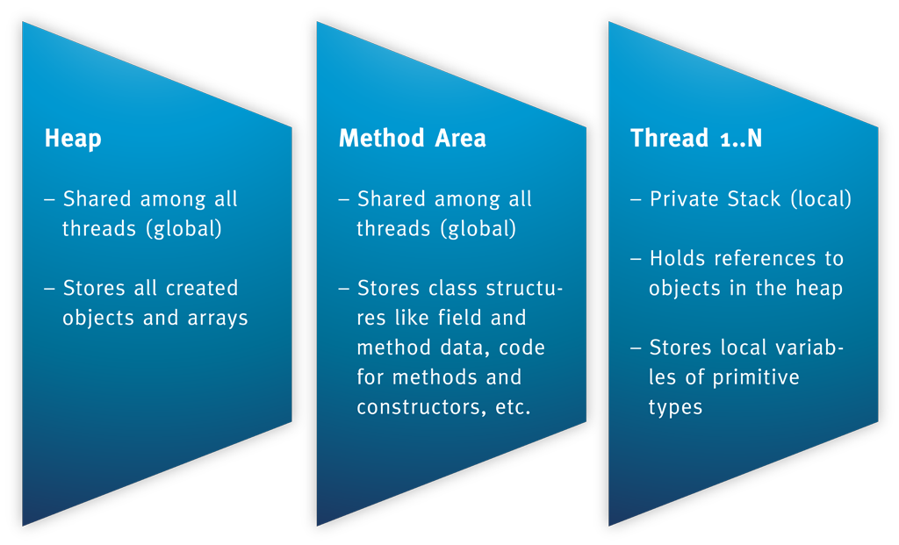
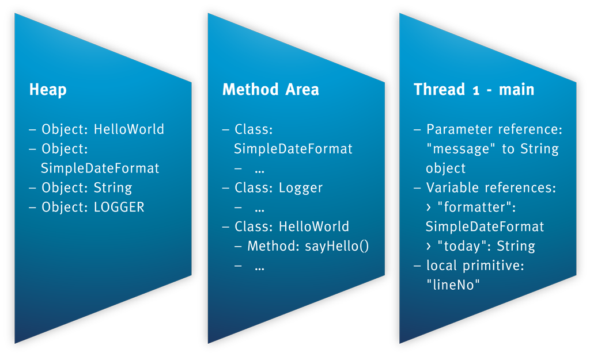
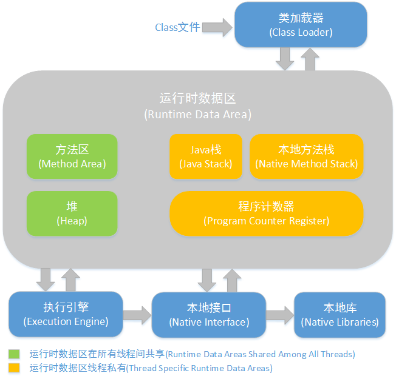
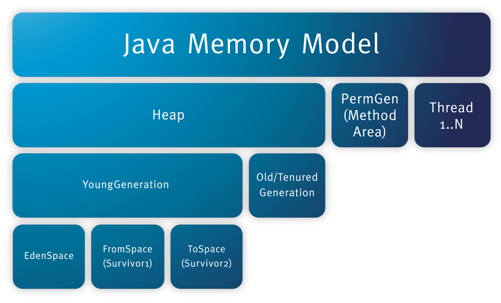

# Java内存模型与classloader

## Java Classloader

### Java语言系统自带有三个类加载器: 

- Bootstrap ClassLoader 最顶层的加载类，Bootstrp加载器是用C++语言写的，主要加载核心类库，%JRE_HOME%\lib下的rt.jar、resources.jar、charsets.jar和class等。另外需要注意的是可以通过启动jvm时指定-Xbootclasspath和路径来改变Bootstrap ClassLoader的加载目录。比如java -Xbootclasspath/a:path被指定的文件追加到默认的bootstrap路径中。我们可以打开我的电脑，在上面的目录下查看，看看这些jar包是不是存在于这个目录。
- Extention ClassLoader 扩展的类加载器，Bootstrp loader加载ExtClassLoader,并且将ExtClassLoader的父加载器设置为Bootstrp loader.ExtClassLoader是用Java写的，加载目录%JRE_HOME%\lib\ext目录下的jar包和class文件。还可以加载-D java.ext.dirs选项指定的目录。
- Appclass Loader也称为SystemAppClass 加载当前应用的classpath的所有类，Bootstrp loader加载完ExtClassLoader后，就会加载AppClassLoader,并且将AppClassLoader的父加载器指定为 ExtClassLoader。。


### 类的加载顺序
1. Bootstrap CLassloder 
2. Extention ClassLoader 
3. AppClassLoader

双亲委派类加载顺序： 


1. 一个AppClassLoader查找资源时，先看看缓存是否有，缓存有从缓存中获取，否则委托给父加载器。 
2. 递归，重复第1部的操作。 
3. 如果ExtClassLoader也没有加载过，则由Bootstrap ClassLoader出面，它首先查找缓存，如果没有找到的话，就去找自己的规定的路径下，也就是sun.mic.boot.class下面的路径。找到就返回，没有找到，让子加载器自己去找。 
4. Bootstrap ClassLoader如果没有查找成功，则ExtClassLoader自己在java.ext.dirs路径中去查找，查找成功就返回，查找不成功，再向下让子加载器找。 
5. ExtClassLoader查找不成功，AppClassLoader就自己查找，在java.class.path路径下查找。找到就返回。如果没有找到就让子类找，如果没有子类会怎么样？抛出各种异常。


### 线程上下文类加载器

在Java应用中存在着很多服务提供者接口（Service Provider Interface，SPI），这些接口允许第三方为它们提供实现，如常见的 SPI 有 JDBC、JNDI等，这些 SPI 的接口属于 Java 核心库，一般存在rt.jar包中，由Bootstrap类加载器加载，而 SPI 的第三方实现代码则是作为Java应用所依赖的 jar 包被存放在classpath路径下，由于SPI接口中的代码经常需要加载具体的第三方实现类并调用其相关方法，但SPI的核心接口类是由引导类加载器来加载的，而Bootstrap类加载器无法直接加载SPI的实现类，同时由于双亲委派模式的存在，Bootstrap类加载器也无法反向委托AppClassLoader加载器SPI的实现类。在这种情况下，我们就需要一种特殊的类加载器来加载第三方的类库，而线程上下文类加载器就是很好的选择。 

线程上下文类加载器（contextClassLoader）是从 JDK 1.2 开始引入的，我们可以通过java.lang.Thread类中的getContextClassLoader()和 setContextClassLoader(ClassLoader cl)方法来获取和设置线程的上下文类加载器。如果没有手动设置上下文类加载器，线程将继承其父线程的上下文类加载器，初始线程的上下文类加载器是系统类加载器（AppClassLoader）,在线程中运行的代码可以通过此类加载器来加载类和资源，如下图所示，以jdbc.jar加载为例



## Java内存模型

Java内存模型在JVM specification, Java SE 7 Edition, and mainly in the chapters “2.5 Runtime Data Areas” and “2.6 Frames”中有详细的说明。

JVM内存结构主要有三大块：堆内存、方法区和栈。堆内存是JVM中最大的一块由年轻代和老年代组成，而年轻代内存又被分成三部分，Eden空间、From Survivor空间、To Survivor空间,默认情况下年轻代按照8:1:1的比例来分配；

方法区存储类信息、常量、静态变量等数据，是线程共享的区域，为与Java堆区分，方法区还有一个别名Non-Heap(非堆)；栈又分为java虚拟机栈和本地方法栈主要用于方法的执行。

在通过一张图来了解如何通过参数来控制各区域的内存大小

方法区也被称为持久代（PermGen）。



方法的执行都是伴随着线程的。原始类型的本地变量以及引用都存放在线程栈中。而引用关联的对象比如String，都存在在堆中。如下面程序
```java
import java.text.SimpleDateFormat;
import java.util.Date;
import org.apache.log4j.Logger;

public class HelloWorld {
    private static Logger LOGGER = Logger.getLogger(HelloWorld.class.getName());

    public void sayHello(String message) {
        SimpleDateFormat formatter = new SimpleDateFormat("dd.MM.YYYY");
        String today = formatter.format(new Date());
        LOGGER.info(today + ": " + message);
    }
}
```


控制参数
```
-Xms设置堆的最小空间大小。
-Xmx设置堆的最大空间大小。
-XX:NewSize设置新生代最小空间大小。
-XX:MaxNewSize设置新生代最大空间大小。
-XX:PermSize设置永久代最小空间大小。
-XX:MaxPermSize设置永久代最大空间大小。
-Xss设置每个线程的堆栈大小。
```

没有直接设置老年代的参数，但是可以设置堆空间大小和新生代空间大小两个参数来间接控制。

老年代空间大小=堆空间大小-年轻代大空间大小

从更高的一个维度再次来看JVM和系统调用之间的关系


##  Java内存结构
垃圾回收(GC)触发的内存自动管理。Java的内存结构包含如下部分：


### Java堆（Heap）
对于大多数应用来说，Java堆（Java Heap）是Java虚拟机所管理的内存中最大的一块。Java堆是被所有线程共享的一块内存区域，在虚拟机启动时创建。此内存区域的唯一目的就是存放对象实例，几乎所有的对象实例都在这里分配内存。

Java堆是垃圾收集器管理的主要区域，因此很多时候也被称做“GC堆”。如果从内存回收的角度看，由于现在收集器基本都是采用的分代收集算法，所以Java堆中还可以细分为：新生代和老年代；再细致一点的有Eden空间、From Survivor空间、To Survivor空间等。

根据Java虚拟机规范的规定，Java堆可以处于物理上不连续的内存空间中，只要逻辑上是连续的即可，就像我们的磁盘空间一样。在实现时，既可以实现成固定大小的，也可以是可扩展的，不过当前主流的虚拟机都是按照可扩展来实现的（通过-Xmx和-Xms控制）。

如果在堆中没有内存完成实例分配，并且堆也无法再扩展时，将会抛出OutOfMemoryError异常。

堆内存同样被划分成了多个区域：
包含伊甸（Eden）和幸存者区域(Survivor Sapce)的新生代（Young generation）
老年代（Old Generation）
不同区域的存放的对象拥有不同的生命周期：

- 新建（New）或者短期的对象存放在Eden区域；
- 幸存的或者中期的对象将会从Eden区域拷贝到Survivor区域；
- 始终存在或者长期的对象将会从Survivor拷贝到Old Generation；
- 生命周期来划分对象，可以消耗很短的时间和CPU做一次小的垃圾回收（GC）。原因是跟C一样，内存的释放（通过销毁对象）通过2种不同的GC实现：Young GC、Full GC。

为了检查所有的对象是否能够被销毁，Young GC会标记不能销毁的对象，经过多次标记后，对象将会被移动到老年代中。

### 方法区（Method Area）
  方法区（Method Area）与Java堆一样，是各个线程共享的内存区域，它用于存储已被虚拟机加载的类信息、常量、静态变量、即时编译器编译后的代码等数据。虽然Java虚拟机规范把方法区描述为堆的一个逻辑部分，但是它却有一个别名叫做Non-Heap（非堆），目的应该是与Java堆区分开来。

对于习惯在HotSpot虚拟机上开发和部署程序的开发者来说，很多人愿意把方法区称为“永久代”（Permanent Generation），本质上两者并不等价，仅仅是因为HotSpot虚拟机的设计团队选择把GC分代收集扩展至方法区，或者说使用永久代来实现方法区而已。

Java虚拟机规范对这个区域的限制非常宽松，除了和Java堆一样不需要连续的内存和可以选择固定大小或者可扩展外，还可以选择不实现垃圾收集。相对而言，垃圾收集行为在这个区域是比较少出现的，但并非数据进入了方法区就如永久代的名字一样“永久”存在了。这个区域的内存回收目标主要是针对常量池的回收和对类型的卸载，一般来说这个区域的回收“成绩”比较难以令人满意，尤其是类型的卸载，条件相当苛刻，但是这部分区域的回收确实是有必要的。

根据Java虚拟机规范的规定，当方法区无法满足内存分配需求时，将抛出OutOfMemoryError异常。 

### 程序计数器（Program Counter Register）
程序计数器（Program Counter Register）是一块较小的内存空间，它的作用可以看做是当前线程所执行的字节码的行号指示器。在虚拟机的概念模型里（仅是概念模型，各种虚拟机可能会通过一些更高效的方式去实现），字节码解释器工作时就是通过改变这个计数器的值来选取下一条需要执行的字节码指令，分支、循环、跳转、异常处理、线程恢复等基础功能都需要依赖这个计数器来完成。 
由于Java虚拟机的多线程是通过线程轮流切换并分配处理器执行时间的方式来实现的，在任何一个确定的时刻，一个处理器（对于多核处理器来说是一个内核）只会执行一条线程中的指令。因此，为了线程切换后能恢复到正确的执行位置，每条线程都需要有一个独立的程序计数器，各条线程之间的计数器互不影响，独立存储，我们称这类内存区域为“线程私有”的内存。 
      如果线程正在执行的是一个Java方法，这个计数器记录的是正在执行的虚拟机字节码指令的地址；如果正在执行的是Natvie方法，这个计数器值则为空（Undefined）。

此内存区域是唯一一个在Java虚拟机规范中没有规定任何OutOfMemoryError情况的区域。

### JVM栈（JVM Stacks）
与程序计数器一样，Java虚拟机栈（Java Virtual Machine Stacks）也是线程私有的，它的生命周期与线程相同。虚拟机栈描述的是Java方法执行的内存模型：每个方法被执行的时候都会同时创建一个栈帧（Stack Frame）用于存储局部变量表、操作栈、动态链接、方法出口等信息。每一个方法被调用直至执行完成的过程，就对应着一个栈帧在虚拟机栈中从入栈到出栈的过程。 

局部变量表存放了编译期可知的各种基本数据类型（boolean、byte、char、short、int、float、long、double）、对象引用（reference类型，它不等同于对象本身，根据不同的虚拟机实现，它可能是一个指向对象起始地址的引用指针，也可能指向一个代表对象的句柄或者其他与此对象相关的位置）和returnAddress类型（指向了一条字节码指令的地址）。

其中64位长度的long和double类型的数据会占用2个局部变量空间（Slot），其余的数据类型只占用1个。局部变量表所需的内存空间在编译期间完成分配，当进入一个方法时，这个方法需要在帧中分配多大的局部变量空间是完全确定的，在方法运行期间不会改变局部变量表的大小。

在Java虚拟机规范中，对这个区域规定了两种异常状况：如果线程请求的栈深度大于虚拟机所允许的深度，将抛出StackOverflowError异常；如果虚拟机栈可以动态扩展（当前大部分的Java虚拟机都可动态扩展，只不过Java虚拟机规范中也允许固定长度的虚拟机栈），当扩展时无法申请到足够的内存时会抛出OutOfMemoryError异常。

### 本地方法栈（Native Method Stacks）
本地方法栈（Native Method Stacks）与虚拟机栈所发挥的作用是非常相似的，其区别不过是虚拟机栈为虚拟机执行Java方法（也就是字节码）服务，而本地方法栈则是为虚拟机使用到的Native方法服务。虚拟机规范中对本地方法栈中的方法使用的语言、使用方式与数据结构并没有强制规定，因此具体的虚拟机可以自由实现它。甚至有的虚拟机（譬如Sun HotSpot虚拟机）直接就把本地方法栈和虚拟机栈合二为一。与虚拟机栈一样，本地方法栈区域也会抛出StackOverflowError和OutOfMemoryError异常。


## 直接内存/堆外内存

直接内存（Direct Memory）并不是虚拟机运行时数据区的一部分，也不是Java虚拟机规范中定义的内存区域，但是这部分内存也被频繁地使用，而且也可能导致OutOfMemoryError 异常出现，所以我们放到这里一起讲解。 
在JDK 1.4 中新加入了NIO（New Input/Output）类，引入了一种基于通道（Channel）与缓冲区（Buffer）的I/O 方式，它可以使用Native 函数库直接分配堆外内存，然后通过一个存储在Java 堆里面的DirectByteBuffer 对象作为这块内存的引用进行操作。这样能在一些场景中显著提高性能，因为避免了在Java 堆和Native 堆中来回复制数据。

```java
import sun.nio.ch.DirectBuffer;

import java.nio.ByteBuffer;

public class Main {

    public static void main(String[] args) throws InterruptedException {
        System.out.println("Hello World!");
        ByteBuffer bb = ByteBuffer.allocateDirect(1024 * 1024 * 128);
        Thread.sleep(10000);
        ((DirectBuffer)bb).cleaner().clean();
        Thread.sleep(10000);
    }
}
```

堆外内存，其实就是不受JVM控制的内存。相比于堆内内存有几个优势： 
　　1 减少了垃圾回收的工作，因为垃圾回收会暂停其他的工作（可能使用多线程或者时间片的方式，根本感觉不到） 
　　2 加快了复制的速度。因为堆内在flush到远程时，会先复制到直接内存（非堆内存），然后在发送；而堆外内存相当于省略掉了这个工作。 
　　而福之祸所依，自然也有不好的一面： 
　　1 堆外内存难以控制，如果内存泄漏，那么很难排查 
　　2 堆外内存相对来说，不适合存储很复杂的对象。一般简单的对象或者扁平化的比较适合。

## Garbage

系统中不再使用的内存比喻为垃圾，而专门负责回收这些内存的线程则比喻为垃圾回收器
- 垃圾回收设计的目的是实现内存自动管理，以防止因遗忘释放而导致的内存泄露
- 尽管垃圾回收实现了垃圾自动管理，但使用不当依然可能导致内存泄露
- 垃圾回收存在暂停现象，并且执行时会占用CPU资源，导致吞吐量下降

HotSpot垃圾回收管理的区域包括

- 堆 (Heap)：YoungGen、Tenured
- 方法区 (Method Area)：PermGen，仅受Full GC管理
- 直接内存 (Direct Memory)：仅受Full GC管理

HotSpot不进行垃圾回收的区域包括

- 线程栈
- 本地栈
- PC寄存器

- 强引用 (Strong Reference): 即一般的引用，只要强引用还存在，垃圾收集器永远不会回收掉被引用的对象
- 软引用 (Soft Reference): 抛出OOM之前释放掉被软引用的对象，如果回收后还没有足够的内存，才会抛出内存溢出异常。适用于缓存
- 弱引用 (Week Reference): 被弱引用关联的对象只能生存到下一次垃圾收集之前，无论当前是否足够，都会被回收掉
- 虚引用 (Phantom Reference): 也称为幽灵引用或幻影引用，最弱的一种引用。为一个对象设置虚引用关联的唯一 目的就是能在这个对象被回收时收到一个系统通知


## Garbage Collection

HotSpot的开发人员将GC执行分为比较模糊的三种模型：
- MinorGC： YoungGen区域的GC，速度很快但也很频繁
- MajorGC：Tenered区域发生的GC，比MinorGC慢10倍以上，通常会伴随一次MinorGC
- FullGC：回收所有区域，包括堆内存和直接内存

何时执行垃圾回收
- 主动调用
    调用System.gc()或者Runtime.getRuntime().gc()
    执行Full GC，速度慢且暂停时间长
    -XX:-DisableExplicitGC，停止System.gc()
- JVM自动执行
    内存不足时自动触发

### 垃圾收集算法

“标记-清除”（Mark-Sweep）算法
- 两个阶段：先标识垃圾，然后回收
- 速度慢，有碎片

复制（Copying）算法
- 内存分为两部分，回收时先复制再回收
- 速度快，无碎片
- 空间成本高，当对象存活率较高时就要进行较多的复制操作，效率会变低

“标记-整理”（Mark-Compact）算法
- 标记过程与“标记-清除”算法一样，但后续步骤不是直接进行清理，而是让所有存活对象都向一端移动，然后清理掉末端边界以外的内存
- 速度极慢，无碎片
- Mark-Sweep-Compact: MSC是标记整理中的一种

分代收集（Generational Collection）算法
- 依据对象生命周期特点，采用不同的收集算法
- 存活率较低的新生代使用复制算法
- 存活率较高的老年代使用“标记-清除”或“标记-整理”算法
- 充分发挥了各种算法的优势，同时回避缺点

### 垃圾回收器

当前HotSpot垃圾回收器主要分为7种：
适用于新生代，均采用复制算法
- Serial
- ParNew
- Parallel Scavenge (PS)

适用于老年代，均非复制算法
- Serial Old
- Paralled Old
- CMS

同时适用
- G1


## OutOfMemoryError

对内存结构清晰的认识同样可以帮助理解不同OutOfMemoryErrors：
Exception in thread “main”: java.lang.OutOfMemoryError: Java heap space
**原因**：对象不能被分配到堆内存中

Exception in thread “main”: java.lang.OutOfMemoryError: PermGen space
**原因**：类或者方法不能被加载到老年代。它可能出现在一个程序加载很多类的时候，比如引用了很多第三方的库；

Exception in thread “main”: java.lang.OutOfMemoryError: Requested array size exceeds VM limit
**原因**：创建的数组大于堆内存的空间

Exception in thread “main”: java.lang.OutOfMemoryError: request <size> bytes for <reason>. Out of swap space?
**原因**：分配本地分配失败。JNI、本地库或者Java虚拟机都会从本地堆中分配内存空间。

Exception in thread “main”: java.lang.OutOfMemoryError: <reason> <stack trace>（Native method）
**原因**：同样是本地方法内存分配失败，只不过是JNI或者本地方法或者Java虚拟机发现；

关于OutOfMemoryError的更多信息可以查看：“[Troubleshooting Guide for HotSpot VM”, Chapter 3 on “Troubleshooting on memory leaks](http://docs.oracle.com/javase/7/docs/webnotes/tsg/TSG-VM/html/memleaks.html "Troubleshooting Guide for HotSpot VM”, Chapter 3 on “Troubleshooting on memory leaks")”

**命令行工具**

jps查看java进程
jinfo查看命令行参数
jstat主要用于gc监测
jstack主要用于线程监测
jmap主要用于内存检测
jhat主要用于分析jmap产生的dump并提供web页面查看分析结果

**可视化工具**

jconsole
VisualVM

参考链接：
[JAVA的内存模型及结构](http://ifeve.com/under-the-hood-runtime-data-areas-javas-memory-model/ "JAVA的内存模型及结构")

