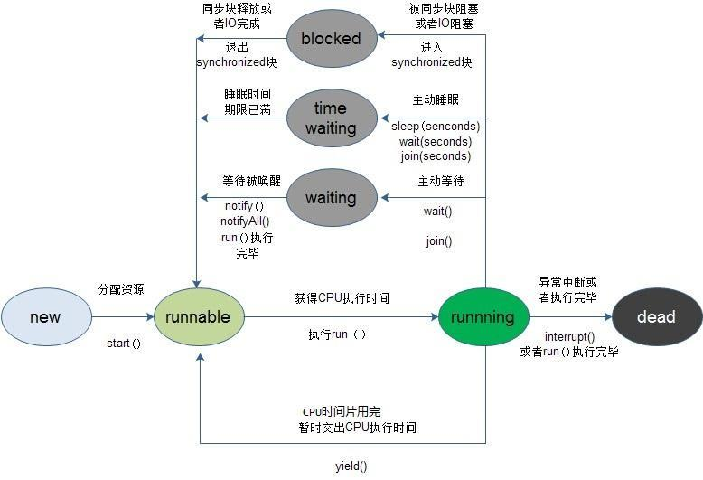

## 线程与进程
1. 线程：进程中负责程序执行的执行单元, 线程本身依靠程序进行运行, 线程是程序中的顺序控制流，只能使用分配给程序的资源和环境
2. 进程：执行中的程序,一个进程至少包含一个线程
3. 单线程：程序中只存在一个线程，实际上主方法就是一个主线程
4. 多线程：在一个程序中运行多个任务,目的是更好地使用CPU资源

## 线程的基本实现

### 继承Thread类

在java.lang包中定义, 继承Thread类必须重写run()方法

```
public class Test {
    public static void main(String[] args)  {
        System.out.println("主线程ID:"+Thread.currentThread().getId());
        MyThread thread1 = new MyThread("thread1");
        thread1.start();
        MyThread thread2 = new MyThread("thread2");
        thread2.run();
    }
}
class MyThread extends Thread{
    private static int num = 0;
    public MyThread(){
        num++;
    }
    @Override
    public void run() {
        System.out.println("主动创建的第"+num+"个线程.  子线程ID:"+Thread.currentThread().getId()););
    }
}

```
1）thread1和thread2的线程ID不同，thread2和主线程ID相同，说明通过run方法调用并不会创建新的线程，而是在主线程中直接运行run方法，跟普通的方法调用没有任何区别；

2）虽然thread1的start方法调用在thread2的run方法前面调用，但是先输出的是thread2的run方法调用的相关信息，说明新线程创建的过程不会阻塞主线程的后续执行。

### 实现Runnable接口

```
public class Test {
    public static void main(String[] args)  {
        System.out.println("主线程ID："+Thread.currentThread().getId());
        MyRunnable runnable = new MyRunnable();
        Thread thread = new Thread(runnable);
        thread.start();
    }
} 
class MyRunnable implements Runnable{
    public MyRunnable() {
    }
 
    @Override
    public void run() {
        System.out.println("子线程ID："+Thread.currentThread().getId());
    }
}
```
这种方式必须将Runnable作为Thread类的参数，然后通过Thread的start方法来创建一个新线程来执行该子任务。如果调用Runnable的run方法的话，是不会创建新线程的，这根普通的方法调用没有任何区别。
直接继承Thread类的话，可能比实现Runnable接口看起来更加简洁，但是由于Java只允许单继承，所以如果自定义类需要继承其他类，则只能选择实现Runnable接口。

## 使用ExecutorService、Callable、Future实现有返回结果的多线程
Executor，Executors，ExecutorService，CompletionService、Callable、Future这个对象都是属于Executor框架中的功能类

可返回值的任务必须实现Callable接口，类似的，无返回值的任务必须Runnable接口。执行Callable任务后，可以获取一个Future的对象，在该对象上调用get就可以获取到Callable任务返回的Object了，再结合线程池接口ExecutorService就可以实现传说中有返回结果的多线程了
并发编程的一种编程方式是把任务拆分为一些列的小任务，即Runnable，然后在提交给一个Executor执行，Executor.execute(Runnalbe) 。Executor在执行时使用内部的线程池完成操作。

### 创建线程池

Executor接口表示线程池，它的execute(Runnable task)方法用来执行Runnable类型的任务。Executor的子接口ExecutorService中声明了管理线程池的一些方法，比如用于关 闭线程池的shutdown()方法等。Executors类中包含一些静态方法，它们负责生成各种类型的线程池ExecutorService实例

Executors类的静态方法	创建的ExecutorService线程池的类型
- newCachedThreadPool()	在有任务时才创建新线程，空闲线程被保留60秒
- newFixedThreadPool(int nThreads)	线程池中包含固定数目的线程，空闲线程会一直保留。参数nThreads设定线程池中线程的数目
- newSingleThreadExecutor()	线程池中只有一个工作线程，它依次执行每个任务
- newScheduledThreadPool(int corePoolSize)	线程池能按时间计划来执行任务，允许用户设定计划执行任务的时间。参数corePoolSize设定线程池中线程的最小数目。当任务较多时，线程池可能会创建更多的工作线程来执行任务
- newSingleThreadScheduledExecutor()	线程池中只有一个工作线程，它能按时间计划来执行任务
```java
Executor executor = Executors.newFixedThreadPool(10);  
Runnable task = new Runnable() {  
    @Override  
    public void run() {  
        System.out.println("task over");  
    }  
};  
executor.execute(task);  
  
executor = Executors.newScheduledThreadPool(10);  
ScheduledExecutorService scheduler = (ScheduledExecutorService) executor;  
scheduler.scheduleAtFixedRate(task, 10, 10, TimeUnit.SECONDS);  
```
### 使用线程池的注意事项

虽然线程池能大大提高服务器的并发性能，但使用它也会存在一定风险。与所有多线程应用程序一样，用线程池构建的应用程序容易产生各种并发问题，如对 共享资源的竞争和死锁。此外，如果线程池本身的实现不健壮，或者没有合理地使用线程池，还容易导致与线程池有关的死锁、系统资源不足和线程泄漏等问题。
1. 死锁
任何多线程应用程序都有死锁风险。造成死锁的最简单的情形是，线程A持有对象X的锁，并且在等待对象Y的锁，而线程B持有对象Y的锁，并且在等待对象X的锁。线程A与线程B都不释放自己持有的锁，并且等待对方的锁，这就导致两个线程永远等待下去，死锁就这样产生了。
虽然任何多线程程序都有死锁的风险，但线程池还会导致另外一种死锁。在这种情形下，假定线程池中的所有工作线程都在执行各自任务时被阻塞，它们都在 等待某个任务A的执行结果。而任务A依然在工作队列中，由于没有空闲线程，使得任务A一直不能被执行。这使得线程池中的所有工作线程都永远阻塞下去，死锁 就这样产生了。

2. 系统资源不足
如果线程池中的线程数目非常多，这些线程会消耗包括内存和其他系统资源在内的大量资源，从而严重影响系统性能。

3. 并发错误
线程池的工作队列依靠wait()和notify()方法来使工作线程及时取得任务，但这两个方法都难于使用。
如果编码不正确，可能会丢失通知，导致工作线程一直保持空闲状态，无视工作队列中需要处理的任务。因此使用这些方法时，必须格外小心，即便是专家也 可能在这方面出错。最好使用现有的、比较成熟的线程池。例如，直接使用java.util.concurrent包中的线程池类。 

4. 线程泄漏
使用线程池的一个严重风险是线程泄漏。对于工作线程数目固定的线程池，如果工作线程在执行 任务时抛出RuntimeException 或Error，并且这些异常或错误没有被捕获，那么这个工作线程就会异常终止，使得线程池永久失去了一个工作线程。如果所有的工作线程都异常终止，线程池 就最终变为空，没有任何可用的工作线程来处理任务。
导致线程泄漏的另一种情形是，工作线程在执行一个任务时被阻塞，如等待用户的输入数据，但是由于用户一直不输入数据（可能是因为用户走开了），导致 这个工作线程一直被阻塞。这样的工作线程名存实亡，它实际上不执行任何任务了。假如线程池中所有的工作线程都处于这样的阻塞状态，那么线程池就无法处理新 加入的任务了。

5. 任务过载
当工作队列中有大量排队等候执行的任务时，这些任务本身可能会消耗太多的系统资源而引起系统资源缺乏。
综上所述，线程池可能会带来种种风险，为了尽可能避免它们，使用线程池时需要遵循以下原则。
（1）如果任务A在执行过程中需要同步等待任务B的执行结果，那么任务A不适合加入到线程池的工作队列中。如果把像任务A一样的需要等待其他任务执行结果的任务加入到工作队列中，可能会导致线程池的死锁。
（2）如果执行某个任务时可能会阻塞，并且是长时间的阻塞，则应该设定超时时间，避免工作线程永久的阻塞下去而导致线程泄漏。在服务器程序中，当线程等待客户连接，或者等待客户发送的数据时，都可能会阻塞。可以通过以下方式设定超时时间：
- 调用ServerSocket的setSoTimeout(int timeout)方法，设定等待客户连接的超时时间，参见本章3.5.1节（SO_TIMEOUT选项）；
- 对于每个与客户连接的Socket，调用该Socket的setSoTimeout(int timeout)方法，设定等待客户发送数据的超时时间，参见本书第2章的2.5.3节（SO_TIMEOUT选项）。
（3）了解任务的特点，分析任务是执行经常会阻塞的I/O操作，还是执行一直不会阻塞的运算操作。前者时断时续地占用CPU，而后者对CPU具有更高的利用率。预计完成任务大概需要多长时间？是短时间任务还是长时间任务？
根据任务的特点，对任务进行分类，然后把不同类型的任务分别加入到不同线程池的工作队列中，这样可以根据任务的特点，分别调整每个线程池。
（4）调整线程池的大小。线程池的最佳大小主要取决于系统的可用CPU的数目，以及工作队列中任务的特点。假如在一个具有 N 个CPU的系统上只有一个工作队列，并且其中全部是运算性质（不会阻塞）的任务，那么当线程池具有 N 或 N+1 个工作线程时，一般会获得最大的 CPU 利用率。
如果工作队列中包含会执行I/O操作并常常阻塞的任务，则要让线程池的大小超过可用CPU的数目，因为并不是所有工作线程都一直在工作。选择一个典 型的任务，然后估计在执行这个任务的过程中，等待时间（WT）与实际占用CPU进行运算的时间（ST）之间的比例WT/ST。对于一个具有N个CPU的系 统，需要设置大约N×(1+WT/ST)个线程来保证CPU得到充分利用。
当然，CPU利用率不是调整线程池大小过程中唯一要考虑的事项。随着线程池中工作线程数目的增长，还会碰到内存或者其他系统资源的限制，如套接字、打开的文件句柄或数据库连接数目等。要保证多线程消耗的系统资源在系统的承载范围之内。
（5）避免任务过载。服务器应根据系统的承载能力，限制客户并发连接的数目。当客户并发连接的数目超过了限制值，服务器可以拒绝连接请求，并友好地告知客户：服务器正忙，请稍后再试

### ExecutorService与生命周期
ExecutorService扩展了Executor并添加了一些生命周期管理的方法。一个Executor的生命周期有三种状态，运行 ，关闭 ，终止 。Executor创建时处于运行状态。当调用ExecutorService.shutdown()后，处于关闭状态，isShutdown()方法返回true。这时，不应该再想Executor中添加任务，所有已添加的任务执行完毕后，Executor处于终止状态，isTerminated()返回true。
如果Executor处于关闭状态，往Executor提交任务会抛出unchecked exception RejectedExecutionException。

### 使用Callable，Future返回结果
Future<V>代表一个异步执行的操作，通过get()方法可以获得操作的结果，如果异步操作还没有完成，则，get()会使当前线程阻塞。FutureTask<V>实现了Future<V>和Runable<V>。Callable代表一个有返回值得操作

```
Callable<Integer> func = new Callable<Integer>(){  
    public Integer call() throws Exception {  
        System.out.println("inside callable");  
        Thread.sleep(1000);  
        return new Integer(8);  
    }         
};        
FutureTask<Integer> futureTask  = new FutureTask<Integer>(func);  
Thread newThread = new Thread(futureTask);  
newThread.start();  
  
try {  
    System.out.println("blocking here");  
    Integer result = futureTask.get();  
    System.out.println(result);  
} catch (InterruptedException ignored) {  
} catch (ExecutionException ignored) {  
}  
```
ExecutoreService提供了submit()方法，传递一个Callable，或Runnable，返回Future。如果Executor后台线程池还没有完成Callable的计算，这调用返回Future对象的get()方法，会阻塞直到计算完成。

### CompletionService

getResult()方法的实现过程中，迭代了FutureTask的数组，如果任务还没有完成则当前线程会阻塞，如果我们希望任意字任务完成后就把其结果加到result中，而不用依次等待每个任务完成，可以使CompletionService。生产者submit()执行的任务。使用者take()已完成的任务，并按照完成这些任务的顺序处理它们的结果 。也就是调用CompletionService的take方法是，会返回按完成顺序放回任务的结果，CompletionService内部维护了一个阻塞队列BlockingQueue，如果没有任务完成，take()方法也会阻塞
```java
public class ConcurrentCalculator2 {  
  
    private ExecutorService exec;  
    private CompletionService<Long> completionService;  
  
  
    private int cpuCoreNumber;  
  
    // 内部类  
    class SumCalculator implements Callable<Long> {  
         private int[] numbers;  
        private int start;  
        private int end;  
  
        public SumCalculator(final int[] numbers, int start, int end) {  
            this.numbers = numbers;  
            this.start = start;  
            this.end = end;  
        }  
  
        public Long call() throws Exception {  
            Long sum = 0l;  
            for (int i = start; i < end; i++) {  
                sum += numbers[i];  
            }  
            return sum;  
        }   
    }  
  
    public ConcurrentCalculator2() {  
        cpuCoreNumber = Runtime.getRuntime().availableProcessors();  
        exec = Executors.newFixedThreadPool(cpuCoreNumber);  
        completionService = new ExecutorCompletionService<Long>(exec);  
  
  
    }  
  
    public Long sum(final int[] numbers) {  
        // 根据CPU核心个数拆分任务，创建FutureTask并提交到Executor  
        for (int i = 0; i < cpuCoreNumber; i++) {  
            int increment = numbers.length / cpuCoreNumber + 1;  
            int start = increment * i;  
            int end = increment * i + increment;  
            if (end > numbers.length)  
                end = numbers.length;  
            SumCalculator subCalc = new SumCalculator(numbers, start, end);   
            if (!exec.isShutdown()) {  
                completionService.submit(subCalc);
            }  
              
        }  
        return getResult();  
    }  
  
    /** 
     * 迭代每个只任务，获得部分和，相加返回 
     *  
     * @return 
     */  
    public Long getResult() {  
        Long result = 0l;  
        for (int i = 0; i < cpuCoreNumber; i++) {              
            try {  
                //直接用take.get()会阻塞等待线程
                Long subSum = completionService.take().get();  
                result += subSum;             
            } catch (InterruptedException e) {  
                e.printStackTrace();  
            } catch (ExecutionException e) {  
                e.printStackTrace();  
            }  
        }  
        return result;  
    }  
  
    public void close() {  
        exec.shutdown();  
    }  
}  
```

## 线程的状态
线程状态有以下几种：
- 创建（new）状态: 准备好了一个多线程的对象
- 就绪（runnable）状态: 调线程对象创建后，其他线程调用了该对象的start()方法。该状态的线程位于可运行线程池中，变得可运行，等待获取CPU的使用权
- 运行（running）状态: 就绪状态的线程获取了CPU，执行程序代码
- 阻塞状态（Blocked）：阻塞状态是线程因为某种原因放弃CPU使用权，暂时停止运行。直到线程进入就绪状态，才有机会转到运行状态。阻塞的情况分三种：
    1. 等待阻塞：运行的线程执行wait()方法，JVM会把该线程放入等待池中。(wait会释放持有的锁)
    2. 同步阻塞：运行的线程在获取对象的同步锁时，若该同步锁被别的线程占用，则JVM会把该线程放入锁池中。
    3. 其他阻塞：运行的线程执行sleep()或join()方法，或者发出了I/O请求时，JVM会把该线程置为阻塞状态。当sleep()状态超时、join()等待线程终止或者超时、或者I/O处理完毕时，线程重新转入就绪状态。（注意,sleep是不会释放持有的锁）
- 终止（dead）状态: 线程执行完了或者因异常退出了run()方法，该线程结束生命周期

当需要新起一个线程来执行某个子任务时，就创建了一个线程。但是线程创建之后，不会立即进入就绪状态，因为线程的运行需要一些条件（比如内存资源，在前面的JVM内存区域划分一篇博文中知道程序计数器、Java栈、本地方法栈都是线程私有的，所以需要为线程分配一定的内存空间），只有线程运行需要的所有条件满足了，才进入就绪状态。

当线程进入就绪状态后，不代表立刻就能获取CPU执行时间，也许此时CPU正在执行其他的事情，因此它要等待。当得到CPU执行时间之后，线程便真正进入运行状态。

线程在运行状态过程中，可能有多个原因导致当前线程不继续运行下去，比如用户主动让线程睡眠（睡眠一定的时间之后再重新执行）、用户主动让线程等待，或者被同步块给阻塞，此时就对应着多个状态：time waiting（睡眠或等待一定的事件）、waiting（等待被唤醒）、blocked（阻塞）。

当由于突然中断或者子任务执行完毕，线程就会被消亡。

下面这副图描述了线程从创建到消亡之间的状态：


在有些教程上将blocked、waiting、time waiting统称为阻塞状态，这个也是可以的，只不过这里我想将线程的状态和Java中的方法调用联系起来，所以将waiting和time waiting两个状态分离出来。

注:sleep和wait的区别:

- sleep是Thread类的方法,wait是Object类中定义的方法.
- Thread.sleep不会导致锁行为的改变, 如果当前线程是拥有锁的, 那么Thread.sleep不会让线程释放锁.
- Thread.sleep和Object.wait都会暂停当前的线程. OS会将执行时间分配给其它线程. 区别是, 调用wait后, 需要别的线程执行notify/notifyAll才能够重新获得CPU执行时间.

上下文切换就是 存储和恢复CPU状态的过程，它使得线程执行能够从中断点恢复执行。虽然多线程可以使得任务执行的效率得到提升，但是由于在线程切换时同样会带来一定的开销代价，并且多个线程会导致系统资源占用的增加，所以在进行多线程编程时要注意这些因素。

## 线程调度


### 调整线程优先级：Java线程有优先级，优先级高的线程会获得较多的运行机会。
 
Java线程的优先级用整数表示，取值范围是1~10，Thread类有以下三个静态常量：
static int MAX_PRIORITY
          线程可以具有的最高优先级，取值为10。
static int MIN_PRIORITY
          线程可以具有的最低优先级，取值为1。
static int NORM_PRIORITY
          分配给线程的默认优先级，取值为5。
 
Thread类的setPriority()和getPriority()方法分别用来设置和获取线程的优先级。
 
每个线程都有默认的优先级。主线程的默认优先级为Thread.NORM_PRIORITY。
线程的优先级有继承关系，比如A线程中创建了B线程，那么B将和A具有相同的优先级。
JVM提供了10个线程优先级，但与常见的操作系统都不能很好的映射。如果希望程序能移植到各个操作系统中，应该仅仅使用Thread类有以下三个静态常量作为优先级，这样能保证同样的优先级采用了同样的调度方式。
 
### 线程睡眠
Thread.sleep(long millis)方法，使线程转到阻塞状态。millis参数设定睡眠的时间，以毫秒为单位。当睡眠结束后，就转为就绪（Runnable）状态。sleep()平台移植性好。
 
    sleep()使当前线程进入停滞状态（阻塞当前线程），让出CUP的使用、目的是不让当前线程独自霸占该进程所获的CPU资源，以留一定时间给其他线程执行的机会;

    sleep()是Thread类的Static(静态)的方法；因此他不能改变对象的机锁，所以当在一个Synchronized块中调用Sleep()方法是，线程虽然休眠了，但是对象的机锁并木有被释放，其他线程无法访问这个对象（即使睡着也持有对象锁）。

    在sleep()休眠时间期满后，该线程不一定会立即执行，这是因为其它线程可能正在运行而且没有被调度为放弃执行，除非此线程具有更高的优先级。

### 线程等待
Object类中的wait()方法，导致当前的线程等待，直到其他线程调用此对象的 notify() 方法或 notifyAll() 唤醒方法。这个两个唤醒方法也是Object类中的方法，行为等价于调用 wait(0) 一样。
 
    wait()方法是Object类里的方法；当一个线程执行到wait()方法时，它就进入到一个和该对象相关的等待池中，同时失去（释放）了对象的机锁（暂时失去机锁，wait(long timeout)超时时间到后还需要返还对象锁）；其他线程可以访问；
    
    wait()使用notify或者notifyAlll或者指定睡眠时间来唤醒当前等待池中的线程。
    
    wiat()必须放在synchronized block中，否则会在program runtime时扔出”java.lang.IllegalMonitorStateException“异常。

### 线程让步
Thread.yield() 方法，暂停当前正在执行的线程对象，把执行机会让给相同或者更高优先级的线程。
 
 Thread.yield()方法作用是：暂停当前正在执行的线程对象，并执行其他线程。
         yield()应该做的是让当前运行线程回到可运行状态，以允许具有相同优先级的其他线程获得运行机会。因此，使用yield()的目的是让相同优先级的线程之间能适当的轮转执行。但是，实际中无法保证yield()达到让步目的，因为让步的线程还有可能被线程调度程序再次选中。
 
结论：yield()从未导致线程转到等待/睡眠/阻塞状态。在大多数情况下，yield()将导致线程从运行状态转到可运行状态，但有可能没有效果。

### 线程加入
join()方法，等待其他线程终止。在当前线程中调用另一个线程的join()方法，则当前线程转入阻塞状态，直到另一个进程运行结束，当前线程再由阻塞转为就绪状态。

在很多情况下，主线程创建并启动了线程，如果子线程中药进行大量耗时运算，主线程往往将早于子线程结束之前结束。这时，如果主线程想等待子线程执行完成之后再结束，比如子线程处理一个数据，主线程要取得这个数据中的值，就要用到join()方法了。方法join()的作用是等待线程对象销毁。
 
```
public class Thread4 extends Thread{
    public Thread4(String name) {
        super(name);
    }
    public void run() {
        for (int i = 0; i < 5; i++) {
            System.out.println(getName() + "  " + i);
        }
    }
    public static void main(String[] args) throws InterruptedException {
        // 启动子进程
        new Thread4("new thread").start();
        for (int i = 0; i < 10; i++) {
            if (i == 5) {
                Thread4 th = new Thread4("joined thread");
                th.start();
                th.join();
            }
            System.out.println(Thread.currentThread().getName() + "  " + i);
        }
    }
}
```
### 线程唤醒
Object类中的notify()方法，唤醒在此对象监视器上等待的单个线程。如果所有线程都在此对象上等待，则会选择唤醒其中一个线程。选择是任意性的，并在对实现做出决定时发生。线程通过调用其中一个 wait 方法，在对象的监视器上等待。 直到当前的线程放弃此对象上的锁定，才能继续执行被唤醒的线程。被唤醒的线程将以常规方式与在该对象上主动同步的其他所有线程进行竞争；例如，唤醒的线程在作为锁定此对象的下一个线程方面没有可靠的特权或劣势。类似的方法还有一个notifyAll()，唤醒在此对象监视器上等待的所有线程。
 注意：Thread中suspend()和resume()两个方法在JDK1.5中已经废除，不再介绍。因为有死锁倾向。

wait()与Obj.notify()必须要与synchronized(Obj)一起使用，也就是wait,与notify是针对已经获取了Obj锁进行操作，从语法角度来说就是Obj.wait(),Obj.notify必须在synchronized(Obj){...}语句块内。从功能上来说wait就是说线程在获取对象锁后，主动释放对象锁，同时本线程休眠。直到有其它线程调用对象的notify()唤醒该线程，才能继续获取对象锁，并继续执行。相应的notify()就是对对象锁的唤醒操作。但有一点需要注意的是notify()调用后，并不是马上就释放对象锁的，而是在相应的synchronized(){}语句块执行结束，自动释放锁后，JVM会在wait()对象锁的线程中随机选取一线程，赋予其对象锁，唤醒线程，继续执行。这样就提供了在线程间同步、唤醒的操作。Thread.sleep()与Object.wait()二者都可以暂停当前线程，释放CPU控制权，主要的区别在于Object.wait()在释放CPU同时，释放了对象锁的控制。

### 线程打断

interrupt():不要以为它是中断某个线程！它只是线线程发送一个中断信号，让线程在无限等待时（如死锁时）能抛出抛出，从而结束线程，但是如果你吃掉了这个异常，那么这个线程还是不会中断的！

## 守护线程

在Java线程中有两种线程，一种是User Thread（用户线程），另一种是Daemon Thread(守护线程)。
Daemon的作用是为其他线程的运行提供服务，比如说GC线程。其实User Thread线程和Daemon Thread守护线程本质上来说去没啥区别的，唯一的区别之处就在虚拟机的离开：如果User Thread全部撤离，那么Daemon Thread也就没啥线程好服务的了，所以虚拟机也就退出了。

守护线程并非虚拟机内部可以提供，用户也可以自行的设定守护线程，方法：public final void setDaemon(boolean on) ；但是有几点需要注意：

thread.setDaemon(true)必须在thread.start()之前设置，否则会跑出一个IllegalThreadStateException异常。你不能把正在运行的常规线程设置为守护线程。 （备注：这点与守护进程有着明显的区别，守护进程是创建后，让进程摆脱原会话的控制+让进程摆脱原进程组的控制+让进程摆脱原控制终端的控制；所以说寄托于虚拟机的语言机制跟系统级语言有着本质上面的区别）
在Daemon线程中产生的新线程也是Daemon的。 （这一点又是有着本质的区别了：守护进程fork()出来的子进程不再是守护进程，尽管它把父进程的进程相关信息复制过去了，但是子进程的进程的父进程不是init进程，所谓的守护进程本质上说就是“父进程挂掉，init收养，然后文件0,1,2都是/dev/null，当前目录到/”）
不是所有的应用都可以分配给Daemon线程来进行服务，比如读写操作或者计算逻辑。因为在Daemon Thread还没来的及进行操作时，虚拟机可能已经退出了。


## 线程同步锁机制

### ThreadLocal类
- 用处：保存线程的独立变量。对一个线程类（继承自Thread)
当使用ThreadLocal维护变量时，ThreadLocal为每个使用该变量的线程提供独立的变量副本，所以每一个线程都可以独立地改变自己的副本，而不会影响其它线程所对应的副本。常用于用户登录控制，如记录session信息。
- 实现：每个Thread都持有一个TreadLocalMap类型的变量（该类是一个轻量级的Map，功能与map一样，区别是桶里放的是entry而不是entry的链表。功能还是一个map。）以本身为key，以目标为value。
- 主要方法是get()和set(T a)，set之后在map里维护一个threadLocal -> a，get时将a返回。ThreadLocal是一个特殊的容器。

### 原子类（AtomicInteger、AtomicBoolean……）

如果使用atomic wrapper class如atomicInteger，或者使用自己保证原子的操作，则等同于synchronized

//返回值为boolean
AtomicInteger.compareAndSet(int expect,int update)

该方法可用于实现乐观锁，考虑文中最初提到的如下场景：a给b付款10元，a扣了10元，b要加10元。此时c给b2元，但是b的加十元代码约为：
```
if(b.value.compareAndSet(old, value)){
   return ;
}else{
   //try again
   // if that fails, rollback and log
}
```
AtomicReference
对于AtomicReference 来讲，也许对象会出现，属性丢失的情况，即oldObject == current，但是oldObject.getPropertyA != current.getPropertyA。
这时候，AtomicStampedReference就派上用场了。这也是一个很常用的思路，即加上版本号

### Lock类

lock: 在java.util.concurrent包内。共有三个实现：
- ReentrantLock
- ReentrantReadWriteLock.ReadLock
- ReentrantReadWriteLock.WriteLock
主要目的是和synchronized一样， 两者都是为了解决同步问题，处理资源争端而产生的技术。功能类似但有一些区别。

1. lock更灵活，可以自由定义多把锁的枷锁解锁顺序（synchronized要按照先加的后解顺序）
2. 提供多种加锁方案，lock 阻塞式, trylock 无阻塞式, lockInterruptily 可打断式， 还有trylock的带超时时间版本。
3. 本质上和监视器锁（即synchronized是一样的）
4. 能力越大，责任越大，必须控制好加锁和解锁，否则会导致灾难。
5. 和Condition类的结合。
6. 性能更高

### 容器类
- BlockingQueue
- ConcurrentHashMap

#### BlockingQueue
阻塞队列。该类是java.util.concurrent包下的重要类，通过对Queue的学习可以得知，这个queue是单向队列，可以在队列头添加元素和在队尾删除或取出元素。类似于一个管　　道，特别适用于先进先出策略的一些应用场景。普通的queue接口主要实现有PriorityQueue（优先队列）

除了传统的queue功能（表格左边的两列）之外，还提供了阻塞接口put和take，带超时功能的阻塞接口offer和poll。put会在队列满的时候阻塞，直到有空间时被唤醒；take在队　列空的时候阻塞，直到有东西拿的时候才被唤醒。用于生产者-消费者模型尤其好用


#### Thread类的sleep()方法和对象的wait()方法都可以让线程暂停执行，它们的区别
sleep()方法（休眠）是线程类（Thread）的静态方法，调用此方法会让当前线程暂停执行指定的时间，将执行机会（CPU）让给其他线程，但是对象的锁依然保持，因此休眠时间结束后会自动恢复（线程回到就绪状态，请参考第66题中的线程状态转换图）。wait()是Object类的方法，调用对象的wait()方法导致当前线程放弃对象的锁（线程暂停执行），进入对象的等待池（wait pool），只有调用对象的notify()方法（或notifyAll()方法）时才能唤醒等待池中的线程进入等锁池（lock pool），如果线程重新获得对象的锁就可以进入就绪状态。

#### 线程的sleep()方法和yield()方法的区别
1. sleep()方法给其他线程运行机会时不考虑线程的优先级，因此会给低优先级的线程以运行的机会；yield()方法只会给相同优先级或更高优先级的线程以运行的机会；
2. 线程执行sleep()方法后转入阻塞（blocked）状态，而执行yield()方法后转入就绪（ready）状态；
3. sleep()方法声明抛出InterruptedException，而yield()方法没有声明任何异常；
4. sleep()方法比yield()方法（跟操作系统CPU调度相关）具有更好的可移植性。

#### CAS
CAS，全称为Compare and Swap，即比较-替换。假设有三个操作数：内存值V、旧的预期值A、要修改的值B，当且仅当预期值A和内存值V相同时，才会将内存值修改为B并返回true，否则什么都不做并返回false。当然CAS一定要volatile变量配合，这样才能保证每次拿到的变量是主内存中最新的那个值，否则旧的预期值A对某条线程来说，永远是一个不会变的值A，只要某次CAS操作失败，永远都不可能成功。

#### AQS
AQS全称为AbstractQueuedSychronizer，翻译过来应该是抽象队列同步器。

如果说java.util.concurrent的基础是CAS的话，那么AQS就是整个Java并发包的核心了，ReentrantLock、CountDownLatch、Semaphore等等都用到了它。AQS实际上以双向队列的形式连接所有的Entry，比方说ReentrantLock，所有等待的线程都被放在一个Entry中并连成双向队列，前面一个线程使用ReentrantLock好了，则双向队列实际上的第一个Entry开始运行。

AQS定义了对双向队列所有的操作，而只开放了tryLock和tryRelease方法给开发者使用，开发者可以根据自己的实现重写tryLock和tryRelease方法，以实现自己的并发功能。

#### 乐观锁和悲观锁

1. 乐观锁：就像它的名字一样，对于并发间操作产生的线程安全问题持乐观状态，乐观锁认为竞争不总是会发生，因此它不需要持有锁，将比较-替换这两个动作作为一个原子操作尝试去修改内存中的变量，如果失败则表示发生冲突，那么就应该有相应的重试逻辑。

2. 悲观锁：还是像它的名字一样，对于并发间操作产生的线程安全问题持悲观状态，悲观锁认为竞争总是会发生，因此每次对某资源进行操作时，都会持有一个独占的锁，就像synchronized，不管三七二十一，直接上了锁就操作资源了。

参考： http://www.importnew.com/21136.html
http://www.iteye.com/topic/366591