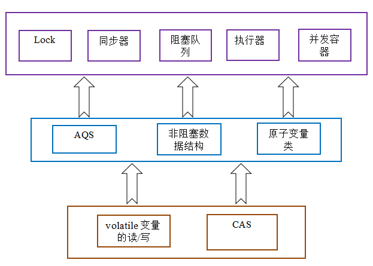

# 多线程

## 线程与进程

1. 线程：进程中负责程序执行的执行单元, 线程本身依靠程序进行运行, 线程是程序中的顺序控制流，只能使用分配给程序的资源和环境
2. 进程：执行中的程序,一个进程至少包含一个线程
3. 单线程：程序中只存在一个线程，实际上主方法就是一个主线程
4. 多线程：在一个程序中运行多个任务,目的是更好地使用CPU资源

## 线程的基本实现

### 上下文切换

多线程并不一定是要在多核处理器才支持的，就算是单核也是可以支持多线程的。 CPU 通过给每个线程分配一定的时间片，由于时间非常短通常是几十毫秒，所以 CPU 可以不停的切换线程执行任务从而达到了多线程的效果。

但是由于在线程切换的时候需要保存本次执行的信息(详见)，在该线程被 CPU 剥夺时间片后又再次运行恢复上次所保存的信息的过程就称为上下文切换。

减少上下文切换通常有以下解决方案:

- 采用无锁编程，比如将数据按照 Hash(id) 进行取模分段，每个线程处理各自分段的数据，从而避免使用锁。
- 采用 CAS(compare and swap) 算法，如 Atomic 包就是采用 CAS 算法(详见)。无锁策略则总是假设对共享资源的访问没有冲突，线程可以不停执行，无需加锁，无需等待，一旦发现冲突，无锁策略则采用一种称为CAS的技术来保证线程执行的安全性
- 合理的创建线程，避免创建了一些线程但其中大部分都是处于 waiting 状态，因为每当从 waiting 状态切换到 running 状态都是一次上下文切换。

### 继承Thread类

在java.lang包中定义, 继承Thread类必须重写run()方法

```
public class Test {
    public static void main(String[] args)  {
        System.out.println("主线程ID:"+Thread.currentThread().getId());
        MyThread thread1 = new MyThread("thread1");
        thread1.start();
        MyThread thread2 = new MyThread("thread2");
        thread2.run();
    }
}
class MyThread extends Thread{
    private static int num = 0;
    public MyThread(){
        num++;
    }
    @Override
    public void run() {
        System.out.println("主动创建的第"+num+"个线程.  子线程ID:"+Thread.currentThread().getId()););
    }
}
```

1）thread1和thread2的线程ID不同，thread2和主线程ID相同，说明通过run方法调用并不会创建新的线程，而是在主线程中直接运行run方法，跟普通的方法调用没有任何区别；

2）虽然thread1的start方法调用在thread2的run方法前面调用，但是先输出的是thread2的run方法调用的相关信息，说明新线程创建的过程不会阻塞主线程的后续执行。

### 实现Runnable接口

```java
public class Test {
    public static void main(String[] args)  {
        System.out.println("主线程ID："+Thread.currentThread().getId());
        MyRunnable runnable = new MyRunnable();
        Thread thread = new Thread(runnable);
        thread.start();
    }
} 
class MyRunnable implements Runnable{
    public MyRunnable() {
    }
 
    @Override
    public void run() {
        System.out.println("子线程ID："+Thread.currentThread().getId());
    }
}
```

这种方式必须将Runnable作为Thread类的参数，然后通过Thread的start方法来创建一个新线程来执行该子任务。如果调用Runnable的run方法的话，是不会创建新线程的，这根普通的方法调用没有任何区别。
直接继承Thread类的话，可能比实现Runnable接口看起来更加简洁，但是由于Java只允许单继承，所以如果自定义类需要继承其他类，则只能选择实现Runnable接口。

## 原子性

这一点，跟数据库事务的原子性概念差不多，即一个操作（有可能包含有多个子操作）要么全部执行（生效），要么全部都不执行（都不生效）。

关于原子性，一个非常经典的例子就是银行转账问题：比如A和B同时向C转账10万元。如果转账操作不具有原子性，A在向C转账时，读取了C的余额为20万，然后加上转账的10万，计算出此时应该有30万，但还未来及将30万写回C的账户，此时B的转账请求过来了，B发现C的余额为20万，然后将其加10万并写回。然后A的转账操作继续——将30万写回C的余额。这种情况下C的最终余额为30万，而非预期的40万。

### 锁和同步

常用的保证Java操作原子性的工具是锁和同步方法（或者同步代码块）。使用锁，可以保证同一时间只有一个线程能拿到锁，也就保证了同一时间只有一个线程能执行申请锁和释放锁之间的代码。

```java
public void testLock () {
  lock.lock();
  try{
    int j = i;
    i = j + 1;
  } finally {
    lock.unlock();
  }
}
```
与锁类似的是同步方法或者同步代码块。使用非静态同步方法时，锁住的是当前实例；使用静态同步方法时，锁住的是该类的Class对象；使用静态代码块时，锁住的是synchronized关键字后面括号内的对象。下面是同步代码块示例
```java
public void testLock () {
  synchronized (anyObject){
    int j = i;
    i = j + 1;
  }
}
```

### CAS（compare and swap）
基础类型变量自增（i++）是一种常被新手误以为是原子操作而实际不是的操作。Java中提供了对应的原子操作类来实现该操作，并保证原子性，其本质是利用了CPU级别的CAS指令。由于是CPU级别的指令，其开销比需要操作系统参与的锁的开销小。AtomicInteger使用方法如下。
```java
AtomicInteger atomicInteger = new AtomicInteger();
for(int b = 0; b < numThreads; b++) {
  new Thread(() -> {
    for(int a = 0; a < iteration; a++) {
      atomicInteger.incrementAndGet();
    }
  }).start();
}
```


## 可见性
可见性是指，当多个线程并发访问共享变量时，一个线程对共享变量的修改，其它线程能够立即看到。可见性问题是好多人忽略或者理解错误的一点。

CPU从主内存中读数据的效率相对来说不高，现在主流的计算机中，都有几级缓存。每个线程读取共享变量时，都会将该变量加载进其对应CPU的高速缓存里，修改该变量后，CPU会立即更新该缓存，但并不一定会立即将其写回主内存（实际上写回主内存的时间不可预期）。此时其它线程（尤其是不在同一个CPU上执行的线程）访问该变量时，从主内存中读到的就是旧的数据，而非第一个线程更新后的数据。

Java提供了volatile关键字来保证可见性。当使用volatile修饰某个变量时，它会保证对该变量的修改会立即被更新到内存中，并且将其它缓存中对该变量的缓存设置成无效，因此其它线程需要读取该值时必须从主内存中读取，从而得到最新的值。

## 顺序性
顺序性指的是，程序执行的顺序按照代码的先后顺序执行。
编译器和处理器对指令进行重新排序时，会保证重新排序后的执行结果和代码顺序执行的结果一致，所以重新排序过程并不会影响单线程程序的执行，却可能影响多线程程序并发执行的正确性。

Java中可通过volatile在一定程序上保证顺序性，另外还可以通过synchronized和锁来保证顺序性。

synchronized和锁保证顺序性的原理和保证原子性一样，都是通过保证同一时间只会有一个线程执行目标代码段来实现的。

除了从应用层面保证目标代码段执行的顺序性外，JVM还通过被称为happens-before原则隐式地保证顺序性。两个操作的执行顺序只要可以通过happens-before推导出来，则JVM会保证其顺序性，反之JVM对其顺序性不作任何保证，可对其进行任意必要的重新排序以获取高效率。

### happens-before原则（先行发生原则）

- 传递规则：如果操作1在操作2前面，而操作2在操作3前面，则操作1肯定会在操作3前发生。该规则说明了happens-before原则具有传递性
- 锁定规则：一个unlock操作肯定会在后面对同一个锁的lock操作前发生。这个很好理解，锁只有被释放了才会被再次获取
- volatile变量规则：对一个被volatile修饰的写操作先发生于后面对该变量的读操作
- 程序次序规则：一个线程内，按照代码顺序执行
- 线程启动规则：Thread对象的start()方法先发生于此线程的其它动作
- 线程终结原则：线程的终止检测后发生于线程中其它的所有操作
- 线程中断规则： 对线程interrupt()方法的调用先发生于对该中断异常的获取
- 对象终结规则：一个对象构造先于它的finalize发生

## 线程的状态

线程状态有以下几种：

- 创建（new）状态: 准备好了一个多线程的对象
- 就绪（runnable）状态: 调线程对象创建后，其他线程调用了该对象的start()方法。该状态的线程位于可运行线程池中，变得可运行，等待获取CPU的使用权
- 运行（running）状态: 就绪状态的线程获取了CPU，执行程序代码
- 阻塞状态（Blocked）：阻塞状态是线程因为某种原因放弃CPU使用权，暂时停止运行。直到线程进入就绪状态，才有机会转到运行状态。阻塞的情况分三种：
    1. 等待阻塞：运行的线程执行wait()方法，JVM会把该线程放入等待池中。(wait会释放持有的锁)
    2. 同步阻塞：运行的线程在获取对象的同步锁时，若该同步锁被别的线程占用，则JVM会把该线程放入锁池中。
    3. 其他阻塞：运行的线程执行sleep()或join()方法，或者发出了I/O请求时，JVM会把该线程置为阻塞状态。当sleep()状态超时、join()等待线程终止或者超时、或者I/O处理完毕时，线程重新转入就绪状态。（注意,sleep是不会释放持有的锁）
- 终止（dead）状态: 线程执行完了或者因异常退出了run()方法，该线程结束生命周期

当需要新起一个线程来执行某个子任务时，就创建了一个线程。但是线程创建之后，不会立即进入就绪状态，因为线程的运行需要一些条件（比如内存资源，在前面的JVM内存区域划分一篇博文中知道程序计数器、Java栈、本地方法栈都是线程私有的，所以需要为线程分配一定的内存空间），只有线程运行需要的所有条件满足了，才进入就绪状态。

当线程进入就绪状态后，不代表立刻就能获取CPU执行时间，也许此时CPU正在执行其他的事情，因此它要等待。当得到CPU执行时间之后，线程便真正进入运行状态。

线程在运行状态过程中，可能有多个原因导致当前线程不继续运行下去，比如用户主动让线程睡眠（睡眠一定的时间之后再重新执行）、用户主动让线程等待，或者被同步块给阻塞，此时就对应着多个状态：time waiting（睡眠或等待一定的事件）、waiting（等待被唤醒）、blocked（阻塞）。

当由于突然中断或者子任务执行完毕，线程就会被消亡。

下面这副图描述了线程从创建到消亡之间的状态：


在有些教程上将blocked、waiting、time waiting统称为阻塞状态，这个也是可以的，只不过这里我想将线程的状态和Java中的方法调用联系起来，所以将waiting和time waiting两个状态分离出来。

注:sleep和wait的区别:

- sleep是Thread类的方法,wait是Object类中定义的方法.
- Thread.sleep不会导致锁行为的改变, 如果当前线程是拥有锁的, 那么Thread.sleep不会让线程释放锁.
- Thread.sleep和Object.wait都会暂停当前的线程. OS会将执行时间分配给其它线程. 区别是, 调用wait后, 需要别的线程执行notify/notifyAll才能够重新获得CPU执行时间.

上下文切换就是 存储和恢复CPU状态的过程，它使得线程执行能够从中断点恢复执行。虽然多线程可以使得任务执行的效率得到提升，但是由于在线程切换时同样会带来一定的开销代价，并且多个线程会导致系统资源占用的增加，所以在进行多线程编程时要注意这些因素。

## 线程调度


### 调整线程优先级：Java线程有优先级，优先级高的线程会获得较多的运行机会。
 
Java线程的优先级用整数表示，取值范围是1~10，Thread类有以下三个静态常量：
static int MAX_PRIORITY
          线程可以具有的最高优先级，取值为10。
static int MIN_PRIORITY
          线程可以具有的最低优先级，取值为1。
static int NORM_PRIORITY
          分配给线程的默认优先级，取值为5。
 
Thread类的setPriority()和getPriority()方法分别用来设置和获取线程的优先级。
 
每个线程都有默认的优先级。主线程的默认优先级为Thread.NORM_PRIORITY。
线程的优先级有继承关系，比如A线程中创建了B线程，那么B将和A具有相同的优先级。
JVM提供了10个线程优先级，但与常见的操作系统都不能很好的映射。如果希望程序能移植到各个操作系统中，应该仅仅使用Thread类有以下三个静态常量作为优先级，这样能保证同样的优先级采用了同样的调度方式。
 
### 线程睡眠

Thread.sleep(long millis)方法，使线程转到阻塞状态。millis参数设定睡眠的时间，以毫秒为单位。当睡眠结束后，就转为就绪（Runnable）状态。sleep()平台移植性好。
 
    sleep()使当前线程进入停滞状态（阻塞当前线程），让出CUP的使用、目的是不让当前线程独自霸占该进程所获的CPU资源，以留一定时间给其他线程执行的机会;

    sleep()是Thread类的Static(静态)的方法；因此他不能改变对象的机锁，所以当在一个Synchronized块中调用Sleep()方法是，线程虽然休眠了，但是对象的机锁并木有被释放，其他线程无法访问这个对象（即使睡着也持有对象锁）。

    在sleep()休眠时间期满后，该线程不一定会立即执行，这是因为其它线程可能正在运行而且没有被调度为放弃执行，除非此线程具有更高的优先级。

### 线程等待

Object类中的wait()方法，导致当前的线程等待，直到其他线程调用此对象的 notify() 方法或 notifyAll() 唤醒方法。这个两个唤醒方法也是Object类中的方法，行为等价于调用 wait(0) 一样。
 
    wait()方法是Object类里的方法；当一个线程执行到wait()方法时，它就进入到一个和该对象相关的等待池中，同时失去（释放）了对象的机锁（暂时失去机锁，wait(long timeout)超时时间到后还需要返还对象锁）；其他线程可以访问；
    
    wait()使用notify或者notifyAlll或者指定睡眠时间来唤醒当前等待池中的线程。
    
    wait()必须放在synchronized block中，否则会在program runtime时扔出”java.lang.IllegalMonitorStateException“异常。

### 线程让步

Thread.yield() 方法，暂停当前正在执行的线程对象，把执行机会让给相同或者更高优先级的线程。
 
 Thread.yield()方法作用是：暂停当前正在执行的线程对象，并执行其他线程。
         yield()应该做的是让当前运行线程回到可运行状态，以允许具有相同优先级的其他线程获得运行机会。因此，使用yield()的目的是让相同优先级的线程之间能适当的轮转执行。但是，实际中无法保证yield()达到让步目的，因为让步的线程还有可能被线程调度程序再次选中。
 
结论：yield()从未导致线程转到等待/睡眠/阻塞状态。在大多数情况下，yield()将导致线程从运行状态转到可运行状态，但有可能没有效果。

### 线程加入

join()方法，等待其他线程终止。在当前线程中调用另一个线程的join()方法，则当前线程转入阻塞状态，直到另一个进程运行结束，当前线程再由阻塞转为就绪状态。

在很多情况下，主线程创建并启动了线程，如果子线程中药进行大量耗时运算，主线程往往将早于子线程结束之前结束。这时，如果主线程想等待子线程执行完成之后再结束，比如子线程处理一个数据，主线程要取得这个数据中的值，就要用到join()方法了。方法join()的作用是等待线程对象销毁。

```java
public class Thread4 extends Thread{
    public Thread4(String name) {
        super(name);
    }
    public void run() {
        for (int i = 0; i < 5; i++) {
            System.out.println(getName() + "  " + i);
        }
    }
    public static void main(String[] args) throws InterruptedException {
        // 启动子进程
        new Thread4("new thread").start();
        for (int i = 0; i < 10; i++) {
            if (i == 5) {
                Thread4 th = new Thread4("joined thread");
                th.start();
                th.join();
            }
            System.out.println(Thread.currentThread().getName() + "  " + i);
        }
    }
}
```

### 线程唤醒

Object类中的notify()方法，唤醒在此对象监视器上等待的单个线程。如果所有线程都在此对象上等待，则会选择唤醒其中一个线程。选择是任意性的，并在对实现做出决定时发生。线程通过调用其中一个 wait 方法，在对象的监视器上等待。 直到当前的线程放弃此对象上的锁定，才能继续执行被唤醒的线程。被唤醒的线程将以常规方式与在该对象上主动同步的其他所有线程进行竞争；例如，唤醒的线程在作为锁定此对象的下一个线程方面没有可靠的特权或劣势。类似的方法还有一个notifyAll()，唤醒在此对象监视器上等待的所有线程。
 注意：Thread中suspend()和resume()两个方法在JDK1.5中已经废除，不再介绍。因为有死锁倾向。

wait()与Obj.notify()必须要与synchronized(Obj)一起使用，也就是wait,与notify是针对已经获取了Obj锁进行操作，从语法角度来说就是Obj.wait(),Obj.notify必须在synchronized(Obj){...}语句块内。从功能上来说wait就是说线程在获取对象锁后，主动释放对象锁，同时本线程休眠。直到有其它线程调用对象的notify()唤醒该线程，才能继续获取对象锁，并继续执行。相应的notify()就是对对象锁的唤醒操作。但有一点需要注意的是notify()调用后，并不是马上就释放对象锁的，而是在相应的synchronized(){}语句块执行结束，自动释放锁后，JVM会在wait()对象锁的线程中随机选取一线程，赋予其对象锁，唤醒线程，继续执行。这样就提供了在线程间同步、唤醒的操作。Thread.sleep()与Object.wait()二者都可以暂停当前线程，释放CPU控制权，主要的区别在于Object.wait()在释放CPU同时，释放了对象锁的控制。

### 线程打断

interrupt():不要以为它是中断某个线程！它只是线线程发送一个中断信号，让线程在无限等待时（如死锁时）能抛出抛出，从而结束线程，但是如果你吃掉了这个异常，那么这个线程还是不会中断的！

## 守护线程

在Java线程中有两种线程，一种是User Thread（用户线程），另一种是Daemon Thread(守护线程)。
Daemon的作用是为其他线程的运行提供服务，比如说GC线程。其实User Thread线程和Daemon Thread守护线程本质上来说去没啥区别的，唯一的区别之处就在虚拟机的离开：如果User Thread全部撤离，那么Daemon Thread也就没啥线程好服务的了，所以虚拟机也就退出了。

守护线程并非虚拟机内部可以提供，用户也可以自行的设定守护线程，方法：public final void setDaemon(boolean on) ；但是有几点需要注意：

thread.setDaemon(true)必须在thread.start()之前设置，否则会跑出一个IllegalThreadStateException异常。你不能把正在运行的常规线程设置为守护线程。 （备注：这点与守护进程有着明显的区别，守护进程是创建后，让进程摆脱原会话的控制+让进程摆脱原进程组的控制+让进程摆脱原控制终端的控制；所以说寄托于虚拟机的语言机制跟系统级语言有着本质上面的区别）
在Daemon线程中产生的新线程也是Daemon的。 （这一点又是有着本质的区别了：守护进程fork()出来的子进程不再是守护进程，尽管它把父进程的进程相关信息复制过去了，但是子进程的进程的父进程不是init进程，所谓的守护进程本质上说就是“父进程挂掉，init收养，然后文件0,1,2都是/dev/null，当前目录到/”）
不是所有的应用都可以分配给Daemon线程来进行服务，比如读写操作或者计算逻辑。因为在Daemon Thread还没来的及进行操作时，虚拟机可能已经退出了。

- 定义：守护线程--也称“服务线程”，在没有用户线程可服务时会自动离开。
- 优先级：守护线程的优先级比较低，用于为系统中的其它对象和线程提供服务。
- 设置：通过setDaemon(true)来设置线程为“守护线程”；将一个用户线程设置为守护线程的方式是在 线程对象创建 之前 用线程对象的setDaemon方法。
- example: 垃圾回收线程就是一个经典的守护线程，当我们的程序中不再有任何运行的Thread,程序就不会再产生垃圾，垃圾回收器也就无事可做，所以当垃圾回收线程是JVM上仅剩的线程时，垃圾回收线程会自动离开。它始终在低级别的状态中运行，用于实时监控和管理系统中的可回收资源。
- 生命周期：守护进程（Daemon）是运行在后台的一种特殊进程。它独立于控制终端并且周期性地执行某种任务或等待处理某些发生的事件。也就是说守护线程不依赖于终端，但是依赖于系统，与系统“同生共死”。那Java的守护线程是什么样子的呢。当JVM中所有的线程都是守护线程的时候，JVM就可以退出了；如果还有一个或以上的非守护线程则JVM不会退出。

## 并发基础

### volatile

Volatile可以看做是一个轻量级的synchronized，它可以在多线程并发的情况下保证变量的“可见性”，什么是可见性？就是在一个线程的工作内存中修改了该变量的值，该变量的值立即能回显到主内存中，从而保证所有的线程看到这个变量的值是一致的。所以在处理同步问题上它大显作用，而且它的开销比synchronized小、使用成本更低。

volitile的使用场景，通过关键字sychronize可以防止多个线程进入同一段代码，在某些特定场景中，volitile相当于一个轻量级的sychronize，因为不会引起线程的上下文切换，一旦一个共享变量（类的成员变量、类的静态成员变量）被volatile修饰之后，那么就具备了两层语义：

- 保证了不同线程对这个变量进行操作时的可见性，即一个线程修改了某个变量的值，这新值对其他线程来说是立即可见的。volatile关键字会强制将修改的值立即写入主存，使线程的工作内存中缓存变量行无效。
禁止进行指令重排序。
- 在java虚拟机的内存模型中，有主内存和工作内存的概念，每个线程对应一个工作内存，并共享主内存的数据。

- 对于普通变量：读操作会优先读取工作内存的数据，如果工作内存中不存在，则从主内存中拷贝一份数据到工作内存中；写操作只会修改工作内存的副本数据，这种情况下，其它线程就无法读取变量的最新值。
- 对于volatile变量，读操作时JMM会把工作内存中对应的值设为无效，要求线程从主内存中读取数据；写操作时JMM会把工作内存中对应的数据刷新到主内存中，这种情况下，其它线程就可以读取变量的最新值。

但是volatile关键字最致命的缺点是不支持原子性。synchronized关键字是防止多个线程同时执行一段代码，那么就会很影响程序执行效率，而volatile关键字在某些情况下性能要优于synchronized，但volatile关键字是无法替代synchronized关键字的，因为volatile关键字无法保证操作的原子性。通常来说，使用volatile必须具备以下2个条件：

- 对变量的写操作不依赖于当前值。
- 该变量没有包含在具有其他变量的不变式中。

### CAS

CAS，全称为Compare and Swap，即比较-替换。CAS(V,E,N)假设有三个操作数：内存值V、旧的预期值A、要修改的值B，当且仅当预期值A和内存值V相同时，才会将内存值修改为B并返回true，否则什么都不做并返回false。当然CAS一定要volatile变量配合，这样才能保证每次拿到的变量是主内存中最新的那个值，否则旧的预期值A对某条线程来说，永远是一个不会变的值A，只要某次CAS操作失败，永远都不可能成功。

由于CAS操作属于乐观派，它总认为自己可以成功完成操作，当多个线程同时使用CAS操作一个变量时，只有一个会胜出，并成功更新，其余均会失败，但失败的线程并不会被挂起，仅是被告知失败，并且允许再次尝试，当然也允许失败的线程放弃操作，这点从图中也可以看出来。基于这样的原理，CAS操作即使没有锁，同样知道其他线程对共享资源操作影响，并执行相应的处理措施

因为CAS是一种系统原语，原语属于操作系统用语范畴，是由若干条指令组成的，用于完成某个功能的一个过程，并且原语的执行必须是连续的，在执行过程中不允许被中断，也就是说CAS是一条CPU的原子指令，不会造成所谓的数据不一致问题

### AQS

AQS全称为AbstractQueuedSychronizer，翻译过来应该是抽象队列同步器。

如果说java.util.concurrent的基础是CAS的话，那么AQS就是整个Java并发包的核心了，ReentrantLock、CountDownLatch、Semaphore等等都用到了它。AQS实际上以双向队列的形式连接所有的Entry，比方说ReentrantLock，所有等待的线程都被放在一个Entry中并连成双向队列，前面一个线程使用ReentrantLock好了，则双向队列实际上的第一个Entry开始运行。

AQS定义了对双向队列所有的操作，而只开放了tryLock和tryRelease方法给开发者使用，开发者可以根据自己的实现重写tryLock和tryRelease方法，以实现自己的并发功能。



### Synchronized

- 同步普通方法，锁的是当前对象。
- 同步静态方法，锁的是当前 Class 对象。
- 同步块，锁的是 () 中的对象。

synchronized 很多都称之为重量锁，JDK1.6 中对 synchronized 进行了各种优化，为了能减少获取和释放锁带来的消耗引入了偏向锁和轻量锁。

#### 作用

synchronized叫做同步锁，是Lock的一个简化版本，性能肯定是不如Lock的，不过它操作起来方便，只需要在一个方法或把需要同步的代码块包装在它内部，那么这段代码就是同步的了，所有线程对这块区域的代码访问必须先持有锁才能进入，否则则拦截在外面等待正在持有锁的线程处理完毕再获取锁进入，正因为它基于这种阻塞的策略，所以它的性能不太好，但是由于操作上的优势，只需要简单的声明一下即可，而且被它声明的代码块也是具有操作的原子性。

```java
public synchronized void increment(){
            count++;
    }
 
    public void increment(){
        synchronized (Counte.class){
            count++;
        }
    }
    }
```

- synchronized方法，被修饰的方法成为同步方法，其作用范围是整个方法，作用对象是调用这个方法的实例。
- synchronized静态方法，修饰一个static静态方法，其作用范围是整个静态方法，作用对象是这个类的所有实例。
- synchronized类锁，synchronized(className.class)，作用的对象是这个类的所有实例。

synchronized()方法中是锁住的对象，即synchronized(this)锁住的只是实例本身，同一个类的不同实例调用的synchronized方法并不会被锁住，而synchronized(className.class)实现了全局锁的功能，所有这个类的实例调用这个方法都受到锁的影响，此外()中还可以添加一个具体的实例，实现给具体实例加锁。

#### 内部实现
重入锁ReentrantLock+一个Condition，一个Lock往往可以对应多个Condition


### ThreadLocal

关于ThreadLocal，这个类的出现并不是用来解决在多线程并发环境下资源的共享问题的，它和其它三个关键字不一样，其它三个关键字都是从线程外来保证变量的一致性，这样使得多个线程访问的变量具有一致性，可以更好的体现出资源的共享。

而ThreadLocal的设计，并不是解决资源共享的问题，而是用来提供线程内的局部变量，这样每个线程都自己管理自己的局部变量，别的线程操作的数据不会对我产生影响，互不影响，所以不存在解决资源共享这么一说，如果是解决资源共享，那么其它线程操作的结果必然我需要获取到，而ThreadLocal则是自己管理自己的，相当于封装在Thread内部了，供线程自己管理。


- 用处：保存线程的独立变量。对一个线程类（继承自Thread)
当使用ThreadLocal维护变量时，ThreadLocal为每个使用该变量的线程提供独立的变量副本，所以每一个线程都可以独立地改变自己的副本，而不会影响其它线程所对应的副本。常用于用户登录控制，如记录session信息。
- 实现：每个Thread都持有一个TreadLocalMap类型的变量（该类是一个轻量级的Map，功能与map一样，区别是桶里放的是entry而不是entry的链表。功能还是一个map。）以本身为key，以目标为value。
- 主要方法是get()和set(T a)，set之后在map里维护一个threadLocal -> a，get时将a返回。ThreadLocal是一个特殊的容器。


### Fork/Join

## 并发包


- BlockingQueue
- ConcurrentHashMap

### BlockingQueue

阻塞队列。该类是java.util.concurrent包下的重要类，通过对Queue的学习可以得知，这个queue是单向队列，可以在队列头添加元素和在队尾删除或取出元素。类似于一个管　　道，特别适用于先进先出策略的一些应用场景。普通的queue接口主要实现有PriorityQueue（优先队列）

除了传统的queue功能（表格左边的两列）之外，还提供了阻塞接口put和take，带超时功能的阻塞接口offer和poll。put会在队列满的时候阻塞，直到有空间时被唤醒；take在队　列空的时候阻塞，直到有东西拿的时候才被唤醒。用于生产者-消费者模型尤其好用

### 原子操作Atom

如果使用atomic wrapper class如atomicInteger，或者使用自己保证原子的操作，则等同于synchronized

#### 作用
对于原子操作类，最大的特点是在多线程并发操作同一个资源的情况下，使用Lock-Free算法来替代锁，这样开销小、速度快，对于原子操作类是采用原子操作指令实现的，从而可以保证操作的原子性。什么是原子性？比如一个操作i++；实际上这是三个原子操作，先把i的值读取、然后修改(+1)、最后写入给i。所以使用Atomic原子类操作数，比如：i++；那么它会在这步操作都完成情况下才允许其它线程再对它进行操作，而这个实现则是通过Lock-Free+原子操作指令来确定的
AtomicInteger类中：
```java
public final int incrementAndGet() {
        for (;;) {
            int current = get();
            int next = current + 1;
            if (compareAndSet(current, next))
                return next;
        }
}
```
而关于Lock-Free算法，则是一种新的策略替代锁来保证资源在并发时的完整性的，Lock-Free的实现有三步：

1. 循环（for(;;)、while）
2. CAS（CompareAndSet）
3. 回退（return、break）

#### 用法

比如在多个线程操作一个count变量的情况下，则可以把count定义为AtomicInteger，如下：

```java
public class Counter {
    private AtomicInteger count = new AtomicInteger();
 
    public int getCount() {
        return count.get();
    }
 
    public void increment() {
        count.incrementAndGet();
    }
}
```

在每个线程中通过increment()来对count进行计数增加的操作，或者其它一些操作。这样每个线程访问到的将是安全、完整的count。

采用Lock-Free算法替代锁+原子操作指令实现并发情况下资源的安全、完整、一致性


## 线程池

- Executor
- ThreadPoolExecutor
- Callable Future
- ScheduledExecutorService


Executor，ExecutorService，CompletionService、Callable、Future这个对象都是属于Executor框架中的功能类

可返回值的任务必须实现Callable接口，类似的，无返回值的任务必须Runnable接口。执行Callable任务后，可以获取一个Future的对象，在该对象上调用get就可以获取到Callable任务返回的Object了，再结合线程池接口ExecutorService就可以实现传说中有返回结果的多线程了
并发编程的一种编程方式是把任务拆分为一些列的小任务，即Runnable，然后在提交给一个Executor执行，Executor.execute(Runnalbe) 。Executor在执行时使用内部的线程池完成操作。

### 创建线程池

Executor接口表示线程池，它的execute(Runnable task)方法用来执行Runnable类型的任务。Executor的子接口ExecutorService中声明了管理线程池的一些方法，比如用于关 闭线程池的shutdown()方法等。Executors类中包含一些静态方法，它们负责生成各种类型的线程池ExecutorService实例

Executors类的静态方法创建的ExecutorService线程池的类型

- newCachedThreadPool()在有任务时才创建新线程，空闲线程被保留60秒
- newFixedThreadPool(int nThreads)线程池中包含固定数目的线程，空闲线程会一直保留。参数nThreads设定线程池中线程的数目
- newSingleThreadExecutor()线程池中只有一个工作线程，它依次执行每个任务
- newScheduledThreadPool(int corePoolSize)线程池能按时间计划来执行任务，允许用户设定计划执行任务的时间。参数corePoolSize设定线程池中线程的最小数目。当任务较多时，线程池可能会创建更多的工作线程来执行任务
- newSingleThreadScheduledExecutor()线程池中只有一个工作线程，它能按时间计划来执行任务

```java
Executor executor = Executors.newFixedThreadPool(10);  
Runnable task = new Runnable() {  
    @Override  
    public void run() {  
        System.out.println("task over");  
    }  
};  
executor.execute(task);  
  
executor = Executors.newScheduledThreadPool(10);  
ScheduledExecutorService scheduler = (ScheduledExecutorService) executor;  
scheduler.scheduleAtFixedRate(task, 10, 10, TimeUnit.SECONDS);  
```

### 使用线程池的注意事项

虽然线程池能大大提高服务器的并发性能，但使用它也会存在一定风险。与所有多线程应用程序一样，用线程池构建的应用程序容易产生各种并发问题，如对 共享资源的竞争和死锁。此外，如果线程池本身的实现不健壮，或者没有合理地使用线程池，还容易导致与线程池有关的死锁、系统资源不足和线程泄漏等问题。

1.死锁

任何多线程应用程序都有死锁风险。造成死锁的最简单的情形是，线程A持有对象X的锁，并且在等待对象Y的锁，而线程B持有对象Y的锁，并且在等待对象X的锁。线程A与线程B都不释放自己持有的锁，并且等待对方的锁，这就导致两个线程永远等待下去，死锁就这样产生了。
虽然任何多线程程序都有死锁的风险，但线程池还会导致另外一种死锁。在这种情形下，假定线程池中的所有工作线程都在执行各自任务时被阻塞，它们都在 等待某个任务A的执行结果。而任务A依然在工作队列中，由于没有空闲线程，使得任务A一直不能被执行。这使得线程池中的所有工作线程都永远阻塞下去，死锁就这样产生了。

2.系统资源不足

如果线程池中的线程数目非常多，这些线程会消耗包括内存和其他系统资源在内的大量资源，从而严重影响系统性能。

3.并发错误

线程池的工作队列依靠wait()和notify()方法来使工作线程及时取得任务，但这两个方法都难于使用。
如果编码不正确，可能会丢失通知，导致工作线程一直保持空闲状态，无视工作队列中需要处理的任务。因此使用这些方法时，必须格外小心，即便是专家也可能在这方面出错。最好使用现有的、比较成熟的线程池。例如，直接使用java.util.concurrent包中的线程池类。

4.线程泄漏

使用线程池的一个严重风险是线程泄漏。对于工作线程数目固定的线程池，如果工作线程在执行 任务时抛出RuntimeException 或Error，并且这些异常或错误没有被捕获，那么这个工作线程就会异常终止，使得线程池永久失去了一个工作线程。如果所有的工作线程都异常终止，线程池 就最终变为空，没有任何可用的工作线程来处理任务。
导致线程泄漏的另一种情形是，工作线程在执行一个任务时被阻塞，如等待用户的输入数据，但是由于用户一直不输入数据（可能是因为用户走开了），导致 这个工作线程一直被阻塞。这样的工作线程名存实亡，它实际上不执行任何任务了。假如线程池中所有的工作线程都处于这样的阻塞状态，那么线程池就无法处理新加入的任务了。

5.任务过载

当工作队列中有大量排队等候执行的任务时，这些任务本身可能会消耗太多的系统资源而引起系统资源缺乏。
综上所述，线程池可能会带来种种风险，为了尽可能避免它们，使用线程池时需要遵循以下原则。
（1）如果任务A在执行过程中需要同步等待任务B的执行结果，那么任务A不适合加入到线程池的工作队列中。如果把像任务A一样的需要等待其他任务执行结果的任务加入到工作队列中，可能会导致线程池的死锁。

（2）如果执行某个任务时可能会阻塞，并且是长时间的阻塞，则应该设定超时时间，避免工作线程永久的阻塞下去而导致线程泄漏。在服务器程序中，当线程等待客户连接，或者等待客户发送的数据时，都可能会阻塞。可以通过以下方式设定超时时间：
- 调用ServerSocket的setSoTimeout(int timeout)方法，设定等待客户连接的超时时间
- 对于每个与客户连接的Socket，调用该Socket的setSoTimeout(int timeout)方法，设定等待客户发送数据的超时时间

（3）了解任务的特点，分析任务是执行经常会阻塞的I/O操作，还是执行一直不会阻塞的运算操作。前者时断时续地占用CPU，而后者对CPU具有更高的利用率。预计完成任务大概需要多长时间？是短时间任务还是长时间任务？
根据任务的特点，对任务进行分类，然后把不同类型的任务分别加入到不同线程池的工作队列中，这样可以根据任务的特点，分别调整每个线程池。

（4）调整线程池的大小。线程池的最佳大小主要取决于系统的可用CPU的数目，以及工作队列中任务的特点。假如在一个具有 N 个CPU的系统上只有一个工作队列，并且其中全部是运算性质（不会阻塞）的任务，那么当线程池具有 N 或 N+1 个工作线程时，一般会获得最大的 CPU 利用率。
如果工作队列中包含会执行I/O操作并常常阻塞的任务，则要让线程池的大小超过可用CPU的数目，因为并不是所有工作线程都一直在工作。选择一个典 型的任务，然后估计在执行这个任务的过程中，等待时间（WT）与实际占用CPU进行运算的时间（ST）之间的比例WT/ST。对于一个具有N个CPU的系 统，需要设置大约N×(1+WT/ST)个线程来保证CPU得到充分利用。
当然，CPU利用率不是调整线程池大小过程中唯一要考虑的事项。随着线程池中工作线程数目的增长，还会碰到内存或者其他系统资源的限制，如套接字、打开的文件句柄或数据库连接数目等。要保证多线程消耗的系统资源在系统的承载范围之内。

（5）避免任务过载。服务器应根据系统的承载能力，限制客户并发连接的数目。当客户并发连接的数目超过了限制值，服务器可以拒绝连接请求，并友好地告知客户：服务器正忙，请稍后再试

### ExecutorService与生命周期

ExecutorService扩展了Executor并添加了一些生命周期管理的方法。一个Executor的生命周期有三种状态，运行 ，关闭 ，终止 。Executor创建时处于运行状态。当调用ExecutorService.shutdown()后，处于关闭状态，isShutdown()方法返回true。这时，不应该再想Executor中添加任务，所有已添加的任务执行完毕后，Executor处于终止状态，isTerminated()返回true。
如果Executor处于关闭状态，往Executor提交任务会抛出unchecked exception RejectedExecutionException。

### 使用Callable，Future返回结果

Future<V>代表一个异步执行的操作，通过get()方法可以获得操作的结果，如果异步操作还没有完成，则，get()会使当前线程阻塞。FutureTask<V>实现了Future<V>和Runable<V>。Callable代表一个有返回值得操作

```java
Callable<Integer> func = new Callable<Integer>(){  
    public Integer call() throws Exception {  
        System.out.println("inside callable");  
        Thread.sleep(1000);  
        return new Integer(8);  
    }
};
FutureTask<Integer> futureTask  = new FutureTask<Integer>(func);  
Thread newThread = new Thread(futureTask);  
newThread.start();  
  
try {  
    System.out.println("blocking here");  
    Integer result = futureTask.get();  
    System.out.println(result);  
} catch (InterruptedException ignored) {  
} catch (ExecutionException ignored) {  
}  
```
ExecutoreService提供了submit()方法，传递一个Callable，或Runnable，返回Future。如果Executor后台线程池还没有完成Callable的计算，这调用返回Future对象的get()方法，会阻塞直到计算完成。

### CompletionService

getResult()方法的实现过程中，迭代了FutureTask的数组，如果任务还没有完成则当前线程会阻塞，如果我们希望任意字任务完成后就把其结果加到result中，而不用依次等待每个任务完成，可以使CompletionService。生产者submit()执行的任务。使用者take()已完成的任务，并按照完成这些任务的顺序处理它们的结果 。也就是调用CompletionService的take方法是，会返回按完成顺序放回任务的结果，CompletionService内部维护了一个阻塞队列BlockingQueue，如果没有任务完成，take()方法也会阻塞

```java
public class ConcurrentCalculator2 {  
  
    private ExecutorService exec;  
    private CompletionService<Long> completionService;  
  
  
    private int cpuCoreNumber;  
  
    // 内部类  
    class SumCalculator implements Callable<Long> {  
         private int[] numbers;  
        private int start;  
        private int end;  
  
        public SumCalculator(final int[] numbers, int start, int end) {  
            this.numbers = numbers;  
            this.start = start;  
            this.end = end;  
        }  
  
        public Long call() throws Exception {  
            Long sum = 0l;  
            for (int i = start; i < end; i++) {  
                sum += numbers[i];  
            }  
            return sum;  
        }   
    }  
  
    public ConcurrentCalculator2() {  
        cpuCoreNumber = Runtime.getRuntime().availableProcessors();  
        exec = Executors.newFixedThreadPool(cpuCoreNumber);  
        completionService = new ExecutorCompletionService<Long>(exec);  
  
  
    }  
  
    public Long sum(final int[] numbers) {  
        // 根据CPU核心个数拆分任务，创建FutureTask并提交到Executor  
        for (int i = 0; i < cpuCoreNumber; i++) {  
            int increment = numbers.length / cpuCoreNumber + 1;  
            int start = increment * i;  
            int end = increment * i + increment;  
            if (end > numbers.length)  
                end = numbers.length;  
            SumCalculator subCalc = new SumCalculator(numbers, start, end);   
            if (!exec.isShutdown()) {  
                completionService.submit(subCalc);
            }  
              
        }  
        return getResult();  
    }  
  
    /** 
     * 迭代每个只任务，获得部分和，相加返回 
     *  
     * @return 
     */  
    public Long getResult() {  
        Long result = 0l;  
        for (int i = 0; i < cpuCoreNumber; i++) {              
            try {  
                //直接用take.get()会阻塞等待线程
                Long subSum = completionService.take().get();  
                result += subSum;             
            } catch (InterruptedException e) {  
                e.printStackTrace();  
            } catch (ExecutionException e) {  
                e.printStackTrace();  
            }  
        }  
        return result;  
    }  
  
    public void close() {  
        exec.shutdown();  
    }  
}  
```

## 并发工具类

- CountDownLatch
- CyclicBarrier
- Semphore


### 闭锁CountDownLatch

java.util.concurrent.CountDownLatch 是一个并发构造，它允许一个或多个线程等待一系列指定操作的完成。
CountDownLatch 以一个给定的数量初始化。countDown() 每被调用一次，这一数量就减一。通过调用 await() 方法之一，线程可以阻塞等待这一数量到达零
Java多线程编程中经常会碰到这样一种场景——某个线程需要等待一个或多个线程操作结束（或达到某种状态）才开始执行。比如开发一个并发测试工具时，主线程需要等到所有测试线程均执行完成再开始统计总共耗费的时间，此时可以通过CountDownLatch轻松实现。

```java
import java.util.Date;
import java.util.concurrent.CountDownLatch;
public class CountDownLatchDemo {
  public static void main(String[] args) throws InterruptedException {
    int totalThread = 3;
    long start = System.currentTimeMillis();
    CountDownLatch countDown = new CountDownLatch(totalThread);
    for(int i = 0; i < totalThread; i++) {
      final String threadName = "Thread " + i;
      new Thread(() -> {
        System.out.println(String.format("%s\t%s %s", new Date(), threadName, "started"));
        try {
          Thread.sleep(1000);
        } catch (Exception ex) {
          ex.printStackTrace();
        }
        countDown.countDown();
        System.out.println(String.format("%s\t%s %s", new Date(), threadName, "ended"));
      }).start();;
    }
    countDown.await();
    long stop = System.currentTimeMillis();
    System.out.println(String.format("Total time : %sms", (stop - start)));
  }
}
```

CountDownLatch工作原理相对简单，可以简单看成一个倒计数器，在构造方法中指定初始值，每次调用countDown()方法时将计数器减1，而await()会等待计数器变为0。CountDownLatch关键接口如下

- countDown() 如果当前计数器的值大于1，则将其减1；若当前值为1，则将其置为0并唤醒所有通过await等待的线程；若当前值为0，则什么也不做直接返回。
- await() 等待计数器的值为0，若计数器的值为0则该方法返回；若等待期间该线程被中断，则抛出InterruptedException并清除该线程的中断状态。
- await(long timeout, TimeUnit unit) 在指定的时间内等待计数器的值为0，若在指定时间内计数器的值变为0，则该方法返回true；若指定时间内计数器的值仍未变为0，则返回false；若指定时间内计数器的值变为0之前当前线程被中断，则抛出InterruptedException并清除该线程的中断状态。
- getCount() 读取当前计数器的值，一般用于调试或者测试。

### 栅栏CyclicBarrier

一个同步辅助类，它允许一组线程互相等待，直到到达某个公共屏障点 (common barrier point)。 
CyclicBarrier可以译为循环屏障，也有类似的功能。CyclicBarrier可以在构造时指定需要在屏障前执行await的个数，所有对await的调用都会等待，直到调用await的次数达到预定指，所有等待都会立即被唤醒。

从使用场景上来说，CyclicBarrier是让多个线程互相等待某一事件的发生，然后同时被唤醒。而上文讲的CountDownLatch是让某一线程等待多个线程的状态，然后该线程被唤醒。
```java
import java.util.Date;
import java.util.concurrent.CyclicBarrier;
public class CyclicBarrierDemo {
  public static void main(String[] args) {
    int totalThread = 5;
    CyclicBarrier barrier = new CyclicBarrier(totalThread);
    
    for(int i = 0; i < totalThread; i++) {
      String threadName = "Thread " + i;
      new Thread(() -> {
        System.out.println(String.format("%s\t%s %s", new Date(), threadName, " is waiting"));
        try {
          barrier.await();
        } catch (Exception ex) {
          ex.printStackTrace();
        }
        System.out.println(String.format("%s\t%s %s", new Date(), threadName, "ended"));
      }).start();
    }
  }
}
```
CyclicBarrier提供的关键方法如下

- await() 等待其它参与方的到来（调用await()）。如果当前调用是最后一个调用，则唤醒所有其它的线程的等待并且如果在构造CyclicBarrier时指定了action，当前线程会去执行该action，然后该方法返回该线程调用await的次序（getParties()-1说明该线程是第一个调用await的，0说明该线程是最后一个执行await的），接着该线程继续执行await后的代码；如果该调用不是最后一个调用，则阻塞等待；如果等待过程中，当前线程被中断，则抛出InterruptedException；如果等待过程中，其它等待的线程被中断，或者其它线程等待超时，或者该barrier被reset，或者当前线程在执行barrier构造时注册的action时因为抛出异常而失败，则抛出BrokenBarrierException。
- await(long timeout, TimeUnit unit) 与await()唯一的不同点在于设置了等待超时时间，等待超时时会抛出TimeoutException。
- reset() 该方法会将该barrier重置为它的初始状态，并使得所有对该barrier的await调用抛出BrokenBarrierException。

### Phaser

CountDownLatch和CyclicBarrier都是JDK 1.5引入的，而Phaser是JDK 1.7引入的。Phaser的功能与CountDownLatch和CyclicBarrier有部分重叠，同时也提供了更丰富的语义和更灵活的用法。

Phaser顾名思义，与阶段相关。Phaser比较适合这样一种场景，一种任务可以分为多个阶段，现希望多个线程去处理该批任务，对于每个阶段，多个线程可以并发进行，但是希望保证只有前面一个阶段的任务完成之后才能开始后面的任务。这种场景可以使用多个CyclicBarrier来实现，每个CyclicBarrier负责等待一个阶段的任务全部完成。但是使用CyclicBarrier的缺点在于，需要明确知道总共有多少个阶段，同时并行的任务数需要提前预定义好，且无法动态修改。而Phaser可同时解决这两个问题。
```java
public class PhaserDemo {
  public static void main(String[] args) throws IOException {
    int parties = 3;
    int phases = 4;
    final Phaser phaser = new Phaser(parties) {
      @Override  
      protected boolean onAdvance(int phase, int registeredParties) {  
          System.out.println("====== Phase : " + phase + " ======");  
          return registeredParties == 0;  
      }  
    };
    
    for(int i = 0; i < parties; i++) {
      int threadId = i;
      Thread thread = new Thread(() -> {
        for(int phase = 0; phase < phases; phase++) {
          System.out.println(String.format("Thread %s, phase %s", threadId, phase));
          phaser.arriveAndAwaitAdvance();
        }
      });
      thread.start();
    }
  }
}
```

Phaser主要接口如下

- arriveAndAwaitAdvance() 当前线程当前阶段执行完毕，等待其它线程完成当前阶段。如果当前线程是该阶段最后一个未到达的，则该方法直接返回下一个阶段的序号（阶段序号从0开始），同时其它线程的该方法也返回下一个阶段的序号。
- arriveAndDeregister() 该方法立即返回下一阶段的序号，并且其它线程需要等待的个数减一，并且把当前线程从之后需要等待的成员中移除。如果该Phaser是另外一个Phaser的子Phaser（层次化Phaser会在后文中讲到），并且该操作导致当前Phaser的成员数为0，则该操作也会将当前Phaser从其父Phaser中移除。
- arrive() 该方法不作任何等待，直接返回下一阶段的序号。
- awaitAdvance(int phase) 该方法等待某一阶段执行完毕。如果当前阶段不等于指定的阶段或者该Phaser已经被终止，则立即返回。该阶段数一般由arrive()方法或者arriveAndDeregister()方法返回。返回下一阶段的序号，或者返回参数指定的值（如果该参数为负数），或者直接返回当前阶段序号（如果当前Phaser已经被终止）。
- awaitAdvanceInterruptibly(int phase) 效果与awaitAdvance(int phase)相当，唯一的不同在于若该线程在该方法等待时被中断，则该方法抛出InterruptedException。
- awaitAdvanceInterruptibly(int phase, long timeout, TimeUnit unit) 效果与awaitAdvanceInterruptibly(int phase)相当，区别在于如果超时则抛出TimeoutException。
- bulkRegister(int parties) 注册多个party。如果当前phaser已经被终止，则该方法无效，并返回负数。如果调用该方法时，onAdvance方法正在执行，则该方法等待其执行完毕。如果该Phaser有父Phaser则指定的party数大于0，且之前该Phaser的party数为0，那么该Phaser会被注册到其父Phaser中。
- forceTermination() 强制让该Phaser进入终止状态。已经注册的party数不受影响。如果该Phaser有子Phaser，则其所有的子Phaser均进入终止状态。如果该Phaser已经处于终止状态，该方法调用不造成任何影响。

## 线程通信与消息传递

## 锁

- ReentranLock
- ReadWriteLock
- Condition

lock: 在java.util.concurrent包内。共有三个实现：

- ReentrantLock
- ReentrantReadWriteLock.ReadLock
- ReentrantReadWriteLock.WriteLock

synchronized是不错，但它并不完美。它有一些功能性的限制，比如

- 它无法中断一个正在等候获得锁的线程，也无法通过投票得到锁。多线程竞争一个锁时，其余未得到锁的线程只能不停的尝试获得锁，而不能中断。高并发的情况下会导致性能下降。
- synchronized上是非公平的,新来的线程有可能立即获得监视器，而在等待区中等候已久的线程可能再次等待。

与synchronized的不同：

- Lock支持在等待一定的时间或者能够响应中断。
- Lock支持在多个线程都只是进行读操作时，线程之间不会发生冲突，通过Lock就可以办到。
- 通过Lock可以知道线程有没有成功获取到锁。
- Lock不是Java语言内置的。synchronized是Java语言的关键字，因此是内置特性。Lock是一个类，通过这个类可以实现同步访问。
- Lock必须要用户去手动释放锁，而synchronized方法或者synchronized代码块执行完之后，系统会自动让线程释放对锁的占用。

### 重入锁

java中的重入锁（即ReentrantLock）与Java内置锁一样，是一种排它锁。使用synchronized的地方一定可以用ReentrantLock代替。

重入锁需要显示请求获取锁，并显示释放锁。为了避免获得锁后，没有释放锁，而造成其它线程无法获得锁而造成死锁，一般建议将释放锁操作放在finally块里

1.等待可中断

在持有锁的线程长时间不释放锁的时候,等待的线程可以选择放弃等待.

`tryLock(long timeout, TimeUnit unit)；`

2.公平锁

按照申请锁的顺序来一次获得锁称为公平锁.synchronized的是非公平锁,ReentrantLock可以通过构造函数实现公平锁.

`new RenentrantLock(boolean fair)；`

3.绑定多个Condition

通过多次newCondition可以获得多个Condition对象,可以简单的实现比较复杂的线程同步的功能。通过await(),signal()等方法实现。
ReentrantLock是实现了Lock接口的类，

```java
public class MyThread implements Runnable {  

     private Lock lock = new ReentrantLock();

     public void run() {
        //Lock lock = new ReentrantLock();    //注意变量lock的范围
        lock.lock();
        try {
            for (int i = 0; i < 5; i++) {  
                System.out.println(Thread.currentThread().getName() + " synchronized loop " + i);  
            }  
        } catch (Exception e) {
            // TODO: handle exception
        }finally {
            System.out.println(thread.getName()+"释放了锁");
            lock.unlock();
        }
     }  

     public static void main(String[] args) {  
          MyThread t1 = new MyThread();  
          MyThread t2 = new MyThread();  
          Thread ta = new Thread(t1, "A");  
          Thread tb = new Thread(t1, "B");  //ta与tb互斥
          Thread tc = new Thread(t2, "C");//tc与ta，tb不互斥
          ta.start();  
          tb.start();  
          tc.start();  
     } 
}

```

如果重入锁已经被其它线程持有，则当前线程的lock操作会被阻塞。除了lock()方法之外，重入锁（或者说锁接口）还提供了其它获取锁的方法以实现不同的效果

#### Condition

ReentrantLock里有个函数newCondition(),该函数得到一个锁上的”条件”，用于实现线程间的通信，条件变量很大一个程度上是为了解决Object.wait/notify/notifyAll难以使用的问题。

Condition拥有await(),signal(),signalAll(),await对应于Object.wait，signal对应于Object.notify，signalAll对应于Object.notifyAll。特别说明的是Condition的接口改变名称就是为了避免与Object中的wait/notify/notifyAll的语义和使用上混淆，因为Condition同样有wait/notify/notifyAll方法()因为任何类都拥有这些方法。

每一个Lock可以有任意数据的Condition对象，Condition是与Lock绑定的，所以就有Lock的公平性特性：如果是公平锁，线程为按照FIFO的顺序从Condition.await中释放，如果是非公平锁，那么后续的锁竞争就不保证FIFO顺序了。下面是一个用Lock和Condition实现的一个生产者消费者的模式：

### 读写锁ReadWriteLock

java.util.concurrent.locks.ReadWriteLock 读写锁是一种先进的线程锁机制。它能够允许多个线程在同一时间对某特定资源进行读取，但同一时间内只能有一个线程对其进行写入。
读写锁的理念在于多个线程能够对一个共享资源进行读取，而不会导致并发问题。并发问题的发生场景在于对一个共享资源的读和写操作的同时进行，或者多个写操作并发进行。
原子性更多是针对写操作而言。对于读多写少的场景，一个读操作无须阻塞其它读操作，只需要保证读和写或者写与写不同时发生即可。此时，如果使用重入锁（即排它锁），对性能影响较大。Java中的读写锁（ReadWriteLock）就是为这种读多写少的场景而创造的。

ReadWriteLock接口并非继承自Lock接口，ReentrantReadWriteLock也只实现了ReadWriteLock接口而未实现Lock接口。ReadLock和WriteLock，是ReentrantReadWriteLock类的静态内部类，它们实现了Lock接口。

#### 读写锁的锁定规则

一个线程在对受保护资源在读或者写之前对 ReadWriteLock 锁定的规则如下：

- 读锁：如果没有任何写操作线程锁定 ReadWriteLock，并且没有任何写操作线程要求一个写锁(但还没有获得该锁)。因此，可以有多个读操作线程对该锁进行锁定。
- 写锁：如果没有任何读操作或者写操作。因此，在写操作的时候，只能有一个线程对该锁进行锁定。


这样就提升了读操作的效率。不过要注意的是，如果有一个线程已经占用了读锁，则此时其他线程如果要申请写锁，则申请写锁的线程会一直等待释放读锁。
如果有一个线程已经占用了写锁，则此时其他线程如果申请写锁或者读锁，则申请的线程会一直等待释放写锁。


主要目的是和synchronized一样， 两者都是为了解决同步问题，处理资源争端而产生的技术。功能类似但有一些区别。

1. lock更灵活，可以自由定义多把锁的枷锁解锁顺序（synchronized要按照先加的后解顺序）
2. 提供多种加锁方案，lock 阻塞式, trylock 无阻塞式, lockInterruptily 可打断式， 还有trylock的带超时时间版本。
3. 本质上和监视器锁（即synchronized是一样的）
4. 能力越大，责任越大，必须控制好加锁和解锁，否则会导致灾难。
5. 和Condition类的结合。
6. 性能更高

### 乐观锁和悲观锁

1. 乐观锁：就像它的名字一样，对于并发间操作产生的线程安全问题持乐观状态，乐观锁认为竞争不总是会发生，因此它不需要持有锁，将比较-替换这两个动作作为一个原子操作尝试去修改内存中的变量，如果失败则表示发生冲突，那么就应该有相应的重试逻辑。

2. 悲观锁：还是像它的名字一样，对于并发间操作产生的线程安全问题持悲观状态，悲观锁认为竞争总是会发生，因此每次对某资源进行操作时，都会持有一个独占的锁，就像synchronized，不管三七二十一，直接上了锁就操作资源了。

### 锁优化

#### 自旋锁

如果持有锁的线程能在很短时间内释放锁资源，那么那些等待竞争锁的线程就不需要做内核态和用户态之间的切换进入阻塞挂起状态，它们只需要等一等（自旋），等持有锁的线程释放锁后即可立即获取锁，这样就避免用户线程和内核的切换的消耗。

但是线程自旋是需要消耗CPU的，说白了就是让CPU在做无用功，线程不能一直占用CPU自旋做无用功，所以需要设定一个自旋等待的最大时间

如果持有锁的线程执行的时间超过自旋等待的最大时间扔没有释放锁，就会导致其它争用锁的线程在最大等待时间内还是获取不到锁，这时争用线程会停止自旋进入阻塞状态。

**自旋锁的优缺点**

自旋锁尽可能的减少线程的阻塞，这对于锁的竞争不激烈，且占用锁时间非常短的代码块来说性能能大幅度的提升，因为自旋的消耗会小于线程阻塞挂起操作的消耗！

但是如果锁的竞争激烈，或者持有锁的线程需要长时间占用锁执行同步块，这时候就不适合使用自旋锁了，因为自旋锁在获取锁前一直都是占用cpu做无用功，占着XX不XX，线程自旋的消耗大于线程阻塞挂起操作的消耗，其它需要cup的线程又不能获取到cpu，造成cpu的浪费

这就是自旋锁，尝试获取锁的线程，在没有获得锁的时候，不被挂起，而转而去执行一个空循环，即自旋。在若干个自旋后，如果还没有获得锁，则才被挂起，获得锁，则执行代码

#### 偏向锁

Java偏向锁(Biased Locking)是Java6引入的一项多线程优化。 

偏向锁，顾名思义，它会偏向于第一个访问锁的线程，如果在运行过程中，同步锁只有一个线程访问，不存在多线程争用的情况，则线程是不需要触发同步的，减少加锁／解锁的一些CAS操作（比如等待队列的一些CAS操作），这种情况下，就会给线程加一个偏向锁。 如果在运行过程中，遇到了其他线程抢占锁，则持有偏向锁的线程会被挂起，JVM会消除它身上的偏向锁，将锁恢复到标准的轻量级锁。

始终只有一个线程在执行同步块，在它没有执行完释放锁之前，没有其它线程去执行同步块，在锁无竞争的情况下使用，一旦有了竞争就升级为轻量级锁，升级为轻量级锁的时候需要撤销偏向锁，撤销偏向锁的时候会导致stop the word操作； 
在有锁的竞争时，偏向锁会多做很多额外操作，尤其是撤销偏向所的时候会导致进入安全点，安全点会导致stw，导致性能下降，这种情况下应当禁用；

#### 轻量锁

轻量级锁是由偏向所升级来的，偏向锁运行在一个线程进入同步块的情况下，当第二个线程加入锁争用的时候，偏向锁就会升级为轻量级锁

#### 重量锁

它可以把任意一个非NULL的对象当作锁。

作用于方法时，锁住的是对象的实例(this)；
当作用于静态方法时，锁住的是Class实例，又因为Class的相关数据存储在永久带PermGen（jdk1.8则是metaspace），永久带是全局共享的，因此静态方法锁相当于类的一个全局锁，会锁所有调用该方法的线程；
synchronized作用于一个对象实例时，锁住的是所有以该对象为锁的代码块。

在所有的锁都启用的情况下线程进入临界区时会先去获取偏向锁，如果已经存在偏向锁了，则会尝试获取轻量级锁，如果以上两种都失败，则启用自旋锁，如果自旋也没有获取到锁，则使用重量级锁，没有获取到锁的线程阻塞挂起，直到持有锁的线程执行完同步块唤醒他们；

偏向所锁，轻量级锁都是乐观锁，重量级锁是悲观锁。轻量级锁认为竞争存在，但是竞争的程度很轻，一般两个线程对于同一个锁的操作都会错开，或者说稍微等待一下（自旋），另一个线程就会释放锁。 但是当自旋超过一定的次数，或者一个线程在持有锁，一个在自旋，又有第三个来访时，轻量级锁膨胀为重量级锁，重量级锁使除了拥有锁的线程以外的线程都阻塞，防止CPU空转

## 总结

关于Volatile关键字具有可见性，但不具有操作的原子性，而synchronized比volatile对资源的消耗稍微大点，但可以保证变量操作的原子性，保证变量的一致性，最佳实践则是二者结合一起使用。

1. 对于synchronized的出现，是解决多线程资源共享的问题，同步机制采用了“以时间换空间”的方式：访问串行化，对象共享化。同步机制是提供一份变量，让所有线程都可以访问。
2. 对于Atomic的出现，是通过原子操作指令+Lock-Free完成，从而实现非阻塞式的并发问题。
3. 对于Volatile，为多线程资源共享问题解决了部分需求，在非依赖自身的操作的情况下，对变量的改变将对任何线程可见。
4. 对于ThreadLocal的出现，并不是解决多线程资源共享的问题，而是用来提供线程内的局部变量，省去参数传递这个不必要的麻烦，ThreadLocal采用了“以空间换时间”的方式：访问并行化，对象独享化。ThreadLocal是为每一个线程都提供了一份独有的变量，各个线程互不影响。