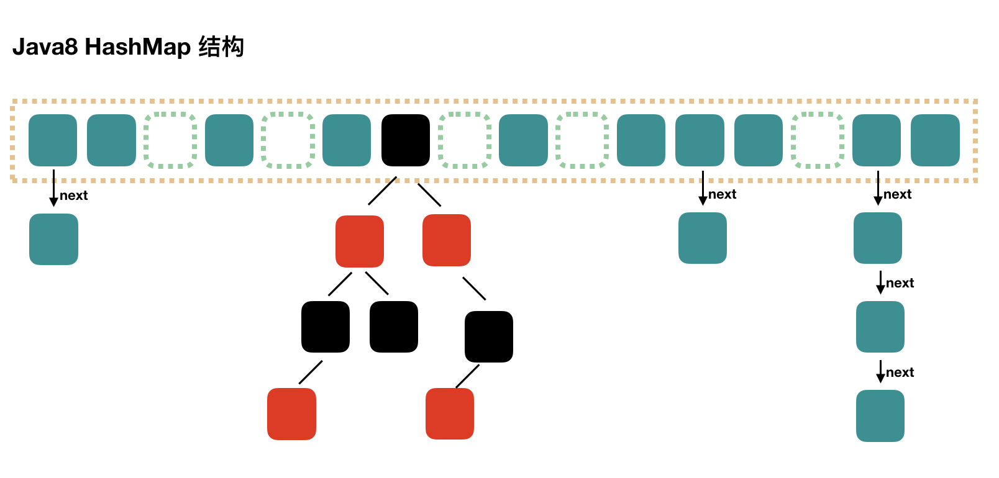

# 1.集合包

   集合包最常用的有Collection和Map两个接口的实现类，Colleciton用于存放多个单对象，Map用于存放Key-Value形式的键值对。

  Collection中最常用的又分为两种类型的接口：List和Set，两者最明显的差别为List支持放入重复的元素，而Set不支持。

List最常用的实现类有：ArrayList、LinkedList、Vector及Stack；Set接口常用的实现类有：HashSet、TreeSet。

## 1.1 ArrayList

  ArrayList基于数组方式实现，默认构造器通过调用ArrayList(int)来完成创建，传入的值为10，实例化了一个Object数组，并将此数组赋给了当前实例的elementData属性，此Object数组的大小即为传入的initialCapacity，因此调用空构造器的情况下会创建一个大小为10的Object数组。

   ArrayList底层就是一个数组，因此按序查找快，乱序插入，删除因为涉及到后面元素移位所以性能慢。

### 插入对象：add(E)插入对象：add(E)

   基于已有元素数量加1作为名叫minCapacity的变量，比较此值和Object数组的大小，若大于数组值，那么先将当前Object数组值赋给一个数组对象，接着产生一个鑫的数组容量值。此值的计算方法为当前数组值*1.5+1，如得出的容量值仍然小于minCapacity，那么就以minCapacity作为新的容量值，调用Arrays.copyOf来生成新的数组对象。
   
   还提供了add(int,E)这样的方法将元素直接插入指定的int位置上，将目前index及其后的数据都往后挪一位，然后才能将指定的index位置的赋值为传入的对象，这种方式要多付出一次复制数组的代价。还提供了addAll

### 删除对象：remove(E)

   这里调用了faseRemove方法将index后的对象往前复制一位，并将数组中的最后一个元素的值设置为null，即释放了对此对象的引用。 还提供了remove(int)方法来删除指定位置的对象，remove(int)的实现比remove(E)多了一个数组范围的检测，但少了对象位置的查找，因此性能会更好。

获取单个对象：get(int)
遍历对象：iterator()
判断对象是否存在：contains(E)

### 总结：

1. ArrayList基于数组方式实现，无容量的限制；
2. ArrayList在执行插入元素时可能要扩容，在删除元素时并不会减小数组的容量（如希望相应的缩小数组容量，可以调用ArrayList的trimToSize()），在查找元素时要遍历数组，对于非null的元素采取equals的方式寻找；
3. ArrayList是非线程安全的。

## 1.2 LinkedList

LinkedList基于双向链表机制，所谓双向链表机制，就是集合中的每个元素都知道其前一个元素及其后一个元素的位置，适用于乱序插入，删除。指定序列操作则性能不如ArrayList。在LinkedList中，以一个内部的Entry类来代表集合中的元素，元素的值赋给element属性，Entry中的next属性指向元素的后一个元素，Entry中的previous属性指向元素的前一个元素，基于这样的机制可以快速实现集合中元素的移动。

1. LinkedList基于双向链表机制实现；
2. LinkedList在插入元素时，须创建一个新的Entry对象，并切换相应元素的前后元素的引用；在查找元素时，须遍历链表；在删除元素时，要遍历链表，找到要删除的元素，然后从链表上将此元素删除即可，此时原有的前后元素改变引用连在一起；
3. LinkedList是非线程安全的。

## 1.3 Vector

其add、remove、get(int)方法都**加了synchronized关键字**，默认创建一个大小为10的Object数组，并将capacityIncrement设置为0。容量扩充策略：如果capacityIncrement大于0，则将Object数组的大小扩大为现有size加上capacityIncrement的值；如果capacity等于或小于0，则将Object数组的大小扩大为现有size的两倍，这种容量的控制策略比ArrayList更为可控。

Vector是基于Synchronized实现的线程安全的ArrayList，但在插入元素时容量扩充的机制和ArrayList稍有不同，并可通过传入capacityIncrement来控制容量的扩充。

## 1.4 Stack

Stack继承于Vector，在其基础上实现了Stack所要求的后进先出(LIFO)的弹出与压入操作，先进后出FILO，默认new Stack()容量为10，其提供了push、pop、peek三个主要的方法：

-  push操作通过调用Vector中的addElement来完成；
-  pop操作通过调用peek来获取元素，并同时删除数组中的最后一个元素；
-  peek操作通过获取当前Object数组的大小，并获取数组上的最后一个元素。

Stack的一个典型应用就是计算表达式如 9 + (3 - 1) * 3 + 10 / 2，计算机将中缀表达式转为后缀表达式，再对后缀表达式进行计算。

## 1.5 HashSet

默认构造创建一个HashMap对象

- add(E)：调用HashMap的put方法来完成此操作，将需要增加的元素作为Map中的key，value则传入一个之前已创建的Object对象。
- remove(E)：调用HashMap的remove(E)方法完成此操作。
- contains(E)：HashMap的containsKey
- iterator()：调用HashMap的keySet的iterator方法。
- HashSet不支持通过get(int)获取指定位置的元素，只能自行通过iterator方法来获取。

1. HashSet基于HashMap实现，无容量限制；
2. HashSet是非线程安全的。

## 1.6 TreeSet

TreeSet和HashSet的主要不同在于TreeSet对于排序的支持，TreeSet基于TreeMap实现。

## 1.7 HashMap

HashMap空构造，将loadFactor设为默认的0.75，threshold设置为12，并创建一个大小为16的Entry对象数组。

基于数组+链表的结合体(链表散列)实现，将key-value看成一个整体，存放于Entity[]数组，put的时候根据key hash后的hashcode和数组length-1按位与的结果值判断放在数组的哪个位置，如果该数组位置上若已经存放其他元素，则在这个位置上的元素以链表的形式存放。如果该位置上没有元素则直接存放。

当系统决定存储HashMap中的key-value对时，完全没有考虑Entry中的value，仅仅只是根据key来计算并决定每个Entry的存储位置。我们完全可以把Map集合中的value当成key的附属，当系统决定了key的存储位置之后，value随之保存在那里即可。get取值也是根据key的hashCode确定在数组的位置，在根据key的equals确定在链表处的位置。

### 扩容resize():

当HashMap中的元素越来越多的时候，hash冲突的几率也就越来越高，因为数组的长度是固定的。所以为了提高查询的效率，就要对HashMap的数组进行扩容，而在HashMap数组扩容之后，最消耗性能的点就出现了：原数组中的数据必须重新计算其在新数组中的位置，并放进去，这就是resize。那么HashMap什么时候进行扩容呢？当HashMap中的元素个数超过数组大小*loadFactor时，就会进行数组扩容，loadFactor的默认值为0.75，这是一个折中的取值。

负载因子衡量的是一个散列表的空间的使用程度，负载因子越大表示散列表的装填程度越高，反之愈小。负载因子越大，对空间的利用更充分，然而后果是查找效率的降低；如果负载因子太小，那么散列表的数据将过于稀疏，对空间造成严重浪费。

HashMap的实现中，通过threshold字段来判断HashMap的最大容量。threshold就是在此loadFactor和capacity对应下允许的最大元素数目，超过这个数目就重新resize，以降低实际的负载因子。默认的的负载因子0.75是对空间和时间效率的一个平衡选择。

initialCapacity*2，成倍扩大容量，HashMap(int initialCapacity, float loadFactor)：以指定初始容量、指定的负载因子创建一个 HashMap。不设定参数，则初始容量值为16，默认的负载因子为0.75，不宜过大也不宜过小，过大影响效率，过小浪费空间。扩容后需要重新计算每个元素在数组中的位置，是一个非常消耗性能的操作，所以如果我们已经预知HashMap中元素的个数，那么预设元素的个数能够有效的提高HashMap的性能。

HashTable数据结构的原理大致一样，区别在于put、get时加了同步关键字，而且HashTable不可存放null值。

在高并发时可以使用ConcurrentHashMap，其内部使用锁分段技术，维持这锁Segment的数组，在数组中又存放着Entity[]数组，内部hash算法将数据较均匀分布在不同锁中。

#### 总结：

1. HashMap采用数组方式存储key、value构成的Entry对象，无容量限制；
2. HashMap基于key hash寻找Entry对象存放到数组的位置，对于hash冲突采用链表的方式解决；
3. HashMap在插入元素时可能会扩大数组的容量，在扩大容量时须要重新计算hash，并复制对象到新的数组中；
4. HashMap是非线程安全的。

## 1.8 TreeMap

TreeMap基于红黑树的实现，因此它要求一定要有key比较的方法，要么传入Comparator实现，要么key对象实现Comparable接口。在put操作时，基于红黑树的方式遍历，基于comparator来比较key应放在树的左边还是右边，如找到相等的key，则直接替换掉value。

# 2.并发包

 jdk5.0一很重要的特性就是增加了并发包java.util.concurrent.，在说具体的实现类或接口之前，这里先简要说下Java内存模型、volatile变量及AbstractQueuedSynchronizer(以下简称AQS同步器)，这些都是并发包众多实现的基础。

#### Java内存模型

描述了线程内存与主存见的通讯关系。定义了线程内的内存改变将怎样传递到其他线程的规则，同样也定义了线程内存与主存进行同步的细节，也描述了哪些操作属于原子操作及操作间的顺序。

#### 代码顺序规则：
一个线程内的每个动作happens-before同一个线程内在代码顺序上在其后的所有动作.

#### volatile变量规则：

对一个volatile变量的读，总是能看到（任意线程）对这个volatile变量最后的写入.

#### 传递性：

 如果A happens-before B, B happens-before C, 那么A happens-before C.

## volatile

当我们声明共享变量为volatile后，对这个变量的读/写将会很特别。理解volatile特性的一个好方法是：把对volatile变量的单个读/写，看成是使用同一个监视器锁对这些单个读/写操作做了同步。

监视器锁的happens-before规则保证释放监视器和获取监视器的两个线程之间的内存可见性，这意味着对一个volatile变量的读，总是能看到（任意线程）对这个volatile变量最后的写入。

简而言之，volatile变量自身具有下列特性：

- 可见性。对一个volatile变量的读，总是能看到（任意线程）对这个volatile变量最后的写入。
- 原子性：对任意单个volatile变量的读/写具有原子性，但类似于volatile++这种复合操作不具有原子性。

### volatile写的内存语义如下
当写一个volatile变量时，JMM会把该线程对应的本地内存中的共享变量刷新到主内存。

### volatile读的内存语义如下
当读一个volatile变量时，JMM会把该线程对应的本地内存置为无效。线程接下来将从主内存中读取共享变量。

### volatile写和volatile读的内存语义总结

- 线程A写一个volatile变量，实质上是线程A向接下来将要读这个volatile变量的某个线程发出了（其对共享变量所在修改的）消息。
- 线程B读一个volatile变量，实质上是线程B接收了之前某个线程发出的（在写这个volatile变量之前对共享变量所做修改的）消息。
- 线程A写一个volatile变量，随后线程B读这个volatile变量，这个过程实质上是线程A通过主内存向线程B发送消息。

锁释放-获取与volatile的读写具有相同的内存语义

### 锁释放的内存语义如下：
当线程释放锁时，JMM会把该线程对应的本地内存中的共享变量刷新到主内存。

### 锁获取的内存语义如下：
当线程获取锁时，JMM会把该线程对应的本地内存置为无效，从而使得被监视器保护的临界区代码必须要从主内存中读取共享变量。

### 锁释放和锁获取的内存语义总结

- 线程A释放一个锁，实质上是线程A向接下来将要获取这个锁的某个线程发出了（线程A对共享变量所做修改的）消息。
- 线程B获取一个锁，实质上是线程B接收了之前某个线程发出的（在释放这个锁之前对共享变量所做修改的）消息。
- 线程A释放锁，随后线程B获取这个锁，这个过程实质上是线程A通过主内存向线程B发送消息。

由于volatile仅仅保证对单个volatile变量的读/写具有原子性，而监视器锁的互斥执行的特性可以确保对整个临界区代码的执行具有原子性。在功能上，监视器锁比volatile更强大；在可伸缩性和执行性能上，volatile更有优势。

## AbstractQueuedSynchronizer (AQS)

AQS使用一个整型的volatile变量（命名为state）来维护同步状态，这是接下来实现大部分同步需求的基础。提供了一个基于FIFO队列，可以用于构建锁或者其他相关同步装置的基础框架。使用的方法是继承，子类通过继承同步器并需要实现它的方法来管理其状态，管理的方式就是通过类似acquire和release的方式来操纵状态。然而多线程环境中对状态的操纵必须确保原子性，因此子类对于状态的把握，需要使用这个同步器提供的以下三个方法对状态进行操作：

- java.util.concurrent.locks.AbstractQueuedSynchronizer.getState()
- java.util.concurrent.locks.AbstractQueuedSynchronizer.setState(int)
- java.util.concurrent.locks.AbstractQueuedSynchronizer.compareAndSetState(int, int)

子类推荐被定义为自定义同步装置的内部类，同步器自身没有实现任何同步接口，它仅仅是定义了若干acquire之类的方法来供使用。该同步器即可以作为排他模式也可以作为共享模式，当它被定义为一个排他模式时，其他线程对其的获取就被阻止，而共享模式对于多个线程获取都可以成功。

同步器是实现锁的关键，利用同步器将锁的语义实现，然后在锁的实现中聚合同步器。可以这样理解：锁的API是面向使用者的，它定义了与锁交互的公共行为，而每个锁需要完成特定的操作也是透过这些行为来完成的（比如：可以允许两个线程进行加锁，排除两个以上的线程），但是实现是依托给同步器来完成；同步器面向的是线程访问和资源控制，它定义了线程对资源是否能够获取以及线程的排队等操作。锁和同步器很好的隔离了二者所需要关注的领域，严格意义上讲，同步器可以适用于除了锁以外的其他同步设施上（包括锁）。

同步器的开始提到了其实现依赖于一个FIFO队列，那么队列中的元素Node就是保存着线程引用和线程状态的容器，每个线程对同步器的访问，都可以看做是队列中的一个节点。

##  2.1 ConcurrentHashMap

### Java 7 

ConcurrentHashMap是线程安全的HashMap的实现，默认构造同样有initialCapacity和loadFactor属性，不过还多了一个concurrencyLevel属性，三属性默认值分别为16、0.75及16。其内部使用锁分段技术，维持这锁Segment的数组，在Segment数组中又存放着Entity[]数组，内部hash算法将数据较均匀分布在不同锁中。
这个时候，最多可以同时支持 16 个线程并发写，只要它们的操作分别分布在不同的 Segment 上。这个值可以在初始化的时候设置为其他值，但是一旦初始化以后，它是**不可以扩容**的。其实每个 Segment 很像之前介绍的 HashMap，不过它要保证线程安全，所以处理起来要麻烦些。

put操作：并没有在此方法上加上synchronized，首先对key.hashcode进行hash操作，得到key的hash值。hash操作的算法和map也不同，根据此hash值计算并获取其对应的数组中的Segment对象(继承自ReentrantLock)，接着调用此Segment对象的put方法来完成当前操作。

ConcurrentHashMap基于concurrencyLevel划分出了多个Segment来对key-value进行存储，从而避免每次put操作都得锁住整个数组。在默认的情况下，最佳情况下可允许16个线程并发无阻塞的操作集合对象，尽可能地减少并发时的阻塞现象。

get(key)

首先对key.hashCode进行hash操作，基于其值找到对应的Segment对象，调用其get方法完成当前操作。而Segment的get操作首先通过hash值和对象数组大小减1的值进行按位与操作来获取数组上对应位置的HashEntry。在这个步骤中，可能会因为对象数组大小的改变，以及数组上对应位置的HashEntry产生不一致性，那么ConcurrentHashMap是如何保证的？

对象数组大小的改变只有在put操作时有可能发生，由于HashEntry对象数组对应的变量是volatile类型的，因此可以保证如HashEntry对象数组大小发生改变，读操作可看到最新的对象数组大小。

在获取到了HashEntry对象后，怎么能保证它及其next属性构成的链表上的对象不会改变呢？这点ConcurrentHashMap采用了一个简单的方式，即HashEntry对象中的hash、key、next属性都是final的，这也就意味着没办法插入一个HashEntry对象到基于next属性构成的链表中间或末尾。这样就可以保证当获取到HashEntry对象后，其基于next属性构建的链表是不会发生变化的。

ConcurrentHashMap默认情况下采用将数据分为16个段进行存储，并且16个段分别持有各自不同的锁Segment，锁仅用于put和remove等改变集合对象的操作，基于volatile及HashEntry链表的不变性实现了读取的不加锁。这些方式使得ConcurrentHashMap能够保持极好的并发支持，尤其是对于读远比插入和删除频繁的Map而言，而它采用的这些方法也可谓是对于Java内存模型、并发机制深刻掌握的体现。

 ### Java 8

 Java8 对 HashMap 进行了一些修改，最大的不同就是利用了红黑树，所以其由 数组+链表+红黑树 组成。

根据 Java7 HashMap 的介绍，我们知道，查找的时候，根据 hash 值我们能够快速定位到数组的具体下标，但是之后的话，需要顺着链表一个个比较下去才能找到我们需要的，时间复杂度取决于链表的长度，为 O(n)。

为了降低这部分的开销，在 Java8 中，当链表中的元素超过了 8 个以后，会将链表转换为红黑树，在这些位置进行查找的时候可以降低时间复杂度为 O(logN)。
Java7 是先扩容后插入新值的，Java8 先插值再扩容，并发控制使用Synchronized和CAS来操作，整个看起来就像是优化过且线程安全的HashMap，虽然在JDK1.8中还能看到Segment的数据结构，但是已经简化了属性，只是为了兼容旧版本

### 总结
其实可以看出JDK1.8版本的ConcurrentHashMap的数据结构已经接近HashMap，相对而言，ConcurrentHashMap只是增加了同步的操作来控制并发，从JDK1.7版本的ReentrantLock+Segment+HashEntry，到JDK1.8版本中synchronized+CAS+HashEntry+红黑树,相对而言，总结如下思考

- JDK1.8的实现降低锁的粒度，JDK1.7版本锁的粒度是基于Segment的，包含多个HashEntry，而JDK1.8取消segments字段，直接采用transient volatile HashEntry<K,V>[] table保存数据，采用table数组元素作为锁，从而实现了对每一HashEntry进行加锁，进一步减少并发冲突的概率
- JDK1.8版本的数据结构变得更加简单，使得操作也更加清晰流畅，因为已经使用synchronized来进行同步，所以不需要分段锁的概念，也就不需要Segment这种数据结构了，由于粒度的降低，实现的复杂度也增加了
- JDK1.8使用红黑树来优化链表，基于长度很长的链表的遍历是一个很漫长的过程，而红黑树的遍历效率是很快的，代替一定阈值的链表，这样形成一个最佳拍档
- JDK1.8为什么使用内置锁synchronized来代替重入锁ReentrantLock，我觉得有以下几点
  1. 因为粒度降低了，在相对而言的低粒度加锁方式，synchronized并不比ReentrantLock差，在粗粒度加锁中ReentrantLock可能通过Condition来控制各个低粒度的边界，更加的灵活，而在低粒度中，Condition的优势就没有了
  2. JVM的开发团队从来都没有放弃synchronized，而且基于JVM的synchronized优化空间更大，使用内嵌的关键字比使用API更加自然
  3. 在大量的数据操作下，对于JVM的内存压力，基于API的ReentrantLock会开销更多的内存，虽然不是瓶颈，但是也是一个选择依据

## 2.2 ReentrantLock

在并发包的开始部分介绍了volatile特性及AQS同步器，而这两部分正是ReentrantLock实现的基础。通过上面AQS的介绍及原理分析，可知道是以volatile维持的int类型的state值，来判断线程是执行还是在syn队列中等待。

ReentrantLock的实现不仅可以替代隐式的synchronized关键字，而且能够提供超过关键字本身的多种功能。

这里提到一个锁获取的公平性问题，如果在绝对时间上，先对锁进行获取的请求一定被先满足，那么这个锁是公平的，反之，是不公平的，也就是说等待时间最长的线程最有机会获取锁，也可以说锁的获取是有序的。ReentrantLock这个锁提供了一个构造函数，能够控制这个锁是否是公平的。

对于公平和非公平的定义是通过对同步器AbstractQueuedSynchronizer的扩展加以实现的，也就是tryAcquire的实现上做了语义的控制。

公平和非公平性的更多原理分析见于http://ifeve.com/reentrantlock-and-fairness/ 

## 2.3 Condition

Condition是并发包中提供的一个接口，典型的实现有ReentrantLock，ReentrantLock提供了一个newCondition的方法，以便用户在同一个锁的情况下可以根据不同的情况执行等待或唤醒动作。典型的用法可参考ArrayBlockingQueue的实现，下面来看ReentrantLock中

newCondition的实现。

**ReentrantLock.newCondition()**
创建一个AbstractQueuedSynchronizer的内部类ConditionObject的对象实例。

**ReentrantLock.newCondition().await()**
将当前线程加入此condition的等待队列中，并将线程置为等待状态。

**ReentrantLock.newCondition().signal()**
 从此condition的等待队列中获取一个等待节点，并将节点上的线程唤醒，如果要唤醒全部等待节点的线程，则调用signalAll方法。

## 2.4 CopyOnWriteArrayList

CopyOnWriteArrayList是一个线程安全、并且在读操作时无锁的ArrayList，其具体实现方法如下。

**CopyOnWriteArrayList()**
 和ArrayList不同，此步的做法为创建一个大小为0的数组。

**add(E)**
add方法并没有加上synchronized关键字，它通过使用ReentrantLock来保证线程安全。此处和ArrayList的不同是每次都会创建一个新的Object数组，此数组的大小为当前数组大小加1，将之前数组中的内容复制到新的数组中，并将

新增加的对象放入数组末尾，最后做引用切换将新创建的数组对象赋值给全局的数组对象。

**remove(E)**
和add方法一样，此方法也通过ReentrantLock来保证其线程安全，但它和ArrayList删除元素采用的方式并不一样。

首先创建一个比当前数组小1的数组，遍历新数组，如找到equals或均为null的元素，则将之后的元素全部赋值给新的数组对象，并做引用切换，返回true；如未找到，则将当前的元素赋值给新的数组对象，最后特殊处理数组中的最后

一个元素，如最后一个元素等于要删除的元素，即将当前数组对象赋值为新创建的数组对象，完成删除操作，如最后一个元素也不等于要删除的元素，那么返回false。

此方法和ArrayList除了锁不同外，最大的不同在于其复制过程并没有调用System的arrayCopy来完成，理论上来说会导致性能有一定下降。

**get(int)** 
此方法非常简单，直接获取当前数组对应位置的元素，这种方法是没有加锁保护的，因此可能会出现读到脏数据的现象。但相对而言，性能会非常高，对于写少读多且脏数据影响不大的场景而言是不错的选择。

**iterator()**
 调用iterator方法后创建一个新的COWIterator对象实例，并保存了一个当前数组的快照，在调用next遍历时则仅对此快照数组进行遍历，因此遍历此list时不会抛出ConcurrentModificatiedException。

与ArrayList的性能对比，在读多写少的并发场景中，较之ArrayList是更好的选择，单线程以及多线程下增加元素及删除元素的性能不比ArrayList好

## 2.5 CopyOnWriteArraySet

CopyOnWriteArraySet基于CopyOnWriteArrayList实现，其唯一的不同是在add时调用的是CopyOnWriteArrayList的addIfAbsent方法。保证了无重复元素，但在add时每次都要进行数组的遍历，因此性能会略低于上个。
